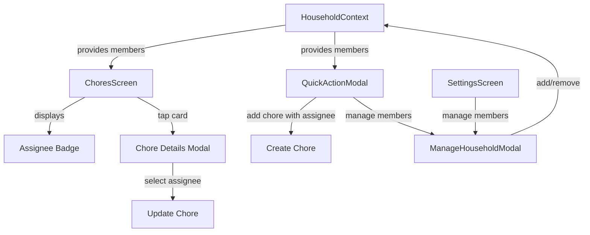

# Add Assignee Display & Selection to Chores

## Overview

Enhance the chores feature by displaying assignee information on chore cards and implementing a comprehensive assignee selection system that combines predefined household roles with custom member management.

## Implementation Plan

### 1. Display Assignee on Chore Cards

**File: [`src/screens/ChoresScreen.tsx`](src/screens/ChoresScreen.tsx)**

Modify the `renderChoreCard` function (lines 85-120) to display the assignee:

- Add assignee text between the `choreCardContent` and `choreCardCheck` sections
- Position it on the right side as a small badge/label
- Style it with a subtle background color and compact typography
- Handle cases where assignee is undefined (show "Unassigned" or hide)

**Styling additions:**

- `choreCardAssignee`: Container for assignee badge
- `choreCardAssigneeText`: Text styling for assignee name

### 2. Create Household Members Management

**New file: `src/contexts/HouseholdContext.tsx`**

Create a context to manage household members:

- Default members: "Mom", "Dad", "Kids", "All"
- Allow adding custom members
- Allow removing custom members (but not default ones)
- Persist members to AsyncStorage under `@kitchen_hub_household_members`
- Provide hooks: `useHousehold()` with methods `addMember`, `removeMember`, `getMembers`

**Interface:**

```typescript
interface HouseholdMember {
  id: string;
  name: string;
  isDefault: boolean;
  color?: string; // Optional color for visual distinction
}
```

### 3. Assignee Selection in Quick Action Modal

**File: [`src/components/modals/ChoresQuickActionModal.tsx`](src/components/modals/ChoresQuickActionModal.tsx)**

Enhance the modal to support assignee selection:

- Add an assignee picker dropdown/selector in the add form (line 133-150)
- Show current assignee in the chore row (already exists at line 171-173)
- Allow tapping on assignee to change it
- Add "Manage Members" button to access member management

**UI Flow:**

1. When adding a chore, show assignee selector below the text input
2. Display as horizontal scrollable chips or dropdown
3. Include "+ Add Member" option to create custom members inline

### 4. Assignee Selection on Chore Card Tap

**File: [`src/screens/ChoresScreen.tsx`](src/screens/ChoresScreen.tsx)**

Add assignee editing when tapping the chore card:

- Create a bottom sheet modal for chore details/editing
- Show chore name, due date/time, and assignee selector
- Allow changing assignee without opening the full Quick Action Modal
- Alternative: Show a small popup menu with assignee options on long-press

**New component: `ChoreDetailsModal` or inline bottom sheet**

### 5. Household Members Management Screen

**New file: `src/components/modals/ManageHouseholdModal.tsx`**

Create a modal for managing household members:

- List all members (default + custom)
- Add new member with name input
- Delete custom members (show trash icon)
- Default members are non-deletable (grayed out delete button)
- Accessible from Settings or from Quick Action Modal

### 6. Update ChoresScreen State Management

**File: [`src/screens/ChoresScreen.tsx`](src/screens/ChoresScreen.tsx)**

Add function to update chore assignee:

```typescript
const updateChoreAssignee = (id: string, assignee: string) => {
  setChores(chores.map(chore =>
    chore.id === id ? { ...chore, assignee } : chore
  ));
};
```

### 7. Integration Points

**Files to update:**

- [`App.tsx`](App.tsx) or [`index.ts`](index.ts): Wrap app with `HouseholdProvider`
- [`src/screens/SettingsScreen.tsx`](src/screens/SettingsScreen.tsx): Add "Manage Household Members" option
- [`src/components/modals/ChoresQuickActionModal.tsx`](src/components/modals/ChoresQuickActionModal.tsx): Integrate assignee selection

## Visual Design

### Assignee Badge on Card

- Small rounded rectangle on the right side
- Light background color (semi-transparent)
- Compact font size (10-11px)
- Truncate long names with ellipsis
- Example: `[Mom]` or `[Dad]`

### Assignee Selector

- Horizontal scrollable chips for quick selection
- Active chip highlighted with accent color
- "+ Add" chip at the end for custom members
- Color-coded chips based on member (optional enhancement)

## Data Flow



## Testing Checklist

- [ ] Assignee displays correctly on chore cards
- [ ] Assignee can be selected when creating new chore
- [ ] Assignee can be changed by tapping chore card
- [ ] Custom members can be added
- [ ] Custom members can be removed
- [ ] Default members cannot be removed
- [ ] Members persist across app restarts
- [ ] Unassigned chores display appropriately
- [ ] UI is responsive on different screen sizes