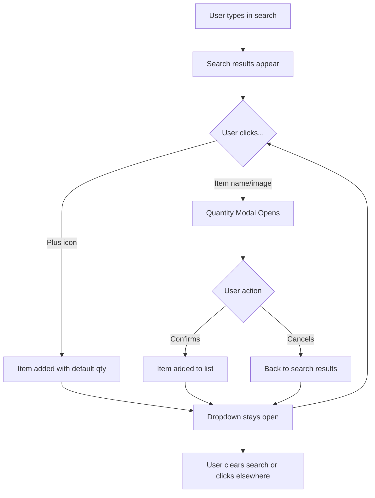

# Persistent Search Dropdown for Grocery Items

## Overview

Change the search dropdown behavior to remain open after adding items, enabling rapid multi-item addition. Users can click the plus icon for quick add (default quantity) or click the item name to specify a custom quantity.

## Changes Required

### 1. Update ShoppingListsScreen.tsx

**Search Dropdown Behavior** (lines 566-588):

- Remove `setShowSearchDropdown(false)` from `handleQuickAddItem` function (line 353)
- Keep `setSearchQuery('')` removal as well (line 354) - search query should persist
- Update the search result item to have two distinct clickable areas:
  - Item name/image area: Opens quantity modal (calls `handleSelectGroceryItem`)
  - Plus icon: Quick adds with default quantity (calls `handleQuickAddItem`)

**Key Changes**:

```typescript
// In handleQuickAddItem (lines 324-355):
const handleQuickAddItem = (groceryItem: GroceryItem) => {
  // ... existing add logic ...
  
  // REMOVE these lines:
  // setShowSearchDropdown(false);
  // setSearchQuery('');
  
  // Dropdown stays open, search query persists
};

// Update search result item structure (lines 572-584):
<TouchableOpacity
  key={item.id}
  style={styles.searchResultItem}
  onPress={() => handleSelectGroceryItem(item)} // Click item for quantity modal
>
  <Image source={{ uri: item.image }} style={styles.searchResultImage} />
  <View style={styles.searchResultDetails}>
    <Text style={styles.searchResultName}>{item.name}</Text>
    <Text style={styles.searchResultCategory}>{item.category}</Text>
  </View>
  <TouchableOpacity 
    onPress={(e) => {
      e.stopPropagation(); // Prevent parent onPress
      handleQuickAddItem(item);
    }}
  >
    <Ionicons name="add-circle" size={24} color={colors.shopping} />
  </TouchableOpacity>
</TouchableOpacity>
```

**Update handleSelectGroceryItem** (lines 317-322):

- Remove `setShowSearchDropdown(false)` from this function as well
- The modal closing should not close the dropdown - user can continue adding after modal closes

### 2. Update ShoppingQuickActionModal.tsx (Optional Enhancement)

Apply the same pattern to the quick action modal for consistency:

**Search Dropdown Behavior** (lines 124-136):

- Remove `setSearchQuery('')` and `setShowSearchDropdown(false)` from `handleSelectGroceryItem`
- Update search result items (lines 203-216) to have two click areas similar to ShoppingListsScreen

### 3. User Experience Flow



## Files to Modify

1. [`src/screens/shopping/ShoppingListsScreen.tsx`](src/screens/shopping/ShoppingListsScreen.tsx) - Primary changes

   - Modify `handleQuickAddItem` function (remove dropdown close)
   - Modify `handleSelectGroceryItem` function (remove dropdown close)
   - Update search result item JSX to have two clickable areas
   - Keep search query persistence

2. [`src/components/modals/ShoppingQuickActionModal.tsx`](src/components/modals/ShoppingQuickActionModal.tsx) - Optional consistency update

   - Apply same pattern for unified UX

## Testing Checklist

- Search for an item (e.g., "apple")
- Click plus icon - item adds, dropdown stays open with same results
- Click plus icon again - item quantity increases, dropdown still open
- Click item name - quantity modal opens
- Confirm modal - item adds, dropdown still visible
- Cancel modal - dropdown still visible
- Clear search manually - dropdown closes
- Click outside search area - dropdown closes