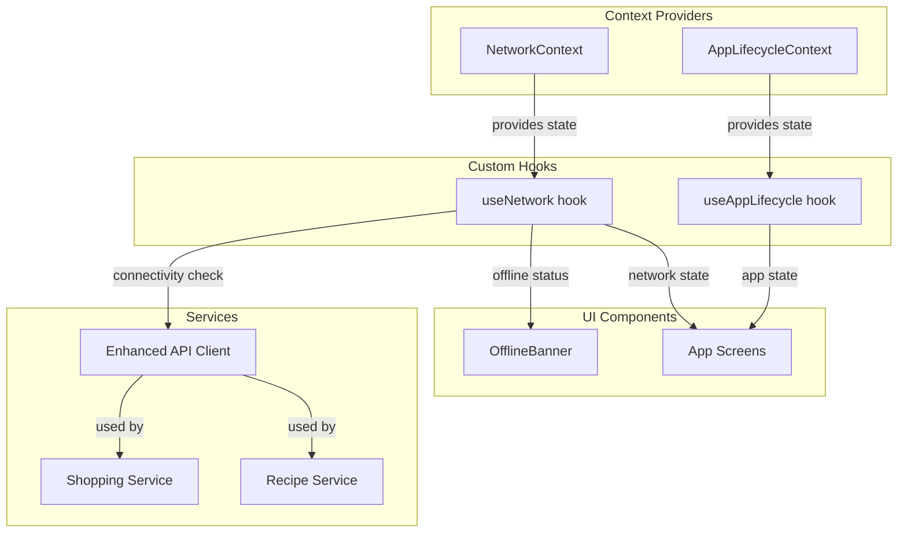

# Network Status + App Lifecycle Signals Implementation

## Architecture Overview

Create a two-layer architecture following the existing AuthContext/HouseholdContext pattern:

1. **Context Layer**: `NetworkContext` and `AppLifecycleContext` to provide global state
2. **Hook Layer**: Custom hooks (`useNetwork()`, `useAppLifecycle()`) for consuming state
3. **UI Layer**: `OfflineBanner` component for visual feedback
4. **Service Layer**: Enhanced API client with automatic network checks



## Implementation Steps

### 1. Install Dependencies

Install `@react-native-community/netinfo`:

```bash
npx expo install @react-native-community/netinfo
```

### 2. Create NetworkContext

**File**: [`mobile/src/contexts/NetworkContext.tsx`](mobile/src/contexts/NetworkContext.tsx)

Following the pattern from [`mobile/src/contexts/AuthContext.tsx`](mobile/src/contexts/AuthContext.tsx):

- Use `@react-native-community/netinfo`'s `useNetInfo()` hook
- Provide state: `isConnected`, `isInternetReachable`, `isOffline`, `connectionType`, `isExpensive`
- Export `NetworkProvider` and `useNetwork()` hook
- Configure NetInfo at provider initialization with appropriate timeouts
- Use `useMemo` to derive offline state (similar to how AuthContext derives `hasGuestData`)

**Key implementation details:**

- `isOffline = !isConnected || isInternetReachable === false`
- Include `connectionType` for cellular vs WiFi detection
- Include `isExpensive` for metered connection awareness
- Memoize derived state to prevent unnecessary re-renders

### 3. Create AppLifecycleContext

**File**: [`mobile/src/contexts/AppLifecycleContext.tsx`](mobile/src/contexts/AppLifecycleContext.tsx)

Following the same pattern:

- Use React Native's `AppState` API
- Provide state: `appState`, `isActive`, `isBackground`, `isForeground`
- Export `AppLifecycleProvider` and `useAppLifecycle()` hook
- Use `useRef` to track previous state (avoid stale closures)
- Add event listener in `useEffect` with proper cleanup
- Detect foreground transitions: `wasBackground && isActive`

**Key implementation details:**

- `isForeground = appState === 'active'`
- Track foreground transitions for sync triggers
- Use `useRef(AppState.currentState)` to track previous state
- Clean up event listener subscription in useEffect return

### 4. Create Custom Hooks (Exported from Contexts)

Both contexts export their respective hooks:

- `useNetwork()` from NetworkContext
- `useAppLifecycle()` from AppLifecycleContext

These hooks throw errors if used outside their providers (same pattern as `useAuth()`):

```typescript
if (context === undefined) {
  throw new Error('useNetwork must be used within a NetworkProvider');
}
```

### 5. Update Root Navigator

**File**: [`mobile/src/navigation/MainNavigator.tsx`](mobile/src/navigation/MainNavigator.tsx)

Wrap the app with providers in this order:

1. `NetworkProvider` (outermost)
2. `AppLifecycleProvider`
3. Existing `AuthProvider`
4. Existing `HouseholdProvider`

This order ensures network/lifecycle state is available to all other contexts.

### 6. Create OfflineBanner Component

**File**: [`mobile/src/common/components/OfflineBanner.tsx`](mobile/src/common/components/OfflineBanner.tsx)

A reusable banner component that:

- Uses `useNetwork()` hook to get offline state
- Shows at the top of the screen when `isOffline === true`
- Displays message: "You're offline. Some features may be unavailable."
- Uses theme colors (e.g., `colors.error` background)
- Has fixed position, semi-transparent background
- Auto-hides when back online
- Includes connection type info when available

**Styling approach:**

- Follow existing component patterns from [`mobile/src/common/components/FloatingActionButton.tsx`](mobile/src/common/components/FloatingActionButton.tsx)
- Use theme colors and spacing from [`mobile/src/theme/`](mobile/src/theme/)
- Consider using `react-native-animatable` for smooth show/hide animation (if not adding dependency, use `Animated` API)

### 7. Enhance API Client

**File**: [`mobile/src/services/api.ts`](mobile/src/services/api.ts)

Currently, api.ts is a simple fetch wrapper with no network error handling:

```1:39:mobile/src/services/api.ts
import { getAuthToken } from './auth';

const API_URL = 'http://localhost:3000/api';

interface ApiError {
  message: string;
  statusCode?: number;
}

export class ApiClient {
  private static async request<T>(
    endpoint: string,
    options: RequestInit = {}
  ): Promise<T> {
    try {
      const token = await getAuthToken();
      const headers = {
        'Content-Type': 'application/json',
        ...(token && { Authorization: `Bearer ${token}` }),
        ...options.headers,
      };

      const response = await fetch(`${API_URL}${endpoint}`, {
        ...options,
        headers,
      });

      if (!response.ok) {
        const error: ApiError = await response.json();
        throw new Error(error.message || 'API request failed');
      }

      return await response.json();
    } catch (error) {
      if (error instanceof Error) {
        throw error;
      }
      throw new Error('An unexpected error occurred');
    }
  }
```

**Enhancements needed:**

1. Create a reference to NetworkContext (using a module-level variable or dependency injection)
2. Check `isOffline` before making requests
3. Throw a specific `NetworkError` class when offline
4. Add timeout handling (15 seconds as per NetInfo best practices)
5. Distinguish between network errors and API errors in catch block

**Implementation approach:**

- Create `NetworkError` class extending `Error`
- Add static method `setNetworkProvider()` to inject network state
- Check network status in `request()` method before fetch
- Add `AbortSignal` with timeout
- Throw meaningful errors: "No internet connection" vs "Request timeout" vs "API error"

### 8. Export Hooks from Common Index

**File**: [`mobile/src/common/hooks/index.ts`](mobile/src/common/hooks/index.ts)

Add re-exports for easy importing:

```typescript
export { useNetwork } from '../../contexts/NetworkContext';
export { useAppLifecycle } from '../../contexts/AppLifecycleContext';
```

This allows consumers to import as:

```typescript
import { useNetwork, useAppLifecycle } from '../../common/hooks';
```

### 9. Add OfflineBanner to Screens

Add `<OfflineBanner />` to key navigation entry points:

- [`mobile/src/navigation/MainTabsScreen.tsx`](mobile/src/navigation/MainTabsScreen.tsx) - Shows on all tabs
- Or individual screens if screen-specific control is needed

Position at the top, outside the main scroll area, so it's always visible.

## Testing Strategy

### Unit Tests

1. **NetworkContext Tests** (`mobile/src/contexts/__tests__/NetworkContext.test.tsx`):

   - Mock `@react-native-community/netinfo`
   - Test state derivation (isOffline = !isConnected || !isInternetReachable)
   - Test hook throws error outside provider
   - Test different connection types (wifi, cellular, none)

2. **AppLifecycleContext Tests** (`mobile/src/contexts/__tests__/AppLifecycleContext.test.tsx`):

   - Mock React Native `AppState`
   - Test foreground/background transitions
   - Test state changes (active → background → active)
   - Test hook throws error outside provider

3. **API Client Tests** (`mobile/src/services/api.spec.ts`):

   - Test offline error thrown when `isOffline === true`
   - Test timeout handling
   - Test network error vs API error distinction
   - Mock network state provider

4. **OfflineBanner Tests** (`mobile/src/common/components/__tests__/OfflineBanner.test.tsx`):

   - Test renders when offline
   - Test hidden when online
   - Test displays correct message
   - Mock `useNetwork()` hook

### Integration Testing

1. Test providers are properly nested in MainNavigator
2. Test OfflineBanner appears across different screens
3. Test API calls fail gracefully when offline
4. Test services receive network errors from API client

### Manual Testing

1. Toggle airplane mode - verify OfflineBanner appears
2. Switch between WiFi and cellular - verify connection type updates
3. Background the app - verify AppState changes
4. Return to foreground - verify state updates
5. Make API calls while offline - verify meaningful error messages

## Success Criteria

✅ **Connectivity signals are reusable**

- `useNetwork()` hook available throughout app
- `useAppLifecycle()` hook available throughout app
- NetworkContext and AppLifecycleContext follow existing patterns

✅ **Offline state exposed to UI**

- OfflineBanner component shows when offline
- `isOffline` state accessible via `useNetwork()` hook
- Connection type and quality info available

✅ **Network listener implemented**

- NetInfo configured and monitoring
- State updates on connectivity changes
- Handles WiFi, cellular, none states

✅ **App lifecycle listener implemented**

- AppState monitoring active
- Foreground/background transitions detected
- State available via `useAppLifecycle()` hook

✅ **Shared hooks exported**

- Both hooks exported from `common/hooks/index.ts`
- Hooks throw errors when used outside providers
- Follow existing AuthContext pattern

✅ **API client enhanced**

- Checks network status before requests
- Throws meaningful offline errors
- Timeout handling implemented

## Files to Create

1. `mobile/src/contexts/NetworkContext.tsx` - Network status provider and hook
2. `mobile/src/contexts/AppLifecycleContext.tsx` - App lifecycle provider and hook
3. `mobile/src/common/components/OfflineBanner.tsx` - Offline indicator UI
4. `mobile/src/contexts/__tests__/NetworkContext.test.tsx` - NetworkContext tests
5. `mobile/src/contexts/__tests__/AppLifecycleContext.test.tsx` - AppLifecycleContext tests
6. `mobile/src/common/components/__tests__/OfflineBanner.test.tsx` - OfflineBanner tests

## Files to Modify

1. `mobile/package.json` - Add @react-native-community/netinfo dependency
2. `mobile/src/navigation/MainNavigator.tsx` - Add NetworkProvider and AppLifecycleProvider
3. `mobile/src/services/api.ts` - Add network checking and enhanced error handling
4. `mobile/src/services/api.spec.ts` - Add tests for network error handling
5. `mobile/src/common/hooks/index.ts` - Export new hooks
6. `mobile/src/navigation/MainTabsScreen.tsx` - Add OfflineBanner component

## Future Enhancements (Out of Scope)

- Offline queue for failed API requests
- Automatic retry logic with exponential backoff
- Sync strategy when returning to foreground
- Background data refresh capabilities
- Network quality indicators beyond online/offline