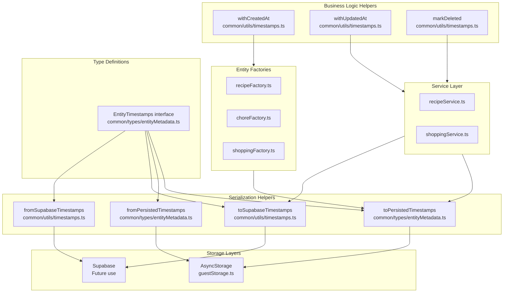

# Persistence Layer with Standardized Timestamps (AsyncStorage + Supabase)

## Overview

Implement consistent timestamp handling and serialization for both guest persistence (AsyncStorage) and signed-in persistence/sync (Supabase), using shared helpers and conventions. This ensures ISO timestamp preservation, automatic timestamp population, and proper soft-delete handling across both storage backends.

**Key Design Decisions:**
- **In-memory representation**: `Date` objects
- **Persisted representation**: ISO 8601 strings
- **Soft-delete convention**: `deletedAt` omitted for active records, included (as ISO string) for deleted records
- **Normalization scope**: Shallow (top-level entities only, no recursive normalization)

## Current State Analysis

- **Existing Helpers**: [`mobile/src/common/types/entityMetadata.ts`](mobile/src/common/types/entityMetadata.ts) already has `serializeTimestamps()` and `deserializeTimestamps()` functions
- **AsyncStorage Usage**: [`mobile/src/common/utils/guestStorage.ts`](mobile/src/common/utils/guestStorage.ts) currently doesn't use timestamp helpers
- **Backend Schema**: Uses snake_case column names (`created_at`, `updated_at`, `deleted_at`) as seen in [`backend/src/infrastructure/database/prisma/schema.prisma`](backend/src/infrastructure/database/prisma/schema.prisma)
- **Mobile Types**: Use camelCase (`createdAt`, `updatedAt`, `deletedAt`)
- **Entity Factories**: Currently don't populate timestamps (e.g., [`mobile/src/features/recipes/utils/recipeFactory.ts`](mobile/src/features/recipes/utils/recipeFactory.ts))

## Architecture



## Implementation Steps

### 1. Refactor Existing Helpers in entityMetadata.ts

**File**: [`mobile/src/common/types/entityMetadata.ts`](mobile/src/common/types/entityMetadata.ts)

- Rename `serializeTimestamps()` to `toPersistedTimestamps()` (alias for backward compatibility)
- Rename `deserializeTimestamps()` to `fromPersistedTimestamps()` (alias for backward compatibility)
- Keep existing implementations but update documentation to reflect new naming
- These helpers work for AsyncStorage (preserves camelCase, converts Date → ISO string)

**Type Documentation:**
- `toPersistedTimestamps<T>()`: Returns object with timestamp fields as `string` (ISO format)
- `fromPersistedTimestamps<T>()`: Returns object with timestamp fields as `Date`

**Key changes:**
```typescript
/**
 * Converts timestamp fields from Date to ISO string for persistence.
 * @returns Object with timestamp fields as ISO strings (Date → string)
 */
export function toPersistedTimestamps<T extends EntityTimestamps>(entity: T): T

/**
 * Converts timestamp fields from ISO string to Date for in-memory use.
 * @returns Object with timestamp fields as Date objects (string → Date)
 */
export function fromPersistedTimestamps<T extends EntityTimestamps>(entity: T): T

// Keep old names as aliases for backward compatibility
export const serializeTimestamps = toPersistedTimestamps;
export const deserializeTimestamps = fromPersistedTimestamps;
```

### 2. Create Timestamp Utilities Module

**File**: [`mobile/src/common/utils/timestamps.ts`](mobile/src/common/utils/timestamps.ts) (NEW FILE)

Create a new file for transport/persistence concerns (not type definitions). This file will contain:

#### 2a. Supabase Serialization Helpers

- `toSupabaseTimestamps<T>(entity: T): T` - Converts camelCase → snake_case and Date → ISO string
  - Maps `createdAt` → `created_at`
  - Maps `updatedAt` → `updated_at`
  - Maps `deletedAt` → `deleted_at`
  - Converts Date objects to ISO strings
  - **Omit `deleted_at` entirely for active records** (not null, omitted)
  - Returns object with timestamp fields as ISO strings

- `fromSupabaseTimestamps<T>(entity: T): T` - Converts snake_case → camelCase and ISO string → Date
  - Maps `created_at` → `createdAt`
  - Maps `updated_at` → `updatedAt`
  - Maps `deleted_at` → `deletedAt`
  - Converts ISO strings to Date objects
  - Validates ISO strings using existing `parseTimestampSafely()` helper
  - Returns object with timestamp fields as Date objects

**Implementation approach:**
- Use object spread with explicit field mapping
- Reuse `parseTimestampSafely()` from `entityMetadata.ts` for validation
- Handle both Date and string inputs (defensive programming)
- Explicitly omit `deleted_at` when undefined/null (active records)

#### 2b. Service-Level Timestamp Helpers

Add helper functions for service layer operations (business logic, not serialization):

- `withCreatedAt<T extends EntityTimestamps>(entity: T, timestamp?: Date): T`
  - **Business rule**: Auto-populates `createdAt` if missing
  - Uses provided timestamp or `new Date()` if not provided
  - Returns new object (immutable)
  - Does NOT modify existing `createdAt` if present

- `withUpdatedAt<T extends EntityTimestamps>(entity: T, timestamp?: Date): T`
  - **Business rule**: Always updates `updatedAt` to current time
  - Uses provided timestamp or `new Date()` if not provided
  - Returns new object (immutable)
  - Always overwrites `updatedAt` (even if already present)

- `markDeleted<T extends EntityTimestamps>(entity: T, timestamp?: Date): T`
  - **Business rule**: Sets `deletedAt` to current time (soft-delete)
  - Uses provided timestamp or `new Date()` if not provided
  - Returns new object (immutable)
  - Preserves all other fields including `createdAt` and `updatedAt`
  - Sets `deletedAt` even if already present (idempotent)

**Implementation approach:**
- Pure functions (no side effects)
- Always return new objects (immutability)
- Use optional timestamp parameter for testability
- Document that these apply business rules, not just serialization

### 3. Update guestStorage.ts to Use Timestamp Helpers

**File**: [`mobile/src/common/utils/guestStorage.ts`](mobile/src/common/utils/guestStorage.ts)

Update all read/write operations:

- **Read operations** (`getRecipes`, `getShoppingLists`, `getShoppingItems`):
  - After parsing JSON, call `fromPersistedTimestamps()` on each entity
  - This normalizes ISO strings to Date objects for in-memory use
  - **Shallow normalization only**: Only top-level entities are normalized (no recursive normalization of nested objects)

- **Write operations** (`saveRecipes`, `saveShoppingLists`, `saveShoppingItems`):
  - Before `JSON.stringify()`, call `toPersistedTimestamps()` on each entity
  - This ensures Date objects are converted to ISO strings
  - **Important**: Do not write `deletedAt: null` - omit the field entirely for active records

**Key changes:**
```typescript
// In getRecipes()
const parsed = JSON.parse(data);
// Shallow normalization: only top-level entities
const normalized = parsed.map(fromPersistedTimestamps);
return normalized.filter(validateRecipe);

// In saveRecipes()
// Shallow serialization: only top-level entities
const serialized = recipes.map(toPersistedTimestamps);
// Ensure deletedAt is omitted (not null) for active records
await AsyncStorage.setItem(GUEST_RECIPES_KEY, JSON.stringify(serialized));
```

**Documentation note**: Add JSDoc comment clarifying that normalization is shallow (top-level only) and does not recursively normalize nested timestamped objects.

### 4. Update Entity Factories to Use Timestamp Helpers

**Files to update:**
- [`mobile/src/features/recipes/utils/recipeFactory.ts`](mobile/src/features/recipes/utils/recipeFactory.ts)
- [`mobile/src/features/chores/utils/choreFactory.ts`](mobile/src/features/chores/utils/choreFactory.ts)
- [`mobile/src/features/shopping/utils/shoppingFactory.ts`](mobile/src/features/shopping/utils/shoppingFactory.ts)

**Changes:**
- Import `withCreatedAt` from `common/utils/timestamps.ts` (not from entityMetadata)
- Apply `withCreatedAt()` to newly created entities
- This ensures `createdAt` is always populated on insert (business rule)

**Example:**
```typescript
import { withCreatedAt } from '../../../common/utils/timestamps';

export const createRecipe = (data: NewRecipeData): Recipe => {
  const recipe = {
    id: String(Date.now()),
    localId: Crypto.randomUUID(),
    name: data.title,
    // ... other fields
  };
  // Business rule: auto-populate createdAt on creation
  return withCreatedAt(recipe);
};
```

### 5. Update Service Layer to Use Timestamp Helpers

**Files to update:**
- [`mobile/src/features/recipes/services/recipeService.ts`](mobile/src/features/recipes/services/recipeService.ts)
- [`mobile/src/features/shopping/services/shoppingService.ts`](mobile/src/features/shopping/services/shoppingService.ts)
- Any other service files that create/update entities

**Changes:**
- **On create**: `withCreatedAt()` is already applied in factory, but ensure it's used consistently
- **On update**: Use `withUpdatedAt()` before saving (business rule: always update `updatedAt`)
- **On delete**: Use `markDeleted()` instead of removing from array (soft-delete tombstone pattern)

**Example for update:**
```typescript
import { withUpdatedAt } from '../../../common/utils/timestamps';

async updateRecipe(recipeId: string, updates: Partial<Recipe>): Promise<Recipe> {
  // ... existing validation
  
  const updated = { ...existing, ...updates };
  // Business rule: always update updatedAt on modification
  const withTimestamps = withUpdatedAt(updated);
  
  // Save with timestamps
  await guestStorage.saveRecipes(updatedList);
  return withTimestamps;
}
```

**Example for delete:**
```typescript
import { markDeleted } from '../../../common/utils/timestamps';

async deleteRecipe(recipeId: string): Promise<void> {
  const recipes = await guestStorage.getRecipes();
  // Business rule: soft-delete (tombstone pattern)
  const updated = recipes.map(r => 
    r.localId === recipeId ? markDeleted(r) : r
  );
  await guestStorage.saveRecipes(updated);
}
```

### 6. Add Comprehensive Tests

**File**: [`mobile/src/common/types/__tests__/entityMetadata.test.ts`](mobile/src/common/types/__tests__/entityMetadata.test.ts)

Add parameterized tests for `toPersistedTimestamps` / `fromPersistedTimestamps`:

- Insert populates `createdAt`/`updatedAt` when missing (via factory/service helpers, not serialization)
- Update changes `updatedAt` (preserves `createdAt`)
- Delete sets `deletedAt` and retains tombstone (preserves `createdAt`/`updatedAt`)
- Round-trip serialization (Date → ISO → Date)
- Handles undefined/null timestamps gracefully
- Returns new objects (immutability)

**File**: [`mobile/src/common/utils/__tests__/timestamps.test.ts`](mobile/src/common/utils/__tests__/timestamps.test.ts) (NEW FILE)

Add comprehensive parameterized tests:

**toSupabaseTimestamps / fromSupabaseTimestamps:**
- Column name mapping (camelCase → snake_case)
- Date → ISO string conversion
- **Omit `deleted_at` for active records** (not null, omitted)
- Include `deleted_at` for deleted records
- Round-trip conversion (camelCase → snake_case → camelCase)
- Handles both Date and string inputs
- Returns objects with correct timestamp types (string for toSupabase, Date for fromSupabase)

**Service-level helpers:**
- `withCreatedAt` populates missing `createdAt`
- `withCreatedAt` doesn't overwrite existing `createdAt`
- `withUpdatedAt` always updates `updatedAt` (even if already present)
- `markDeleted` sets `deletedAt` and preserves other timestamps
- `markDeleted` is idempotent (can be called multiple times)
- All helpers return new objects (immutability)

**Integration tests:**
- **guestStorage read/write round-trip**: Write entity with Date timestamps → read back → verify Date objects
- **Factory create timestamp population**: Create entity via factory → verify `createdAt` populated
- **Service update timestamp changes**: Update entity via service → verify `updatedAt` changed, `createdAt` preserved
- **Service delete timestamp changes**: Delete entity via service → verify `deletedAt` set, other timestamps preserved
- **Soft-delete tombstone retention**: Verify deleted entities retain `createdAt`/`updatedAt` and have `deletedAt`

## Files to Create

1. [`mobile/src/common/utils/timestamps.ts`](mobile/src/common/utils/timestamps.ts)
   - Supabase serialization helpers (`toSupabaseTimestamps`, `fromSupabaseTimestamps`)
   - Service-level timestamp helpers (`withCreatedAt`, `withUpdatedAt`, `markDeleted`)

2. [`mobile/src/common/utils/__tests__/timestamps.test.ts`](mobile/src/common/utils/__tests__/timestamps.test.ts)
   - Tests for Supabase helpers
   - Tests for service-level helpers
   - Integration tests

## Files to Modify

1. [`mobile/src/common/types/entityMetadata.ts`](mobile/src/common/types/entityMetadata.ts)
   - Rename existing helpers (with aliases)
   - Update documentation to clarify return types (Date vs string)

2. [`mobile/src/common/utils/guestStorage.ts`](mobile/src/common/utils/guestStorage.ts)
   - Update read operations to use `fromPersistedTimestamps()` (shallow normalization)
   - Update write operations to use `toPersistedTimestamps()` (shallow serialization)
   - Ensure `deletedAt` is omitted (not null) for active records
   - Add JSDoc documenting shallow normalization scope

3. [`mobile/src/features/recipes/utils/recipeFactory.ts`](mobile/src/features/recipes/utils/recipeFactory.ts)
   - Apply `withCreatedAt()` to new recipes

4. [`mobile/src/features/chores/utils/choreFactory.ts`](mobile/src/features/chores/utils/choreFactory.ts)
   - Apply `withCreatedAt()` to new chores

5. [`mobile/src/features/shopping/utils/shoppingFactory.ts`](mobile/src/features/shopping/utils/shoppingFactory.ts)
   - Apply `withCreatedAt()` to new shopping lists/items

6. [`mobile/src/features/recipes/services/recipeService.ts`](mobile/src/features/recipes/services/recipeService.ts)
   - Use `withUpdatedAt()` on updates
   - Use `markDeleted()` on deletes

7. [`mobile/src/common/types/__tests__/entityMetadata.test.ts`](mobile/src/common/types/__tests__/entityMetadata.test.ts)
   - Add tests for renamed helpers
   - Verify return type behavior (Date vs string)

## Success Criteria

✅ **Shared serialization helpers implemented**
- `toPersistedTimestamps()` and `fromPersistedTimestamps()` available (renamed from existing)
- Return types documented: `toPersistedTimestamps` returns objects with timestamp fields as ISO strings, `fromPersistedTimestamps` returns objects with timestamp fields as Date objects
- All helpers preserve ISO timestamps and handle Date/string conversion

✅ **Supabase serialization helpers in correct location**
- `toSupabaseTimestamps()` and `fromSupabaseTimestamps()` implemented in `common/utils/timestamps.ts` (not in `common/types/`)
- Column name mapping: camelCase ↔ snake_case
- `deleted_at` omitted for active records, included for deleted records (not null)

✅ **AsyncStorage serialization**
- `guestStorage` read operations normalize timestamps (ISO → Date, shallow only)
- `guestStorage` write operations serialize timestamps (Date → ISO, shallow only)
- Timestamps preserved through read/write cycles
- `deletedAt` omitted (not null) for active records

✅ **Service-level helpers separate from serialization**
- `withCreatedAt()` auto-populates `createdAt` on inserts (business rule)
- `withUpdatedAt()` auto-populates `updatedAt` on updates (business rule)
- `markDeleted()` sets `deletedAt` and retains tombstone (business rule)
- Helpers located in `common/utils/timestamps.ts` (not in types)

✅ **Tests coverage**
- Factory create populates `createdAt`/`updatedAt`
- Service update changes `updatedAt`
- Service delete sets `deletedAt` and retains tombstone
- Round-trip serialization tests
- Column name mapping tests
- **guestStorage read/write round-trip tests**
- **Factory create timestamp population tests**
- **Service update/delete timestamp changes tests**

## Testing Strategy

### Unit Tests
- Parameterized tests for all helper functions
- Edge cases (undefined, null, invalid ISO strings)
- Immutability verification (helpers return new objects)
- Column name mapping accuracy
- Return type verification (Date vs string)

### Integration Tests
- **guestStorage read/write round-trip**: Write Date → read Date
- **Factory create timestamp population**: Verify `createdAt` populated
- **Service layer timestamp updates**: Verify `updatedAt` changed on update
- **Service layer soft-delete**: Verify `deletedAt` set, tombstone retained
- Shallow normalization verification (no recursive normalization)

### Manual Testing
- Create entity → verify `createdAt` populated
- Update entity → verify `updatedAt` changed, `createdAt` preserved
- Delete entity → verify `deletedAt` set, other timestamps preserved
- Restart app → verify timestamps persist correctly
- Verify `deletedAt` is omitted (not null) in storage for active records

## Design Decisions

### 1. File Organization
- **Types**: `common/types/entityMetadata.ts` - Pure type definitions and basic serialization
- **Utilities**: `common/utils/timestamps.ts` - Transport/persistence concerns and business logic helpers
- **Rationale**: Prevents `types/` from becoming a "misc utils" folder

### 2. Type Safety
- **In-memory**: Timestamp fields are `Date` objects
- **Persisted**: Timestamp fields are ISO 8601 strings
- **Documentation**: Explicitly document return types to avoid treating ISO strings as Dates

### 3. Soft-Delete Convention
- **Active records**: `deletedAt` omitted entirely (not `null`, not `undefined`)
- **Deleted records**: `deletedAt` contains ISO string timestamp
- **Rationale**: Consistent with backend schema and tombstone pattern

### 4. Normalization Scope
- **Shallow normalization**: Only top-level entities are normalized
- **No recursion**: Nested timestamped objects are not normalized
- **Rationale**: Simpler implementation, matches current entity structure
- **Documentation**: Explicitly document this limitation

### 5. Business Rules vs Serialization
- **Serialization helpers**: Only convert representations (Date ↔ string, camelCase ↔ snake_case)
- **Business logic helpers**: Apply business rules (populate `createdAt`, update `updatedAt`, mark deleted)
- **Rationale**: Clear separation of concerns

## Future Enhancements (Out of Scope)

- Supabase client integration (when direct Supabase usage is added)
- Timestamp conflict resolution for sync
- Batch timestamp operations
- Timestamp validation at schema level
- Recursive normalization for nested timestamped objects (if needed)