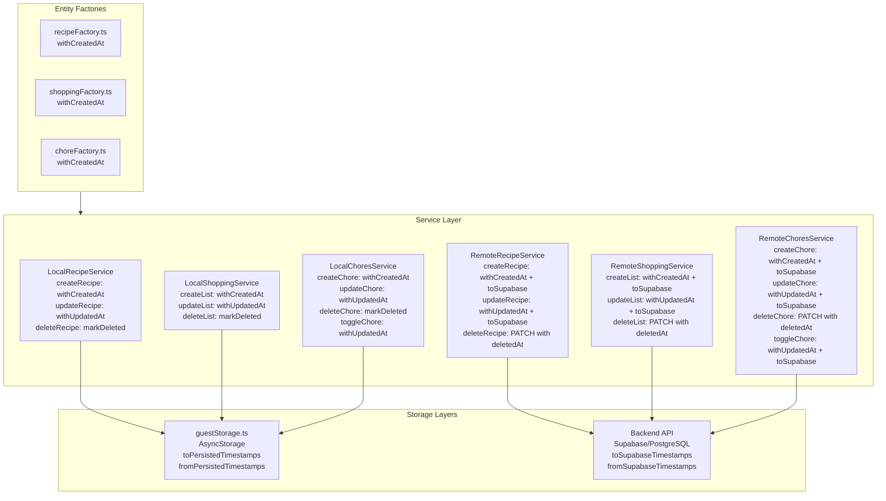

# Service Layer Timestamp Management (Shopping/Recipes/Chores)

## Overview

Update all domain services to consistently set and update timestamps (createdAt/updatedAt/deletedAt) across guest and signed-in modes. Ensure guest mode writes persist timestamps locally, and signed-in mode writes update local cache immediately and sync timestamps correctly.

## Consistency Contract

This section defines the "rules of the road" for timestamp management across all services. **Every service must follow this contract:**

### Timestamp Application Rules

- **Create**: `withCreatedAt()` sets both `createdAt` and `updatedAt` (factory handles this)
- **Update/Toggle**: `withUpdatedAt()` updates `updatedAt` only (preserves `createdAt`)
- **Delete**: `markDeleted()` sets `deletedAt`, then `withUpdatedAt()` updates `updatedAt` (preserves `createdAt`)

### Persistence Rules

- **Guest Mode Persist**: Use `toPersistedTimestamps()` before saving to AsyncStorage (Date → ISO string)
- **Guest Mode Hydrate**: Use `fromPersistedTimestamps()` after reading from AsyncStorage (ISO string → Date)
- **Remote Payloads**: Use `toSupabaseTimestamps()` before sending to API (Date → ISO, camelCase → snake_case)
- **Remote Responses**: Use `fromSupabaseTimestamps()` after receiving from API (ISO → Date, snake_case → camelCase)

### Timestamp Authority

**Server is the authority for signed-in canonical timestamps:**
- Backend Prisma auto-manages `createdAt` and `updatedAt` on database writes
- Backend sets `deletedAt` in soft-delete operations
- Server timestamps are the source of truth for signed-in entities

**Client still sets timestamps for:**
- **Optimistic UI updates**: Immediate feedback before server response
- **Offline queue events**: Deterministic ordering when queuing operations
- **Deterministic merges/conflicts**: Consistent conflict resolution logic

**Timestamp resolution:**
- When server response returns, **overwrite client timestamps with server values**
- This prevents long-term drift ("client time vs server time" bugs)
- Client timestamps are temporary until server confirms

## Current State Analysis

### ✅ Already Implemented

1. **Timestamp Helpers** (`mobile/src/common/utils/timestamps.ts`):
   - `withCreatedAt()` - Auto-populates createdAt on creation
   - `withUpdatedAt()` - Always updates updatedAt on modification
   - `markDeleted()` - Sets deletedAt for soft-delete
   - `toSupabaseTimestamps()` / `fromSupabaseTimestamps()` - Serialization helpers

2. **Factories**:
   - `recipeFactory.ts` - Uses `withCreatedAt()` ✅
   - `shoppingFactory.ts` - Uses `withCreatedAt()` ✅
   - `choreFactory.ts` - Uses `withCreatedAt()` ✅

3. **LocalRecipeService**:
   - `createRecipe()` - Uses factory (which applies `withCreatedAt()`) ✅
   - `updateRecipe()` - Uses `withUpdatedAt()` ✅
   - Missing: `deleteRecipe()` method ❌

4. **guestStorage**:
   - Read operations normalize timestamps (ISO → Date) ✅
   - Write operations serialize timestamps (Date → ISO) ✅

5. **Backend Repositories**:
   - Prisma auto-manages `createdAt` and `updatedAt` ✅
   - Soft-delete methods set `deletedAt` ✅

### ❌ Missing Implementation

1. **shoppingService** (`mobile/src/features/shopping/services/shoppingService.ts`):
   - Only has `getShoppingData()` method
   - Missing: `createList()`, `updateList()`, `deleteList()`
   - Missing: `createItem()`, `updateItem()`, `deleteItem()`, `toggleItem()`
   - No timestamp management in any operations

2. **choresService** (`mobile/src/features/chores/services/choresService.ts`):
   - Only has `getChores()` method
   - Missing: `createChore()`, `updateChore()`, `deleteChore()`, `toggleChore()`
   - No timestamp management in any operations

3. **recipeService** (`mobile/src/features/recipes/services/recipeService.ts`):
   - Missing: `deleteRecipe()` method
   - `RemoteRecipeService` doesn't apply timestamps before API calls

4. **Remote Services** (all):
   - Don't apply timestamps before sending to API
   - Don't apply timestamps before cache updates (when cache layer exists)
   - Don't normalize timestamps from API responses

5. **Tests**:
   - No unit tests for service timestamp behavior
   - No tests for create/update/delete timestamp consistency

## Architecture



## Implementation Steps

### 1. Update recipeService

**File**: [`mobile/src/features/recipes/services/recipeService.ts`](mobile/src/features/recipes/services/recipeService.ts)

#### 1a. Add deleteRecipe() to IRecipeService interface

```typescript
export interface IRecipeService {
    getRecipes(): Promise<Recipe[]>;
    createRecipe(recipe: Partial<Recipe>): Promise<Recipe>;
    updateRecipe(recipeId: string, updates: Partial<Recipe>): Promise<Recipe>;
    deleteRecipe(recipeId: string): Promise<void>; // NEW
}
```

#### 1b. Implement deleteRecipe() in LocalRecipeService

```typescript
async deleteRecipe(recipeId: string): Promise<void> {
    // Business rule: soft-delete (tombstone pattern)
    let retries = MAX_RETRIES;
    while (retries > 0) {
        try {
            const existingRecipes = await guestStorage.getRecipes();
            const recipeIndex = existingRecipes.findIndex(r => r.id === recipeId || r.localId === recipeId);
            
            if (recipeIndex === -1) {
                throw new Error(`Recipe not found: ${recipeId}`);
            }

            // Business rule: mark as deleted, preserve tombstone
            const deletedRecipe = markDeleted(existingRecipes[recipeIndex]);
            // Also update updatedAt on delete
            const withTimestamps = withUpdatedAt(deletedRecipe);
            
            const updatedRecipes = [...existingRecipes];
            updatedRecipes[recipeIndex] = withTimestamps;
            await guestStorage.saveRecipes(updatedRecipes);
            return;
        } catch (error) {
            // ... retry logic
        }
    }
}
```

#### 1c. Update RemoteRecipeService to apply timestamps

```typescript
async createRecipe(recipe: Partial<Recipe>): Promise<Recipe> {
    // Apply timestamp for optimistic UI and offline queue
    const withTimestamps = withCreatedAt(recipe as Recipe);
    const payload = toSupabaseTimestamps(withTimestamps);
    const response = await api.post<Recipe>('/recipes', payload);
    // Server is authority: overwrite with server timestamps
    return fromSupabaseTimestamps(response);
}

async updateRecipe(recipeId: string, updates: Partial<Recipe>): Promise<Recipe> {
    // Get existing recipe first (or merge with updates)
    const existing = await this.getRecipes().then(recipes => 
        recipes.find(r => r.id === recipeId)
    );
    if (!existing) {
        throw new Error(`Recipe not found: ${recipeId}`);
    }
    
    // Apply timestamp for optimistic UI and offline queue
    const updated = { ...existing, ...updates };
    const withTimestamps = withUpdatedAt(updated);
    const payload = toSupabaseTimestamps(withTimestamps);
    const response = await api.put<Recipe>(`/recipes/${recipeId}`, payload);
    // Server is authority: overwrite with server timestamps
    return fromSupabaseTimestamps(response);
}

async deleteRecipe(recipeId: string): Promise<void> {
    // Get existing recipe
    const existing = await this.getRecipes().then(recipes => 
        recipes.find(r => r.id === recipeId)
    );
    if (!existing) {
        throw new Error(`Recipe not found: ${recipeId}`);
    }
    
    // Apply timestamp for optimistic UI and offline queue
    const deleted = markDeleted(existing);
    const withTimestamps = withUpdatedAt(deleted);
    const payload = toSupabaseTimestamps(withTimestamps);
    
    // Use PATCH instead of DELETE with body (more compatible)
    // Alternative: POST /recipes/:id/delete if backend supports it
    await api.patch(`/recipes/${recipeId}`, { deleted_at: payload.deleted_at });
}
```

#### 1d. Normalize timestamps in getRecipes()

```typescript
async getRecipes(): Promise<Recipe[]> {
    const response = await api.get<Recipe[]>('/recipes');
    // Normalize timestamps from API response (server is authority)
    return response.map(fromSupabaseTimestamps);
}
```

### 2. Update shoppingService

**File**: [`mobile/src/features/shopping/services/shoppingService.ts`](mobile/src/features/shopping/services/shoppingService.ts)

**Note on Scope**: The current UI flows primarily use direct API calls in `ShoppingListsScreen.tsx`. This implementation adds service-layer CRUD methods for consistency and future use. If certain operations aren't immediately needed, they can be stubbed with basic implementations and expanded later.

#### 2a. Extend IShoppingService interface

```typescript
export interface IShoppingService {
    getShoppingData(): Promise<ShoppingData>;
    // NEW methods
    createList(list: Partial<ShoppingList>): Promise<ShoppingList>;
    updateList(listId: string, updates: Partial<ShoppingList>): Promise<ShoppingList>;
    deleteList(listId: string): Promise<void>;
    createItem(item: Partial<ShoppingItem>): Promise<ShoppingItem>;
    updateItem(itemId: string, updates: Partial<ShoppingItem>): Promise<ShoppingItem>;
    deleteItem(itemId: string): Promise<void>;
    toggleItem(itemId: string): Promise<ShoppingItem>;
}
```

#### 2b. Implement LocalShoppingService methods

```typescript
async createList(list: Partial<ShoppingList>): Promise<ShoppingList> {
    const newList = createShoppingList(
        list.name || 'New List',
        list.icon || DEFAULT_LIST_ICON,
        list.color || DEFAULT_LIST_COLOR
    );
    
    const existingLists = await guestStorage.getShoppingLists();
    await guestStorage.saveShoppingLists([...existingLists, newList]);
    return newList;
}

async updateList(listId: string, updates: Partial<ShoppingList>): Promise<ShoppingList> {
    const existingLists = await guestStorage.getShoppingLists();
    const listIndex = existingLists.findIndex(l => l.id === listId || l.localId === listId);
    
    if (listIndex === -1) {
        throw new Error(`Shopping list not found: ${listId}`);
    }
    
    const updated = { ...existingLists[listIndex], ...updates };
    const withTimestamps = withUpdatedAt(updated);
    
    const updatedLists = [...existingLists];
    updatedLists[listIndex] = withTimestamps;
    await guestStorage.saveShoppingLists(updatedLists);
    return withTimestamps;
}

async deleteList(listId: string): Promise<void> {
    const existingLists = await guestStorage.getShoppingLists();
    const listIndex = existingLists.findIndex(l => l.id === listId || l.localId === listId);
    
    if (listIndex === -1) {
        throw new Error(`Shopping list not found: ${listId}`);
    }
    
    const deleted = markDeleted(existingLists[listIndex]);
    const withTimestamps = withUpdatedAt(deleted);
    const updatedLists = [...existingLists];
    updatedLists[listIndex] = withTimestamps;
    await guestStorage.saveShoppingLists(updatedLists);
}

async createItem(item: Partial<ShoppingItem>): Promise<ShoppingItem> {
    if (!item.listId) {
        throw new Error('Shopping item must have a listId');
    }
    
    const newItem = createShoppingItem(
        item as GroceryItem,
        item.listId,
        item.quantity || 1
    );
    
    const existingItems = await guestStorage.getShoppingItems();
    await guestStorage.saveShoppingItems([...existingItems, newItem]);
    return newItem;
}

async updateItem(itemId: string, updates: Partial<ShoppingItem>): Promise<ShoppingItem> {
    const existingItems = await guestStorage.getShoppingItems();
    const itemIndex = existingItems.findIndex(i => i.id === itemId || i.localId === itemId);
    
    if (itemIndex === -1) {
        throw new Error(`Shopping item not found: ${itemId}`);
    }
    
    const updated = { ...existingItems[itemIndex], ...updates };
    const withTimestamps = withUpdatedAt(updated);
    
    const updatedItems = [...existingItems];
    updatedItems[itemIndex] = withTimestamps;
    await guestStorage.saveShoppingItems(updatedItems);
    return withTimestamps;
}

async deleteItem(itemId: string): Promise<void> {
    const existingItems = await guestStorage.getShoppingItems();
    const itemIndex = existingItems.findIndex(i => i.id === itemId || i.localId === itemId);
    
    if (itemIndex === -1) {
        throw new Error(`Shopping item not found: ${itemId}`);
    }
    
    const deleted = markDeleted(existingItems[itemIndex]);
    const withTimestamps = withUpdatedAt(deleted);
    const updatedItems = [...existingItems];
    updatedItems[itemIndex] = withTimestamps;
    await guestStorage.saveShoppingItems(updatedItems);
}

async toggleItem(itemId: string): Promise<ShoppingItem> {
    const existingItems = await guestStorage.getShoppingItems();
    const itemIndex = existingItems.findIndex(i => i.id === itemId || i.localId === itemId);
    
    if (itemIndex === -1) {
        throw new Error(`Shopping item not found: ${itemId}`);
    }
    
    const updated = { 
        ...existingItems[itemIndex], 
        isChecked: !existingItems[itemIndex].isChecked 
    };
    const withTimestamps = withUpdatedAt(updated);
    
    const updatedItems = [...existingItems];
    updatedItems[itemIndex] = withTimestamps;
    await guestStorage.saveShoppingItems(updatedItems);
    return withTimestamps;
}
```

#### 2c. Implement RemoteShoppingService methods

Similar pattern to RemoteRecipeService:
- Apply `withCreatedAt()` / `withUpdatedAt()` / `markDeleted()` before API calls
- Use `toSupabaseTimestamps()` for request payloads
- Use `fromSupabaseTimestamps()` for response normalization
- Use PATCH for delete operations (not DELETE with body)
- Overwrite client timestamps with server response values

### 3. Update choresService

**File**: [`mobile/src/features/chores/services/choresService.ts`](mobile/src/features/chores/services/choresService.ts)

**Note on Scope**: Similar to shopping, implement CRUD methods for consistency. Current UI may use direct API calls, but service layer provides unified interface.

#### 3a. Extend IChoresService interface

```typescript
export interface IChoresService {
    getChores(): Promise<Chore[]>;
    // NEW methods
    createChore(chore: Partial<Chore>): Promise<Chore>;
    updateChore(choreId: string, updates: Partial<Chore>): Promise<Chore>;
    deleteChore(choreId: string): Promise<void>;
    toggleChore(choreId: string): Promise<Chore>;
}
```

#### 3b. Implement LocalChoresService methods

Similar pattern to LocalShoppingService:
- Use `createChore()` factory (already applies `withCreatedAt()`)
- Use `withUpdatedAt()` for updates and toggles
- Use `markDeleted()` then `withUpdatedAt()` for deletes
- Persist to guestStorage (need to add `guestStorage.getChores()` / `saveChores()`)

#### 3c. Implement RemoteChoresService methods

Similar pattern to RemoteRecipeService:
- Apply timestamps before API calls
- Use `toSupabaseTimestamps()` / `fromSupabaseTimestamps()`
- Use PATCH for delete operations
- Overwrite client timestamps with server response values

### 4. Add guestStorage methods for chores

**File**: [`mobile/src/common/utils/guestStorage.ts`](mobile/src/common/utils/guestStorage.ts)

Add `getChores()` and `saveChores()` methods following the same pattern as recipes/shopping:
- Use `fromPersistedTimestamps()` on read
- Use `toPersistedTimestamps()` on write
- Validate chore data

### 5. Add comprehensive unit tests

**Files to create/update**:
- [`mobile/src/features/recipes/services/__tests__/recipeService.test.ts`](mobile/src/features/recipes/services/__tests__/recipeService.test.ts)
- [`mobile/src/features/shopping/services/__tests__/shoppingService.test.ts`](mobile/src/features/shopping/services/__tests__/shoppingService.test.ts)
- [`mobile/src/features/chores/services/__tests__/choresService.test.ts`](mobile/src/features/chores/services/__tests__/choresService.test.ts)

**Test coverage**:

For each service (Local and Remote), test:

1. **Create operations**:
   - `createdAt` is populated
   - `updatedAt` is populated (same as createdAt on create)
   - Timestamps are Date objects in memory
   - Timestamps are ISO strings when persisted/sent

2. **Update operations**:
   - `updatedAt` is updated
   - `createdAt` is preserved
   - Timestamps are Date objects in memory
   - Timestamps are ISO strings when persisted/sent

3. **Delete operations**:
   - `deletedAt` is set
   - `updatedAt` is updated
   - `createdAt` is preserved (tombstone)
   - Timestamps are Date objects in memory
   - Timestamps are ISO strings when persisted/sent

4. **Toggle operations** (shopping items, chores):
   - `updatedAt` is updated
   - `createdAt` is preserved
   - Other fields are updated correctly

5. **Mode consistency**:
   - Guest mode: timestamps written to AsyncStorage
   - Signed-in mode: timestamps applied before API calls
   - Signed-in mode: timestamps normalized from API responses
   - Signed-in mode: server timestamps overwrite client timestamps

6. **Timestamp authority**:
   - Remote service responses overwrite client-set timestamps
   - Server timestamps are used as source of truth

## Files to Modify

### Mobile Services

1. [`mobile/src/features/recipes/services/recipeService.ts`](mobile/src/features/recipes/services/recipeService.ts)
   - Add `deleteRecipe()` to interface and both implementations
   - Update `RemoteRecipeService` to apply timestamps
   - Normalize timestamps in `getRecipes()`
   - Use PATCH for delete (not DELETE with body)

2. [`mobile/src/features/shopping/services/shoppingService.ts`](mobile/src/features/shopping/services/shoppingService.ts)
   - Extend interface with CRUD methods
   - Implement all methods in `LocalShoppingService`
   - Implement all methods in `RemoteShoppingService`

3. [`mobile/src/features/chores/services/choresService.ts`](mobile/src/features/chores/services/choresService.ts)
   - Extend interface with CRUD methods
   - Implement all methods in `LocalChoresService`
   - Implement all methods in `RemoteChoresService`

4. [`mobile/src/common/utils/guestStorage.ts`](mobile/src/common/utils/guestStorage.ts)
   - Add `getChores()` and `saveChores()` methods

### Test Files

5. [`mobile/src/features/recipes/services/__tests__/recipeService.test.ts`](mobile/src/features/recipes/services/__tests__/recipeService.test.ts) (NEW)
6. [`mobile/src/features/shopping/services/__tests__/shoppingService.test.ts`](mobile/src/features/shopping/services/__tests__/shoppingService.test.ts) (NEW)
7. [`mobile/src/features/chores/services/__tests__/choresService.test.ts`](mobile/src/features/chores/services/__tests__/choresService.test.ts) (NEW)

## Success Criteria

✅ **shoppingService timestamp consistency**:
- `createList()` / `createItem()` set `createdAt` + `updatedAt`
- `updateList()` / `updateItem()` / `toggleItem()` set `updatedAt`
- `deleteList()` / `deleteItem()` set `deletedAt` + `updatedAt`
- Guest mode writes persist timestamps to AsyncStorage
- Signed-in mode applies timestamps before API calls and normalizes responses
- Signed-in mode overwrites client timestamps with server values

✅ **recipeService timestamp consistency**:
- `createRecipe()` sets `createdAt` + `updatedAt` (via factory)
- `updateRecipe()` sets `updatedAt`
- `deleteRecipe()` sets `deletedAt` + `updatedAt`
- Guest mode writes persist timestamps to AsyncStorage
- Signed-in mode applies timestamps before API calls and normalizes responses
- Signed-in mode overwrites client timestamps with server values

✅ **choresService timestamp consistency**:
- `createChore()` sets `createdAt` + `updatedAt` (via factory)
- `updateChore()` / `toggleChore()` sets `updatedAt`
- `deleteChore()` sets `deletedAt` + `updatedAt`
- Guest mode writes persist timestamps to AsyncStorage
- Signed-in mode applies timestamps before API calls and normalizes responses
- Signed-in mode overwrites client timestamps with server values

✅ **No timestamp logic duplication**:
- All services use shared helpers (`withCreatedAt`, `withUpdatedAt`, `markDeleted`)
- All services use shared serialization helpers (`toSupabaseTimestamps`, `fromSupabaseTimestamps`)
- Consistent patterns across all services
- Consistency contract is followed by all implementations

✅ **Comprehensive test coverage**:
- Unit tests for all create/update/delete operations
- Tests verify timestamp values and types
- Tests cover both guest and signed-in modes
- Tests verify server timestamp authority
- Parameterized tests for edge cases

## Design Decisions

### 1. Timestamp Application Order

**Guest Mode**:
1. Apply business logic helpers (`withCreatedAt`, `withUpdatedAt`, `markDeleted`)
2. Save to AsyncStorage (which serializes Date → ISO)

**Signed-In Mode**:
1. Apply business logic helpers (for optimistic UI and offline queue)
2. Serialize with `toSupabaseTimestamps()` (Date → ISO, camelCase → snake_case)
3. Send to API
4. Normalize response with `fromSupabaseTimestamps()` (ISO → Date, snake_case → camelCase)
5. **Overwrite client timestamps with server values** (server is authority)

### 2. Timestamp Authority

**Server is the authority for signed-in canonical timestamps:**
- Backend Prisma auto-manages `createdAt` and `updatedAt` on database writes
- Backend sets `deletedAt` in soft-delete operations
- Server timestamps are the source of truth for signed-in entities

**Client still sets timestamps for:**
- **Optimistic UI updates**: Immediate feedback before server response
- **Offline queue events**: Deterministic ordering when queuing operations
- **Deterministic merges/conflicts**: Consistent conflict resolution logic

**Timestamp resolution:**
- When server response returns, **overwrite client timestamps with server values**
- This prevents long-term drift ("client time vs server time" bugs)
- Client timestamps are temporary until server confirms

### 3. Delete Operations in Remote Services

**Use PATCH instead of DELETE with body:**
- Many HTTP clients/backends don't accept a body on DELETE consistently
- Safer pattern: `PATCH /recipes/:id` with `{ deleted_at: ... }`
- Alternative: `POST /recipes/:id/delete` with tombstone payload (if backend supports it)
- Plan keeps it abstract, but implementation should use PATCH pattern

### 4. Toggle Operations

Toggle operations (like `toggleItem()`, `toggleChore()`) are treated as updates:
- Use `withUpdatedAt()` to update timestamp
- Preserve `createdAt`
- Don't set `deletedAt`

### 5. Error Handling

All service methods should:
- Validate entity exists before update/delete
- Throw descriptive errors for not found cases
- Preserve existing retry logic where applicable

### 6. CRUD Scope Considerations

**Shopping/Chores CRUD scope:**
- Current UI flows may use direct API calls in screens
- Service layer CRUD methods provide consistency and future-proofing
- If certain operations aren't immediately needed:
  - Implement only operations used by current UI flows first
  - Leave stubs for the rest with basic implementations
  - Expand as needed
- This plan implements full CRUD for consistency, but can be phased if needed

### 7. Backend Compatibility

Backend already handles timestamps via Prisma:
- `createdAt` and `updatedAt` are auto-managed
- `deletedAt` is set manually in soft-delete operations
- Mobile services apply timestamps for:
  - Immediate local cache updates (when cache layer exists)
  - Offline queue operations (when offline sync exists)
  - Consistency with guest mode behavior
  - **But always defer to server timestamps when available**
