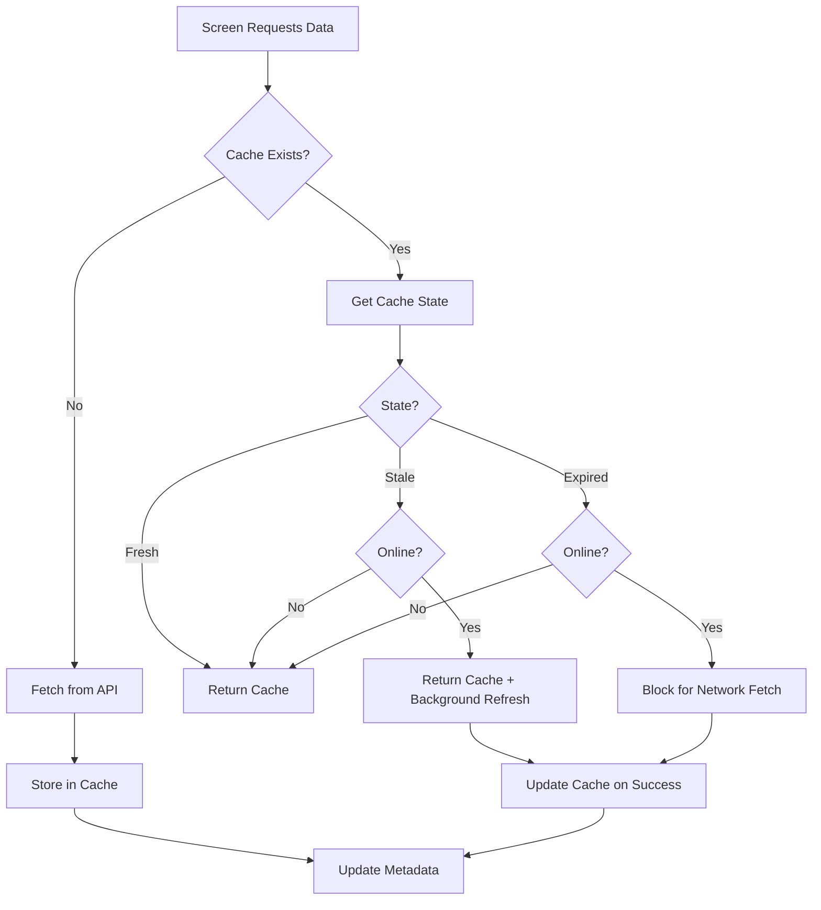

# Cache-First + Background Refresh Strategy Specification

**Epic:** Signed-In Cache and Offline Sync  
**Created:** 2026-01-25  
**Status:** Planning

## Overview

Define the cache-first + background refresh strategy for signed-in users, including TTL definitions, stale detection rules, and cache metadata structure. This specification will guide the implementation of an offline-first caching layer.

## Current State Analysis

### ✅ Already Implemented

1. **Cache Storage Infrastructure**:
   - Signed-in cache keys: `@kitchen_hub_cache_*` (defined in `mobile/src/common/storage/dataModeStorage.ts`)
   - Storage utilities: `getSignedInCacheKey()`, `validateSignedInCacheKey()`
   - Entity types: `recipes`, `shoppingLists`, `shoppingItems`, `chores`

2. **Sync Infrastructure**:
   - `applyRemoteUpdatesToLocal()` in `mobile/src/common/utils/syncApplication.ts`
   - Conflict resolution: `mergeEntityArrays()` using LWW + tombstone rules
   - Entity timestamps: `updatedAt`, `createdAt`, `deletedAt` tracked on all entities

3. **Network Status Detection**:
   - `NetworkContext` with `isOffline`, `isConnected`, `isInternetReachable`
   - API client checks network status before requests (`mobile/src/services/api.ts`)

4. **Service Layer**:
   - Remote services: `RemoteRecipeService`, `RemoteShoppingService`, `RemoteChoresService`
   - All services currently fetch directly from API (no cache layer)

### ❌ Missing Implementation

1. **Cache Metadata Tracking**:
   - No `lastSyncedAt` timestamp per entity type
   - No TTL tracking
   - No stale detection logic

2. **Cache-First Strategy**:
   - Services always fetch from API (no cache reads)
   - No background refresh mechanism
   - No cache invalidation on writes

3. **TTL and Stale Rules**:
   - No TTL definitions
   - No stale detection rules
   - No cache expiration logic

## Cache Metadata Structure

### Simple Metadata Model

Each entity type tracks a single timestamp:

```typescript
interface CacheMetadata {
  lastSyncedAt: string; // ISO 8601 timestamp
}
```

**Storage Key Pattern**: `@kitchen_hub_cache_meta_${entityType}`

**Entity Types**: `recipes`, `shoppingLists`, `shoppingItems`, `chores`

**Rationale**: Keep metadata minimal. Only track when data was last synced. Additional fields (version, etag, etc.) can be added later if needed.

## Cache State Model

### Three Cache States

Cache age is calculated as: `currentTime - lastSyncedAt`

#### 1. Fresh (age ≤ staleThreshold)

- **Behavior**: Return cache immediately, no refresh needed
- **Rationale**: Data is recent enough to trust without verification

#### 2. Stale (staleThreshold < age ≤ TTL)

- **Behavior**: Return cache immediately + refresh in background if online
- **Rationale**: Data may be outdated, but acceptable to show while refreshing
- **Network**: Only refresh if online; if offline, use cache as-is

#### 3. Expired (age > TTL)

- **Behavior**: **UX Decision Required** (see below)
- **Rationale**: Data is too old to trust without verification

### Expired Cache UX Decision

When cache is expired, we need to decide:

**Option A: Block for Network** (Recommended for initial implementation)
- If online: Wait for network fetch, show loading state
- If offline: Return cached data (better than nothing)

**Option B: Show Cached with Warning**
- Return cached data immediately
- Show subtle indicator that data may be outdated
- Refresh in background

**Decision**: **Option A** - Block for network when expired and online. This ensures users see current data when possible, while still supporting offline mode.

## TTL Definitions (Initial Defaults)

### Entity-Specific TTLs

These are **initial defaults** and will be tuned based on:
- User behavior patterns
- Network usage analytics
- Cache hit/miss rates
- Refresh frequency

| Entity Type | Stale Threshold | TTL | Rationale |
|------------|-----------------|-----|------------|
| `recipes` | 5 minutes | 10 minutes | Recipes change infrequently, but users may edit |
| `shoppingLists` | 2 minutes | 5 minutes | Shopping lists change more frequently |
| `shoppingItems` | 1 minute | 3 minutes | Items are checked/unchecked frequently (may be too aggressive - starting point) |
| `chores` | 2 minutes | 5 minutes | Chores are completed/updated regularly |

**Note**: Shopping items at 1 minute TTL may cause frequent refreshes. This is a starting point and should be monitored/tuned.

### TTL Configuration Structure

```typescript
type SyncEntityType = 'recipes' | 'shoppingLists' | 'shoppingItems' | 'chores';

interface CacheTTLConfig {
  staleThreshold: number; // milliseconds - when to start background refresh
  ttl: number; // milliseconds - when cache is considered expired
}

const CACHE_TTL_CONFIG: Record<SyncEntityType, CacheTTLConfig> = {
  recipes: { 
    staleThreshold: 5 * 60 * 1000,  // 5 minutes
    ttl: 10 * 60 * 1000                // 10 minutes
  },
  shoppingLists: { 
    staleThreshold: 2 * 60 * 1000,    // 2 minutes
    ttl: 5 * 60 * 1000                 // 5 minutes
  },
  shoppingItems: { 
    staleThreshold: 1 * 60 * 1000,    // 1 minute
    ttl: 3 * 60 * 1000                 // 3 minutes
  },
  chores: { 
    staleThreshold: 2 * 60 * 1000,     // 2 minutes
    ttl: 5 * 60 * 1000                 // 5 minutes
  },
};
```

## Stale Detection Rules

### Rule 1: Time-Based State Classification

Cache state is determined by age relative to thresholds:

```typescript
function getCacheState(entityType: SyncEntityType, lastSyncedAt: string): 'fresh' | 'stale' | 'expired' {
  const age = Date.now() - new Date(lastSyncedAt).getTime();
  const config = CACHE_TTL_CONFIG[entityType];
  
  if (age <= config.staleThreshold) return 'fresh';
  if (age <= config.ttl) return 'stale';
  return 'expired';
}
```

### Rule 2: Network-Aware Behavior

- **Online + Fresh**: Use cache, no refresh
- **Online + Stale**: Use cache immediately, refresh in background
- **Online + Expired**: Block for network fetch (show loading)
- **Offline**: Always use cache (regardless of state)

### Rule 3: Write-Invalidation

After any write operation (create/update/delete):
- Update `lastSyncedAt` to current time (mark as fresh)
- Trigger background sync if online
- Cache is immediately considered fresh after write

### Rule 4: App Lifecycle Refresh

On app foreground:
- Check cache state for all entity types
- If stale and online: trigger background refresh
- If expired and online: trigger foreground refresh (blocking)

## Cache-First Flow



## Background Refresh Strategy

### Principles

1. **Immediate Response**: Always return cached data if available (even if stale/expired when offline)
2. **Background Refresh**: Refresh happens asynchronously, never blocks UI
3. **Offline Mode**: Use cache only, no refresh attempts
4. **Write-Through**: Writes update cache immediately and trigger background sync

### Refresh Triggers

1. **Stale Cache + Online**: Automatic background refresh
2. **App Foreground**: Check and refresh stale caches
3. **After Write**: Refresh affected entity type
4. **Manual Refresh**: User-initiated pull-to-refresh

## Success Criteria

1. ✅ Cache metadata structure defined (lastSyncedAt per entity type)
2. ✅ TTL and stale thresholds defined as initial defaults
3. ✅ Cache state model documented (Fresh/Stale/Expired)
4. ✅ Stale detection rules specified
5. ✅ Expired cache UX decision made
6. ✅ Background refresh strategy defined
7. ✅ All entity types have TTL configuration

## Out of Scope (Future Enhancements)

1. **Backend ETag Support**: Add ETag headers for conditional requests
2. **Incremental Sync**: Only fetch changed entities
3. **Cache Size Limits**: Implement LRU eviction
4. **Cache Compression**: Compress large cached data
5. **Analytics**: Track cache hit rates and refresh frequency
6. **Version Tracking**: Add version/etag to metadata if needed

## Related Plans

- **Implementation Plan**: `signed-in-cache-implementation.md` - Detailed implementation steps
