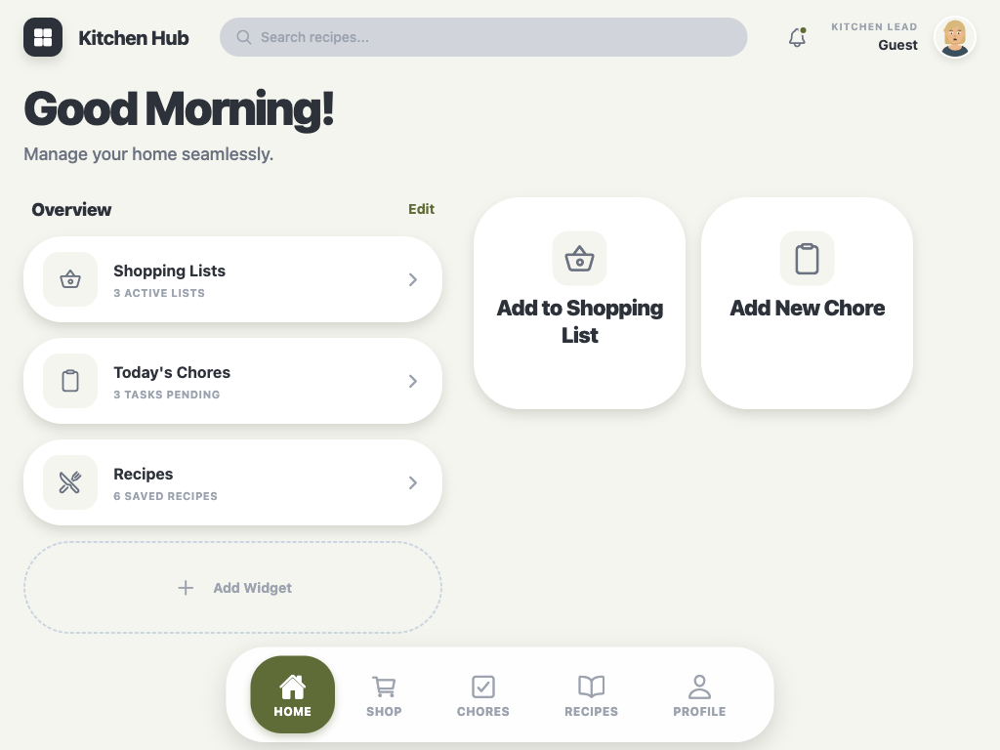

# Kitchen Hub 🏠

> A comprehensive household management app for shopping lists, recipes, and chores

  

## What is Kitchen Hub?

Kitchen Hub is a React Native mobile app built with Expo that simplifies household management. Organize shopping lists with a 111-item grocery database, discover and create recipes, track chores, and get a unified dashboard view—all with support for Google sign-in or guest mode.

## Screenshots

<table>
  <tr>
    <td></td>
    <td></td>
    <td></td>
  </tr>
</table>

## Features

- **🛒 Shopping Lists** - Multi-list management with 111-item grocery database, smart search, and category browsing
- **🍳 Recipes** - Discover, create, and organize recipes with ingredient-to-shopping list integration
- **✅ Chores** - Task tracking with progress visualization and assignee management
- **🏠 Dashboard** - Quick overview with time-based greeting and action widgets
- **👤 Authentication** - Google sign-in and guest mode with profile management
- **⚙️ Settings** - Manage notifications, household members, and app preferences

## Tech Stack

- **Framework**: React Native 0.81.5 with Expo SDK 54
- **Language**: TypeScript (strict mode)
- **Navigation**: React Navigation (drawer, native stack)
- **State Management**: React Context, AsyncStorage
- **UI**: React Native Paper, Expo Vector Icons
- **Animation**: React Native Reanimated, Gesture Handler
- **Utilities**: DayJS, Lucide React

## Quick Start

```bash
# Install dependencies
npm install

# Start development server
npm start

# Run on specific platform
npm run ios       # iOS simulator
npm run android   # Android emulator
npm run web       # Web browser
```

## Project Structure

```
kitchen-hub/
├── src/
│   ├── features/       # Feature modules (shopping, recipes, chores, etc.)
│   ├── common/         # Shared components and utilities
│   ├── navigation/     # Navigation configuration
│   ├── contexts/       # React contexts (Auth, Household)
│   ├── theme/          # Design tokens (colors, spacing, typography)
│   └── data/           # Grocery database
├── docs/               # Feature documentation and screenshots
└── app.json            # Expo configuration
```

Kitchen Hub follows a **feature-based architecture** where each feature (shopping, recipes, chores) is self-contained with its own components, screens, styles, and hooks.

## Documentation

- **[📖 Detailed Documentation](README-DETAILED.md)** - Comprehensive guide with architecture, development guidelines, and troubleshooting
- **[📁 Feature Docs](docs/features/)** - In-depth documentation for each feature
- **[🤖 CLAUDE.md](CLAUDE.md)** - Development guidance for AI assistants

## Development

See [CLAUDE.md](CLAUDE.md) for detailed development guidelines including:
- Feature-based structure rules
- Component organization
- Import path conventions
- Theme system usage

## License

Private repository - All rights reserved.

---

Built with ❤️ using React Native and Expo
