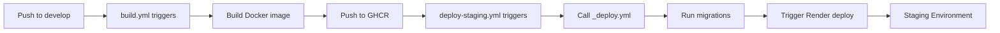
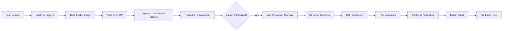

# Deployment Guide

This guide covers deploying the Kitchen Hub backend API to production.

## Prerequisites

- ✅ Production Dockerfile (already exists)
- ✅ Production environment variables configured
- ✅ Database migrations ready
- ✅ Production database accessible
- ✅ Docker or container orchestration platform (Docker, Kubernetes, etc.)

---

## Quick Start: Local Development

**You can deploy locally right now!**

```bash
cd backend

# 1. Ensure .env is configured (already done)
# 2. Start services
docker-compose up -d

# 3. Run migrations
docker-compose exec backend npx prisma migrate deploy --schema=src/infrastructure/database/prisma/schema.prisma

# 4. Verify it's running
curl http://localhost:3000/api/version
```

**That's it!** Your backend is running locally at `http://localhost:3000`.

---

## Automated Staging Deployment

The staging environment is automatically deployed when code is merged to the `develop` branch via GitHub Actions.

### How It Works

1. **Build Workflow** (`.github/workflows/build.yml`):
   - Triggers on pushes to `develop` branch
   - Builds Docker image and pushes to GHCR with tag `develop-latest`
   - Creates images tagged with `develop-SHA` and `develop-latest`

2. **Staging Deployment Workflow** (`.github/workflows/deploy-staging.yml`):
   - Triggers on pushes to `develop` branch (runs independently, assumes image exists from `build.yml`)
   - Calls reusable `_deploy.yml` workflow with:
     - `environment: staging`
     - `deploy_target: render`
     - `image_tag: develop-latest`
   - Automatically runs database migrations
   - Triggers Render deployment via deploy hook
   - Optionally performs health checks

### Prerequisites

Before automated staging deployment can work, you need to configure GitHub secrets:

#### Required GitHub Secrets

1. **`RENDER_DEPLOY_HOOK_URL_STAGING`**:
   - Get this from Render Dashboard → Your Staging Service → Settings → Deploy Hook
   - Copy the deploy hook URL
   - Add to GitHub: Repository Settings → Secrets and variables → Actions → New repository secret

2. **`STAGING_DATABASE_URL`** (Optional, for migrations):
   - Staging database connection URL (pooled connection)
   - Used for running migrations before deployment
   - Add to GitHub secrets if you want automated migrations

3. **`STAGING_DIRECT_URL`** (Optional, for migrations):
   - Direct staging database connection URL
   - Preferred over `STAGING_DATABASE_URL` for migrations
   - Add to GitHub secrets if you want automated migrations

#### Setting Up Render Deploy Hook

1. **In Render Dashboard**:
   - Navigate to your staging service
   - Go to Settings → Deploy Hook
   - Copy the deploy hook URL (looks like `https://api.render.com/deploy/srv-xxx?key=yyy`)

2. **In GitHub**:
   - Go to your repository → Settings → Secrets and variables → Actions
   - Click "New repository secret"
   - Name: `RENDER_DEPLOY_HOOK_URL_STAGING`
   - Value: Paste the deploy hook URL
   - Click "Add secret"

### Deployment Flow



### What Happens During Deployment

1. **Migrations Job**:
   - Pulls Docker image from GHCR (`develop-latest`)
   - Runs Prisma migrations using `STAGING_DIRECT_URL` or `STAGING_DATABASE_URL`
   - Ensures database schema is up-to-date

2. **Deploy Job**:
   - Validates deployment configuration
   - Triggers Render deployment via deploy hook
   - Render pulls the latest `develop-latest` image from GHCR
   - Render starts the new container with updated code

3. **Health Check Job** (if `service_url` is provided):
   - Waits for service to become healthy
   - Checks `/api/version` endpoint
   - Verifies deployment success
   - **Note**: Currently disabled in `deploy-staging.yml` (service_url not set). To enable, add `service_url` input with your staging service URL.

### Monitoring Deployments

- **GitHub Actions**: Check `.github/workflows/deploy-staging.yml` runs in Actions tab
- **Render Dashboard**: Monitor deployment status in Render dashboard
- **Logs**: View deployment logs in Render dashboard or GitHub Actions logs

### Troubleshooting Staging Deployments

**Deployment doesn't trigger:**
- Verify you pushed to `develop` branch
- Check path filters: workflow only triggers on `backend/**` changes
- Verify workflow file exists: `.github/workflows/deploy-staging.yml`

**Render deployment fails:**
- Verify `RENDER_DEPLOY_HOOK_URL_STAGING` secret is set correctly
- Check Render dashboard for deployment errors
- Verify Render service is configured to use GHCR image: `ghcr.io/YOUR_USERNAME/kitchen-hub-api:develop-latest`

**Migrations fail:**
- Verify `STAGING_DIRECT_URL` or `STAGING_DATABASE_URL` secrets are set
- Check database connection string is correct
- Verify database is accessible from GitHub Actions runners

**Health check fails:**
- Verify staging service URL is correct (if `service_url` is configured)
- Check application is running and accessible
- Review application logs in Render dashboard

### Manual Staging Deployment

If you need to manually trigger a staging deployment:

1. **Via GitHub Actions**:
   - Go to Actions → Deploy to Staging
   - Click "Run workflow" → Select `develop` branch → Run workflow

2. **Via Render Dashboard**:
   - Go to your staging service
   - Click "Manual Deploy" → Select commit → Deploy

---

## Automated Production Deployment

The production environment is automatically deployed when code is merged to the `main` branch via GitHub Actions, with manual approval protection via GitHub Environments.

### How It Works

1. **Build Workflow** (`.github/workflows/build.yml`):
   - Triggers on pushes to `main` branch
   - Builds Docker image and pushes to GHCR with tag `main-latest`
   - Creates images tagged with `main-SHA` and `main-latest`

2. **Production Deployment Workflow** (`.github/workflows/deploy-production.yml`):
   - Triggers on pushes to `main` branch (runs independently, assumes image exists from `build.yml`)
   - Calls reusable `_deploy.yml` workflow with:
     - `environment: production`
     - `deploy_target: render`
     - `image_tag: main-latest`
   - **Requires manual approval** before deployment proceeds (via GitHub Environment protection)
   - Automatically runs database migrations after approval
   - Triggers Render deployment via deploy hook
   - Optionally performs health checks

### Prerequisites

Before automated production deployment can work, you need to:

1. **Configure GitHub Environment** (one-time setup):
   - See [GitHub Environment Setup](#github-environment-setup) section below

2. **Configure GitHub Secrets**:
   - See [Required GitHub Secrets](#required-github-secrets-for-production) section below

### GitHub Environment Setup

The production deployment workflow uses GitHub Environments to require manual approval before deployment. Follow these steps to configure it:

#### Step 1: Create Production Environment

1. Go to your repository on GitHub
2. Navigate to **Settings** → **Environments**
3. Click **"New environment"**
4. Name it: `production`
5. Click **"Configure environment"**

#### Step 2: Add Required Reviewers

1. Scroll to **"Deployment protection rules"**
2. Enable **"Required reviewers"**
3. Add 1-6 reviewers (users or teams who can approve deployments)
4. Optionally enable **"Prevent self-review"** to require approval from someone other than the person who triggered the deployment
5. Click **"Save protection rules"**

#### Step 3: Configure Deployment Branches

1. Scroll to **"Deployment branches"**
2. Select **"Selected branches"**
3. Add branch: `main`
4. This ensures only the `main` branch can deploy to production
5. Click **"Save"**

#### Step 4: Environment Secrets (Optional)

You can optionally store production secrets at the environment level instead of repository level:

1. In the production environment settings, scroll to **"Environment secrets"**
2. Click **"Add secret"**
3. Add secrets like `RENDER_DEPLOY_HOOK_URL_PRODUCTION`, `PROD_DATABASE_URL`, etc.
4. These secrets are scoped to the production environment only

### Required GitHub Secrets for Production

#### Required Secrets

1. **`RENDER_DEPLOY_HOOK_URL_PRODUCTION`**:
   - Render deploy hook URL for production service
   - Get from Render Dashboard → Production Service → Settings → Deploy Hook
   - Copy the deploy hook URL
   - Add to GitHub: Repository Settings → Secrets and variables → Actions → New repository secret
   - Or add at Environment level: Repository Settings → Environments → production → Secrets

2. **`PROD_DATABASE_URL`** (for migrations):
   - Production database connection URL (pooled connection)
   - Used for running migrations before deployment
   - Add to GitHub secrets

3. **`PROD_DIRECT_URL`** (for migrations, preferred):
   - Direct production database connection URL
   - Preferred over `PROD_DATABASE_URL` for migrations
   - Add to GitHub secrets

#### Optional Secrets

4. **`PRODUCTION_SERVICE_URL`** (optional, for health checks):
   - Base URL of production service
   - Used for post-deployment health checks
   - Example: `https://api.production.example.com`
   - **Recommended for production**: Health checks verify deployment success before marking as complete
   - If not set, health checks are skipped (workflow will still succeed)
   - To enable: Add this secret, then uncomment `service_url` line in `deploy-production.yml`

### Deployment Flow



### What Happens During Deployment

1. **Workflow Trigger**:
   - When code is pushed to `main`, `deploy-production.yml` triggers
   - Workflow pauses and waits for manual approval

2. **Approval Process**:
   - **Important**: Approval happens before any deployment steps begin (migrations, deployment, health checks)
   - Required reviewers receive email notifications
   - Reviewer goes to GitHub Actions → Workflow run → "Review deployments"
   - Reviewer can approve or reject the deployment
   - If approved, workflow continues with migrations and deployment
   - If rejected, workflow stops immediately and no deployment occurs

3. **Migrations Job** (after approval):
   - Pulls Docker image from GHCR (`main-latest`)
   - Runs Prisma migrations using `PROD_DIRECT_URL` or `PROD_DATABASE_URL`
   - Ensures database schema is up-to-date

4. **Deploy Job**:
   - Validates deployment configuration
   - Triggers Render deployment via deploy hook
   - Render pulls the latest `main-latest` image from GHCR
   - Render starts the new container with updated code

5. **Health Check Job** (if `PRODUCTION_SERVICE_URL` is configured):
   - Waits for service to become healthy
   - Checks `/api/version` endpoint
   - Verifies deployment success
   - **Note**: Health checks are currently disabled by default. To enable, uncomment `service_url` in `deploy-production.yml` and configure `PRODUCTION_SERVICE_URL` secret.

### Manual Production Deployment

You can also manually trigger a production deployment:

1. **Via GitHub Actions**:
   - Go to Actions → Deploy to Production
   - Click "Run workflow"
   - Select `main` branch
   - Optionally specify custom `image_tag` (e.g., `main-abc123def456` for specific commit)
   - Click "Run workflow"
   - Wait for approval prompt
   - Approve deployment when ready

2. **Use Cases for Manual Dispatch**:
   - Deploy specific commit SHA instead of `main-latest`
   - Re-deploy previous version (rollback)
   - Deploy to production outside normal merge flow
   - Emergency deployments

### Monitoring Production Deployments

- **GitHub Actions**: Check `.github/workflows/deploy-production.yml` runs in Actions tab
- **Approval Status**: View pending approvals in the workflow run
- **Render Dashboard**: Monitor deployment status in Render dashboard
- **Logs**: View deployment logs in Render dashboard or GitHub Actions logs

### Troubleshooting Production Deployments

**Deployment doesn't trigger:**
- Verify you pushed to `main` branch
- Check path filters: workflow only triggers on `backend/**` changes
- Verify workflow file exists: `.github/workflows/deploy-production.yml`

**Approval prompt doesn't appear:**
- Verify GitHub Environment "production" is configured
- Check that required reviewers are set up
- Verify job references `environment: production` in workflow file
- Check that you have permission to view the environment

**Render deployment fails:**
- Verify `RENDER_DEPLOY_HOOK_URL_PRODUCTION` secret is set correctly
- Check Render dashboard for deployment errors
- Verify Render service is configured to use GHCR image: `ghcr.io/YOUR_USERNAME/kitchen-hub-api:main-latest`

**Migrations fail:**
- Verify `PROD_DIRECT_URL` or `PROD_DATABASE_URL` secrets are set
- Check database connection string is correct
- Verify database is accessible from GitHub Actions runners
- Ensure database user has migration permissions

**Health check fails:**
- Verify `PRODUCTION_SERVICE_URL` secret is set correctly (if health checks are enabled)
- Check application is running and accessible
- Review application logs in Render dashboard
- Verify `/api/version` endpoint is responding

---

## Production Deployment (Manual)

### Step 1: Prepare Production Environment

1. **Copy production environment template:**
   ```bash
   cp .env.production.example .env.prod
   ```

2. **Generate production JWT secrets** (different from dev!):
   ```bash
   openssl rand -base64 32  # For JWT_SECRET
   openssl rand -base64 32  # For JWT_REFRESH_SECRET
   ```

3. **Fill in production values in `.env.prod`:**
   - Database connection strings (production database)
   - JWT secrets (new ones, not dev secrets!)
   - Supabase production credentials
   - Google OAuth production credentials (if using)

4. **Store secrets securely:**
   - Use your hosting platform's secrets manager
   - Never commit `.env.prod` to git
   - Use environment variables in CI/CD

### Step 2: Get Production Docker Image

#### Option A: Pull from GitHub Container Registry (GHCR) - Recommended

Images are automatically built and pushed to GHCR on every code change. Use these images for production deployments.

**Authenticate to GHCR:**

1. Create a GitHub Personal Access Token (PAT) with `read:packages` scope:
   - Go to GitHub Settings → Developer settings → Personal access tokens → Tokens (classic)
   - Generate new token with `read:packages` permission
   - Copy the token

2. Login to GHCR:
   ```bash
   echo $GITHUB_TOKEN | docker login ghcr.io -u YOUR_GITHUB_USERNAME --password-stdin
   ```

   Or set as environment variable:
   ```bash
   export GITHUB_TOKEN=your_pat_token
   echo $GITHUB_TOKEN | docker login ghcr.io -u YOUR_GITHUB_USERNAME --password-stdin
   ```

**Pull image from GHCR:**

Images are tagged with branch name and commit SHA. For production, use the `main` branch:

```bash
# Pull latest main branch image
docker pull ghcr.io/YOUR_GITHUB_USERNAME/kitchen-hub-api:main-latest

# Or pull specific commit SHA
docker pull ghcr.io/YOUR_GITHUB_USERNAME/kitchen-hub-api:main-abc123def456

# Or pull by SHA only
docker pull ghcr.io/YOUR_GITHUB_USERNAME/kitchen-hub-api:abc123def456
```

**Tag for convenience:**
```bash
docker tag ghcr.io/YOUR_GITHUB_USERNAME/kitchen-hub-api:main-latest kitchen-hub-api:latest
```

**Verify image:**
```bash
docker images ghcr.io/YOUR_GITHUB_USERNAME/kitchen-hub-api
# Should show ~150MB image size
```

> **Note**: Replace `YOUR_GITHUB_USERNAME` with your GitHub username or organization name. For organization repos, use the organization name.

#### Option B: Build Locally

If you need to build the image locally:

```bash
cd backend
docker build -t kitchen-hub-api:latest .
```

**Verify image:**
```bash
docker images kitchen-hub-api:latest
# Should show ~150MB image size
```

### Step 3: Run Database Migrations

**Before starting the application, run migrations:**

```bash
docker run --rm \
  --env-file .env.prod \
  kitchen-hub-api:latest \
  npx prisma migrate deploy --schema=src/infrastructure/database/prisma/schema.prisma
```

**Or if using environment variables directly:**
```bash
docker run --rm \
  -e DATABASE_URL="$PROD_DIRECT_URL" \
  -e DIRECT_URL="$PROD_DIRECT_URL" \
  kitchen-hub-api:latest \
  npx prisma migrate deploy --schema=src/infrastructure/database/prisma/schema.prisma
```

### Step 4: Deploy the Application

#### Option A: Docker Run (Simple Deployment)

**Using GHCR image:**
```bash
docker run -d \
  --name kitchen-hub-api \
  -p 3000:3000 \
  --env-file .env.prod \
  --restart unless-stopped \
  ghcr.io/YOUR_GITHUB_USERNAME/kitchen-hub-api:main-latest
```

**Using locally built image:**
```bash
docker run -d \
  --name kitchen-hub-api \
  -p 3000:3000 \
  --env-file .env.prod \
  --restart unless-stopped \
  kitchen-hub-api:latest
```

#### Option B: Docker Compose (Production)

Create `docker-compose.prod.yml`:

**Using GHCR image:**
```yaml
version: '3.8'

services:
  backend:
    image: ghcr.io/YOUR_GITHUB_USERNAME/kitchen-hub-api:main-latest
    container_name: kitchen-hub-api-prod
    ports:
      - "3000:3000"
    env_file:
      - .env.prod
    restart: unless-stopped
    healthcheck:
      test: ["CMD", "node", "-e", "require('http').get('http://localhost:3000/api/version', (r) => process.exit(r.statusCode === 200 ? 0 : 1))"]
      interval: 30s
      timeout: 10s
      retries: 3
      start_period: 40s
```

**Using locally built image:**
```yaml
version: '3.8'

services:
  backend:
    image: kitchen-hub-api:latest
    container_name: kitchen-hub-api-prod
    ports:
      - "3000:3000"
    env_file:
      - .env.prod
    restart: unless-stopped
    healthcheck:
      test: ["CMD", "node", "-e", "require('http').get('http://localhost:3000/api/version', (r) => process.exit(r.statusCode === 200 ? 0 : 1))"]
      interval: 30s
      timeout: 10s
      retries: 3
      start_period: 40s
```

Then deploy:
```bash
docker-compose -f docker-compose.prod.yml up -d
```

#### Option C: Cloud Platform (AWS, GCP, Azure, etc.)

**Common platforms:**
- **AWS**: ECS, EKS, App Runner, Elastic Beanstalk
- **Google Cloud**: Cloud Run, GKE
- **Azure**: Container Instances, AKS
- **DigitalOcean**: App Platform, Droplets
- **Heroku**: Container Registry
- **Railway**: Direct Dockerfile support
- **Render**: Dockerfile support

**General steps:**
1. Pull image from GHCR (already pushed automatically) or use your platform's container registry
2. Configure environment variables in platform
3. Deploy container with health checks
4. Set up reverse proxy/load balancer if needed

**Using GHCR images:**
- Images are automatically available at `ghcr.io/YOUR_GITHUB_USERNAME/kitchen-hub-api:TAG`
- Use `main-latest` tag for production deployments
- Use specific commit SHA tags for reproducible deployments

### Step 5: Verify Deployment

```bash
# Check health endpoint
curl https://your-domain.com/api/version

# Check Swagger docs
curl https://your-domain.com/api/docs/v1

# Check logs
docker logs kitchen-hub-api
```

---

## Deployment Checklist

Before deploying to production:

- [ ] Production database is set up and accessible
- [ ] Database migrations have been run
- [ ] Production JWT secrets generated (different from dev)
- [ ] Production environment variables configured
- [ ] `.env.prod` file created (not committed to git)
- [ ] Docker image built and tested
- [ ] Health checks configured
- [ ] Reverse proxy/load balancer configured (if needed)
- [ ] SSL/TLS certificates configured (HTTPS)
- [ ] CORS settings verified for production domain
- [ ] Monitoring and logging set up
- [ ] Backup strategy in place

---

## Environment Variables for Production

### Required Variables

| Variable | Description | Example |
|----------|-------------|---------|
| `NODE_ENV` | Environment | `production` |
| `PORT` | Server port | `3000` |
| `DATABASE_URL` | Database connection (pooled) | `postgresql://...` |
| `DIRECT_URL` | Direct database connection | `postgresql://...` |
| `JWT_SECRET` | JWT signing secret (32+ chars) | Generated secret |
| `JWT_REFRESH_SECRET` | Refresh token secret (32+ chars) | Generated secret |
| `SUPABASE_URL` | Supabase project URL | `https://xxx.supabase.co` |
| `SUPABASE_ANON_KEY` | Supabase anonymous key | `eyJ...` |
| `SUPABASE_SERVICE_ROLE_KEY` | Supabase service role key | `eyJ...` |

### Optional Variables

| Variable | Description | Default |
|----------|-------------|---------|
| `JWT_EXPIRES_IN` | Access token expiry | `15m` |
| `JWT_REFRESH_EXPIRES_IN` | Refresh token expiry | `7d` |
| `GOOGLE_CLIENT_ID` | Google OAuth client ID | (optional) |
| `GOOGLE_CLIENT_SECRET` | Google OAuth secret | (optional) |

---

## Security Best Practices

1. **Never commit secrets to git**
   - `.env.prod` should be in `.gitignore`
   - Use secrets manager or environment variables

2. **Use different secrets for production**
   - Generate new JWT secrets for production
   - Don't reuse development secrets

3. **Enable HTTPS**
   - Use reverse proxy (nginx, Traefik) with SSL
   - Or use platform-managed SSL (Cloud Run, App Runner)

4. **Restrict database access**
   - Use connection pooling for `DATABASE_URL`
   - Use direct connection only for migrations
   - Enable SSL/TLS for database connections

5. **Monitor and log**
   - Set up application monitoring
   - Log errors and security events
   - Monitor database connections

6. **Regular updates**
   - Keep Docker base images updated
   - Update dependencies regularly
   - Apply security patches promptly

---

## Common Deployment Platforms

### Railway

1. Connect GitHub repository
2. Railway detects Dockerfile automatically
3. Add environment variables in dashboard
4. Deploy!

### Render

**Automated Deployment (Recommended):**

Staging deployments are automated via GitHub Actions. See [Automated Staging Deployment](#automated-staging-deployment) section above.

**Complete Render Setup Guide:**

This section provides step-by-step instructions for setting up Render account, connecting GitHub repository, and configuring Docker-based services for staging and production environments.

#### Step 1: Create Render Account

1. **Sign Up/Login**:
   - Go to [Render Dashboard](https://dashboard.render.com)
   - Sign up for a new account or log in to existing account
   - Verify email if required

2. **Account Verification**:
   - Complete account setup
   - Choose appropriate plan (Free tier available for testing)
   - **Note**: Free tier has limitations (sleeps after inactivity, limited resources)

#### Step 2: Connect GitHub Repository

1. **Connect GitHub Account**:
   - Navigate to Render Dashboard → Account Settings → Connected Accounts
   - Click "Connect GitHub" or "Connect Account"
   - Authorize Render to access GitHub repositories
   - Select appropriate permissions:
     - ✅ Read repository contents
     - ✅ Read package registry (for GHCR access)

2. **Verify Connection**:
   - Confirm repository appears in Render dashboard
   - Verify repository access permissions

#### Step 3: Create GitHub Personal Access Token for GHCR

1. **Generate Token**:
   - Go to GitHub Settings → Developer settings → Personal access tokens → Tokens (classic)
   - Click "Generate new token (classic)"
   - Name: "Render GHCR Access"
   - Select scopes:
     - ✅ `read:packages` (required to pull images from GHCR)
   - Click "Generate token"
   - **Copy token immediately** (won't be visible again)

2. **Store Token Securely**:
   - Keep token safe for use in Render service configuration
   - Token will be used as GHCR password in Render

#### Step 4: Create Staging Service

1. **Service Creation**:
   - In Render Dashboard, click "+ New" → "Web Service"
   - Under "Source Code", select "Existing Image"
   - Image URL: `ghcr.io/YOUR_GITHUB_USERNAME/kitchen-hub-api:develop-latest`
     - Replace `YOUR_GITHUB_USERNAME` with your actual GitHub username or organization name
     - Example: `ghcr.io/myusername/kitchen-hub-api:develop-latest`

2. **Configure Image Pull**:
   - Registry: Select "GitHub Container Registry"
   - Username: Enter your GitHub username
   - Password: Enter the GitHub Personal Access Token created in Step 3
   - Click "Add credential" or "Save credential"

3. **Service Settings**:
   - **Name**: `kitchen-hub-api-staging` (or your preferred name)
   - **Region**: Choose appropriate region (e.g., US East)
   - **Environment**: `Docker`
   - **Instance Type**: Choose based on needs (Free tier available for testing)
   - **Auto-Deploy**: **Disable** (deployments triggered via GitHub Actions)

4. **Health Check Configuration**:
   - **Health Check Path**: `/api/version`
   - **Health Check Interval**: Default (30 seconds)
   - **Health Check Timeout**: Default (10 seconds)
   - **Health Check Grace Period**: Default (40 seconds)

5. **Environment Variables**:
   Add the following staging-specific environment variables in Render dashboard:
   
   **Required Variables:**
   - `NODE_ENV=production`
   - `PORT` is provided by Render automatically. Set the **Render service Port** to `3000` (the app listens on 3000 in the Docker image) and do **not** manually override `PORT` as an environment variable.
   - `DATABASE_URL` - Staging database connection string (pooled)
   - `DIRECT_URL` - Staging direct database connection string (for migrations)
   - `JWT_SECRET` - Staging JWT secret (minimum 32 characters)
   - `JWT_REFRESH_SECRET` - Staging refresh token secret (minimum 32 characters)
   - `SUPABASE_URL` - Supabase project URL (e.g., `https://xxx.supabase.co`)
   - `SUPABASE_ANON_KEY` - Supabase anonymous key
   
   **Optional Variables:**
   - `JWT_EXPIRES_IN=15m` (default: 15 minutes)
   - `JWT_REFRESH_EXPIRES_IN=7d` (default: 7 days)
   - `SUPABASE_SERVICE_ROLE_KEY` - Supabase service role key (if needed)
   - `GOOGLE_CLIENT_ID` - Google OAuth client ID (if using Google sign-in)
   - `GOOGLE_CLIENT_SECRET` - Google OAuth secret (if using Google sign-in)

6. **Deploy Hook Configuration**:
   - After creating the service, navigate to Settings → Deploy Hook
   - Copy the deploy hook URL (format: `https://api.render.com/deploy/srv-xxx?key=yyy`)
   - **Save this URL** - you'll add it to GitHub secrets in Step 6

7. **Create Service**:
   - Review all settings
   - Click "Create Web Service"
   - Wait for initial deployment to complete
   - Verify service is running and health check passes

#### Step 5: Create Production Service

1. **Service Creation**:
   - In Render Dashboard, click "+ New" → "Web Service"
   - Under "Source Code", select "Existing Image"
   - Image URL: `ghcr.io/YOUR_GITHUB_USERNAME/kitchen-hub-api:main-latest`
     - Replace `YOUR_GITHUB_USERNAME` with your actual GitHub username or organization name
     - Example: `ghcr.io/myusername/kitchen-hub-api:main-latest`

2. **Configure Image Pull**:
   - Registry: Select "GitHub Container Registry"
   - Username: Enter your GitHub username
   - Password: Enter the GitHub Personal Access Token (can reuse from staging)
   - Click "Add credential" or "Save credential"

3. **Service Settings**:
   - **Name**: `kitchen-hub-api-production` (or your preferred name)
   - **Region**: Choose appropriate region (should match staging or production requirements)
   - **Environment**: `Docker`
   - **Instance Type**: Choose production-appropriate instance (**not Free tier**)
   - **Auto-Deploy**: **Disable** (deployments triggered via GitHub Actions)

4. **Health Check Configuration**:
   - **Health Check Path**: `/api/version`
   - **Health Check Interval**: Default (30 seconds)
   - **Health Check Timeout**: Default (10 seconds)
   - **Health Check Grace Period**: Default (40 seconds)

5. **Environment Variables**:
   Add the following production-specific environment variables in Render dashboard:
   
   **Required Variables:**
   - `NODE_ENV=production`
   - `PORT` is provided by Render automatically. Set the **Render service Port** to `3000` (the app listens on 3000 in the Docker image) and do **not** manually override `PORT` as an environment variable.
   - `DATABASE_URL` - Production database connection string (pooled)
   - `DIRECT_URL` - Production direct database connection string (for migrations)
   - `JWT_SECRET` - Production JWT secret (**different from staging**, minimum 32 characters)
   - `JWT_REFRESH_SECRET` - Production refresh token secret (**different from staging**, minimum 32 characters)
   - `SUPABASE_URL` - Supabase project URL (e.g., `https://xxx.supabase.co`)
   - `SUPABASE_ANON_KEY` - Supabase anonymous key
   
   **Optional Variables:**
   - `JWT_EXPIRES_IN=15m` (default: 15 minutes)
   - `JWT_REFRESH_EXPIRES_IN=7d` (default: 7 days)
   - `SUPABASE_SERVICE_ROLE_KEY` - Supabase service role key (if needed)
   - `GOOGLE_CLIENT_ID` - Google OAuth client ID (if using Google sign-in)
   - `GOOGLE_CLIENT_SECRET` - Google OAuth secret (if using Google sign-in)

6. **Deploy Hook Configuration**:
   - After creating the service, navigate to Settings → Deploy Hook
   - Copy the deploy hook URL (format: `https://api.render.com/deploy/srv-xxx?key=yyy`)
   - **Save this URL** - you'll add it to GitHub secrets in Step 6

7. **Create Service**:
   - Review all settings
   - Click "Create Web Service"
   - Wait for initial deployment to complete
   - Verify service is running and health check passes

#### Step 6: Configure GitHub Secrets

1. **Add Staging Deploy Hook Secret**:
   - Go to GitHub Repository → Settings → Secrets and variables → Actions
   - Click "New repository secret"
   - Name: `RENDER_DEPLOY_HOOK_URL_STAGING`
   - Value: Deploy hook URL from staging service (Step 4.6)
   - Click "Add secret"

2. **Add Production Deploy Hook Secret**:
   - Click "New repository secret"
   - Name: `RENDER_DEPLOY_HOOK_URL_PRODUCTION`
   - Value: Deploy hook URL from production service (Step 5.6)
   - Click "Add secret"

3. **Add Database Secrets (Optional, for automated migrations)**:
   - `STAGING_DATABASE_URL` - Staging database connection URL (pooled)
   - `STAGING_DIRECT_URL` - Staging direct database connection URL (preferred for migrations)
   - `PROD_DATABASE_URL` - Production database connection URL (pooled)
   - `PROD_DIRECT_URL` - Production direct database connection URL (preferred for migrations)

4. **Add Service URL Secrets (Optional, for health checks)**:
   - `STAGING_SERVICE_URL` - Staging service URL (e.g., `https://kitchen-hub-api-staging.onrender.com`)
   - `PRODUCTION_SERVICE_URL` - Production service URL (e.g., `https://kitchen-hub-api-production.onrender.com`)

#### Step 7: Verify Service Configuration

1. **Verify Staging Service**:
   - Check service is running in Render dashboard
   - Test health endpoint: `https://YOUR_STAGING_URL.onrender.com/api/version`
   - Should return JSON with version information
   - Verify environment variables are set correctly
   - Check logs for any startup errors

2. **Verify Production Service**:
   - Check service is running in Render dashboard
   - Test health endpoint: `https://YOUR_PRODUCTION_URL.onrender.com/api/version`
   - Should return JSON with version information
   - Verify environment variables are set correctly
   - Check logs for any startup errors

3. **Test Deploy Hooks**:
   - Manually trigger staging deploy hook via curl:
     ```bash
     curl -X POST RENDER_DEPLOY_HOOK_URL_STAGING
     ```
   - Verify deployment triggers in Render dashboard
   - Repeat for production deploy hook

#### Step 8: Test Automated Deployment

1. **Test Staging Deployment**:
   - Push a change to `develop` branch
   - Verify `build.yml` workflow builds and pushes image to GHCR
   - Verify `deploy-staging.yml` workflow triggers
   - Check Render dashboard for new deployment
   - Verify service health check passes

2. **Test Production Deployment**:
   - Merge code to `main` branch
   - Verify `build.yml` workflow builds and pushes image to GHCR
   - Verify `deploy-production.yml` workflow triggers
   - Approve deployment in GitHub Actions (if approval required)
   - Check Render dashboard for new deployment
   - Verify service health check passes

#### Render Setup Checklist

**Staging Service:**
- [ ] Render account created
- [ ] GitHub repository connected to Render
- [ ] GitHub PAT created with `read:packages` scope
- [ ] Staging service created in Render
- [ ] Docker image URL configured: `ghcr.io/USERNAME/kitchen-hub-api:develop-latest`
- [ ] GHCR credentials configured (username + PAT)
- [ ] Health check path set: `/api/version`
- [ ] Environment variables configured
- [ ] Deploy hook URL copied
- [ ] Auto-deploy disabled
- [ ] Service deployed successfully
- [ ] Health endpoint accessible: `/api/version`
- [ ] Deploy hook secret added to GitHub: `RENDER_DEPLOY_HOOK_URL_STAGING`

**Production Service:**
- [ ] Production service created in Render
- [ ] Docker image URL configured: `ghcr.io/USERNAME/kitchen-hub-api:main-latest`
- [ ] GHCR credentials configured (can reuse from staging)
- [ ] Health check path set: `/api/version`
- [ ] Environment variables configured (production values)
- [ ] Deploy hook URL copied
- [ ] Auto-deploy disabled
- [ ] Service deployed successfully
- [ ] Health endpoint accessible: `/api/version`
- [ ] Deploy hook secret added to GitHub: `RENDER_DEPLOY_HOOK_URL_PRODUCTION`

**GitHub Secrets:**
- [ ] `RENDER_DEPLOY_HOOK_URL_STAGING` added
- [ ] `RENDER_DEPLOY_HOOK_URL_PRODUCTION` added
- [ ] `STAGING_DATABASE_URL` added (optional, for migrations)
- [ ] `STAGING_DIRECT_URL` added (optional, for migrations)
- [ ] `PROD_DATABASE_URL` added (optional, for migrations)
- [ ] `PROD_DIRECT_URL` added (optional, for migrations)
- [ ] `STAGING_SERVICE_URL` added (optional, for health checks)
- [ ] `PRODUCTION_SERVICE_URL` added (optional, for health checks)

#### Important Notes

**Render Free Tier Limitations:**
- Free tier services sleep after 15 minutes of inactivity
- First request after sleep takes ~30 seconds (cold start)
- Limited CPU and memory resources
- **Recommendation**: Use Free tier for staging, paid tier for production

**GHCR Authentication:**
- Public images don't require authentication
- Private images require GitHub PAT with `read:packages` scope
- Store PAT securely and rotate periodically
- Same PAT can be used for multiple services

**Health Check Configuration:**
- Path: `/api/version` (public endpoint, no auth required)
- Render checks this endpoint to verify service health
- Service marked unhealthy after multiple failures

**Deploy Hook Security:**
- Deploy hook URLs are sensitive - anyone with URL can trigger deployment
- Store URLs as GitHub secrets, never commit to repository
- Can regenerate deploy hooks if compromised

**Environment Variables:**
- Never commit secrets to repository
- Use different secrets for staging and production
- Set via Render dashboard UI
- Ensure all required variables from `backend/src/config/env.validation.ts` are set

### Fly.io

```bash
# Install flyctl
# Create app
fly launch

# Set secrets
fly secrets set JWT_SECRET=xxx JWT_REFRESH_SECRET=xxx

# Deploy
fly deploy
```

### AWS App Runner

1. Create service from container image
2. Configure environment variables
3. Set up auto-scaling
4. Deploy

---

## Troubleshooting

### Container won't start
- Check environment variables are set
- Verify database connection string
- Check container logs: `docker logs <container-name>`

### Database connection errors
- Verify `DATABASE_URL` and `DIRECT_URL` are correct
- Check database is accessible from deployment environment
- Ensure SSL mode is correct (`sslmode=require` for production)

### Migration errors
- Ensure migrations run before application starts
- Check `DIRECT_URL` is set correctly
- Verify database user has migration permissions

### Prisma engine mismatch (Alpine vs Debian)

If you see an error like:
- `Prisma Client could not locate the Query Engine for runtime "debian-openssl-3.0.x"`
- `Prisma Client was generated for "linux-musl-openssl-3.0.x"`

It means Prisma Client was generated in an Alpine (musl) build environment, but is running on a Debian (glibc) runtime image.

**Fix:**
- Update `src/infrastructure/database/prisma/schema.prisma` Prisma generator to include both binary targets (Debian + musl).
- Rebuild and push the Docker image to GHCR.
- Redeploy on Render so the new image is pulled.

### Health check failures
- Verify `/api/version` endpoint is accessible
- Check application is listening on correct port
- Review application logs for errors

---

## Rollback Procedure

If deployment fails:

1. **Stop new container:**
   ```bash
   docker stop kitchen-hub-api
   docker rm kitchen-hub-api
   ```

2. **Start previous version:**
   ```bash
   # Using GHCR image with specific SHA
   docker run -d --name kitchen-hub-api \
     -p 3000:3000 \
     --env-file .env.prod \
     ghcr.io/YOUR_GITHUB_USERNAME/kitchen-hub-api:previous-commit-sha
   
   # Or using locally tagged image
   docker run -d --name kitchen-hub-api \
     -p 3000:3000 \
     --env-file .env.prod \
     kitchen-hub-api:previous-version
   ```

3. **Or use docker-compose:**
   ```bash
   docker-compose -f docker-compose.prod.yml down
   # Update image tag to previous version
   docker-compose -f docker-compose.prod.yml up -d
   ```

---

## Next Steps

After successful deployment:

1. Set up monitoring (e.g., Sentry, DataDog)
2. Configure logging aggregation
3. Set up CI/CD pipeline
4. Configure auto-scaling (if needed)
5. Set up database backups
6. Configure alerts for errors/downtime

---

## Support

For issues or questions:
- Check [README.md](./README.md) for general documentation
- Review [ENV_SETUP_GUIDE.md](./ENV_SETUP_GUIDE.md) for environment setup
- Check [GHCR_QUICK_REFERENCE.md](./docs/GHCR_QUICK_REFERENCE.md) for GHCR usage
- Check application logs for errors
