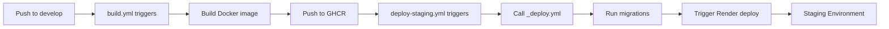

# Deployment Guide

This guide covers deploying the Kitchen Hub backend API to production.

## Prerequisites

- ✅ Production Dockerfile (already exists)
- ✅ Production environment variables configured
- ✅ Database migrations ready
- ✅ Production database accessible
- ✅ Docker or container orchestration platform (Docker, Kubernetes, etc.)

---

## Quick Start: Local Development

**You can deploy locally right now!**

```bash
cd backend

# 1. Ensure .env is configured (already done)
# 2. Start services
docker-compose up -d

# 3. Run migrations
docker-compose exec backend npx prisma migrate deploy --schema=src/infrastructure/database/prisma/schema.prisma

# 4. Verify it's running
curl http://localhost:3000/api/version
```

**That's it!** Your backend is running locally at `http://localhost:3000`.

---

## Automated Staging Deployment

The staging environment is automatically deployed when code is merged to the `develop` branch via GitHub Actions.

### How It Works

1. **Build Workflow** (`.github/workflows/build.yml`):
   - Triggers on pushes to `develop` branch
   - Builds Docker image and pushes to GHCR with tag `develop-latest`
   - Creates images tagged with `develop-SHA` and `develop-latest`

2. **Staging Deployment Workflow** (`.github/workflows/deploy-staging.yml`):
   - Triggers on pushes to `develop` branch (runs independently, assumes image exists from `build.yml`)
   - Calls reusable `_deploy.yml` workflow with:
     - `environment: staging`
     - `deploy_target: render`
     - `image_tag: develop-latest`
   - Automatically runs database migrations
   - Triggers Render deployment via deploy hook
   - Optionally performs health checks

### Prerequisites

Before automated staging deployment can work, you need to configure GitHub secrets:

#### Required GitHub Secrets

1. **`RENDER_DEPLOY_HOOK_URL_STAGING`**:
   - Get this from Render Dashboard → Your Staging Service → Settings → Deploy Hook
   - Copy the deploy hook URL
   - Add to GitHub: Repository Settings → Secrets and variables → Actions → New repository secret

2. **`STAGING_DATABASE_URL`** (Optional, for migrations):
   - Staging database connection URL (pooled connection)
   - Used for running migrations before deployment
   - Add to GitHub secrets if you want automated migrations

3. **`STAGING_DIRECT_URL`** (Optional, for migrations):
   - Direct staging database connection URL
   - Preferred over `STAGING_DATABASE_URL` for migrations
   - Add to GitHub secrets if you want automated migrations

#### Setting Up Render Deploy Hook

1. **In Render Dashboard**:
   - Navigate to your staging service
   - Go to Settings → Deploy Hook
   - Copy the deploy hook URL (looks like `https://api.render.com/deploy/srv-xxx?key=yyy`)

2. **In GitHub**:
   - Go to your repository → Settings → Secrets and variables → Actions
   - Click "New repository secret"
   - Name: `RENDER_DEPLOY_HOOK_URL_STAGING`
   - Value: Paste the deploy hook URL
   - Click "Add secret"

### Deployment Flow



### What Happens During Deployment

1. **Migrations Job**:
   - Pulls Docker image from GHCR (`develop-latest`)
   - Runs Prisma migrations using `STAGING_DIRECT_URL` or `STAGING_DATABASE_URL`
   - Ensures database schema is up-to-date

2. **Deploy Job**:
   - Validates deployment configuration
   - Triggers Render deployment via deploy hook
   - Render pulls the latest `develop-latest` image from GHCR
   - Render starts the new container with updated code

3. **Health Check Job** (if `service_url` is provided):
   - Waits for service to become healthy
   - Checks `/api/version` endpoint
   - Verifies deployment success
   - **Note**: Currently disabled in `deploy-staging.yml` (service_url not set). To enable, add `service_url` input with your staging service URL.

### Monitoring Deployments

- **GitHub Actions**: Check `.github/workflows/deploy-staging.yml` runs in Actions tab
- **Render Dashboard**: Monitor deployment status in Render dashboard
- **Logs**: View deployment logs in Render dashboard or GitHub Actions logs

### Troubleshooting Staging Deployments

**Deployment doesn't trigger:**
- Verify you pushed to `develop` branch
- Check path filters: workflow only triggers on `backend/**` changes
- Verify workflow file exists: `.github/workflows/deploy-staging.yml`

**Render deployment fails:**
- Verify `RENDER_DEPLOY_HOOK_URL_STAGING` secret is set correctly
- Check Render dashboard for deployment errors
- Verify Render service is configured to use GHCR image: `ghcr.io/YOUR_USERNAME/kitchen-hub-api:develop-latest`

**Migrations fail:**
- Verify `STAGING_DIRECT_URL` or `STAGING_DATABASE_URL` secrets are set
- Check database connection string is correct
- Verify database is accessible from GitHub Actions runners

**Health check fails:**
- Verify staging service URL is correct (if `service_url` is configured)
- Check application is running and accessible
- Review application logs in Render dashboard

### Manual Staging Deployment

If you need to manually trigger a staging deployment:

1. **Via GitHub Actions**:
   - Go to Actions → Deploy to Staging
   - Click "Run workflow" → Select `develop` branch → Run workflow

2. **Via Render Dashboard**:
   - Go to your staging service
   - Click "Manual Deploy" → Select commit → Deploy

---

## Production Deployment

### Step 1: Prepare Production Environment

1. **Copy production environment template:**
   ```bash
   cp .env.production.example .env.prod
   ```

2. **Generate production JWT secrets** (different from dev!):
   ```bash
   openssl rand -base64 32  # For JWT_SECRET
   openssl rand -base64 32  # For JWT_REFRESH_SECRET
   ```

3. **Fill in production values in `.env.prod`:**
   - Database connection strings (production database)
   - JWT secrets (new ones, not dev secrets!)
   - Supabase production credentials
   - Google OAuth production credentials (if using)

4. **Store secrets securely:**
   - Use your hosting platform's secrets manager
   - Never commit `.env.prod` to git
   - Use environment variables in CI/CD

### Step 2: Get Production Docker Image

#### Option A: Pull from GitHub Container Registry (GHCR) - Recommended

Images are automatically built and pushed to GHCR on every code change. Use these images for production deployments.

**Authenticate to GHCR:**

1. Create a GitHub Personal Access Token (PAT) with `read:packages` scope:
   - Go to GitHub Settings → Developer settings → Personal access tokens → Tokens (classic)
   - Generate new token with `read:packages` permission
   - Copy the token

2. Login to GHCR:
   ```bash
   echo $GITHUB_TOKEN | docker login ghcr.io -u YOUR_GITHUB_USERNAME --password-stdin
   ```

   Or set as environment variable:
   ```bash
   export GITHUB_TOKEN=your_pat_token
   echo $GITHUB_TOKEN | docker login ghcr.io -u YOUR_GITHUB_USERNAME --password-stdin
   ```

**Pull image from GHCR:**

Images are tagged with branch name and commit SHA. For production, use the `main` branch:

```bash
# Pull latest main branch image
docker pull ghcr.io/YOUR_GITHUB_USERNAME/kitchen-hub-api:main-latest

# Or pull specific commit SHA
docker pull ghcr.io/YOUR_GITHUB_USERNAME/kitchen-hub-api:main-abc123def456

# Or pull by SHA only
docker pull ghcr.io/YOUR_GITHUB_USERNAME/kitchen-hub-api:abc123def456
```

**Tag for convenience:**
```bash
docker tag ghcr.io/YOUR_GITHUB_USERNAME/kitchen-hub-api:main-latest kitchen-hub-api:latest
```

**Verify image:**
```bash
docker images ghcr.io/YOUR_GITHUB_USERNAME/kitchen-hub-api
# Should show ~150MB image size
```

> **Note**: Replace `YOUR_GITHUB_USERNAME` with your GitHub username or organization name. For organization repos, use the organization name.

#### Option B: Build Locally

If you need to build the image locally:

```bash
cd backend
docker build -t kitchen-hub-api:latest .
```

**Verify image:**
```bash
docker images kitchen-hub-api:latest
# Should show ~150MB image size
```

### Step 3: Run Database Migrations

**Before starting the application, run migrations:**

```bash
docker run --rm \
  --env-file .env.prod \
  kitchen-hub-api:latest \
  npx prisma migrate deploy --schema=src/infrastructure/database/prisma/schema.prisma
```

**Or if using environment variables directly:**
```bash
docker run --rm \
  -e DATABASE_URL="$PROD_DIRECT_URL" \
  -e DIRECT_URL="$PROD_DIRECT_URL" \
  kitchen-hub-api:latest \
  npx prisma migrate deploy --schema=src/infrastructure/database/prisma/schema.prisma
```

### Step 4: Deploy the Application

#### Option A: Docker Run (Simple Deployment)

**Using GHCR image:**
```bash
docker run -d \
  --name kitchen-hub-api \
  -p 3000:3000 \
  --env-file .env.prod \
  --restart unless-stopped \
  ghcr.io/YOUR_GITHUB_USERNAME/kitchen-hub-api:main-latest
```

**Using locally built image:**
```bash
docker run -d \
  --name kitchen-hub-api \
  -p 3000:3000 \
  --env-file .env.prod \
  --restart unless-stopped \
  kitchen-hub-api:latest
```

#### Option B: Docker Compose (Production)

Create `docker-compose.prod.yml`:

**Using GHCR image:**
```yaml
version: '3.8'

services:
  backend:
    image: ghcr.io/YOUR_GITHUB_USERNAME/kitchen-hub-api:main-latest
    container_name: kitchen-hub-api-prod
    ports:
      - "3000:3000"
    env_file:
      - .env.prod
    restart: unless-stopped
    healthcheck:
      test: ["CMD", "node", "-e", "require('http').get('http://localhost:3000/api/version', (r) => process.exit(r.statusCode === 200 ? 0 : 1))"]
      interval: 30s
      timeout: 10s
      retries: 3
      start_period: 40s
```

**Using locally built image:**
```yaml
version: '3.8'

services:
  backend:
    image: kitchen-hub-api:latest
    container_name: kitchen-hub-api-prod
    ports:
      - "3000:3000"
    env_file:
      - .env.prod
    restart: unless-stopped
    healthcheck:
      test: ["CMD", "node", "-e", "require('http').get('http://localhost:3000/api/version', (r) => process.exit(r.statusCode === 200 ? 0 : 1))"]
      interval: 30s
      timeout: 10s
      retries: 3
      start_period: 40s
```

Then deploy:
```bash
docker-compose -f docker-compose.prod.yml up -d
```

#### Option C: Cloud Platform (AWS, GCP, Azure, etc.)

**Common platforms:**
- **AWS**: ECS, EKS, App Runner, Elastic Beanstalk
- **Google Cloud**: Cloud Run, GKE
- **Azure**: Container Instances, AKS
- **DigitalOcean**: App Platform, Droplets
- **Heroku**: Container Registry
- **Railway**: Direct Dockerfile support
- **Render**: Dockerfile support

**General steps:**
1. Pull image from GHCR (already pushed automatically) or use your platform's container registry
2. Configure environment variables in platform
3. Deploy container with health checks
4. Set up reverse proxy/load balancer if needed

**Using GHCR images:**
- Images are automatically available at `ghcr.io/YOUR_GITHUB_USERNAME/kitchen-hub-api:TAG`
- Use `main-latest` tag for production deployments
- Use specific commit SHA tags for reproducible deployments

### Step 5: Verify Deployment

```bash
# Check health endpoint
curl https://your-domain.com/api/version

# Check Swagger docs
curl https://your-domain.com/api/docs/v1

# Check logs
docker logs kitchen-hub-api
```

---

## Deployment Checklist

Before deploying to production:

- [ ] Production database is set up and accessible
- [ ] Database migrations have been run
- [ ] Production JWT secrets generated (different from dev)
- [ ] Production environment variables configured
- [ ] `.env.prod` file created (not committed to git)
- [ ] Docker image built and tested
- [ ] Health checks configured
- [ ] Reverse proxy/load balancer configured (if needed)
- [ ] SSL/TLS certificates configured (HTTPS)
- [ ] CORS settings verified for production domain
- [ ] Monitoring and logging set up
- [ ] Backup strategy in place

---

## Environment Variables for Production

### Required Variables

| Variable | Description | Example |
|----------|-------------|---------|
| `NODE_ENV` | Environment | `production` |
| `PORT` | Server port | `3000` |
| `DATABASE_URL` | Database connection (pooled) | `postgresql://...` |
| `DIRECT_URL` | Direct database connection | `postgresql://...` |
| `JWT_SECRET` | JWT signing secret (32+ chars) | Generated secret |
| `JWT_REFRESH_SECRET` | Refresh token secret (32+ chars) | Generated secret |
| `SUPABASE_URL` | Supabase project URL | `https://xxx.supabase.co` |
| `SUPABASE_ANON_KEY` | Supabase anonymous key | `eyJ...` |
| `SUPABASE_SERVICE_ROLE_KEY` | Supabase service role key | `eyJ...` |

### Optional Variables

| Variable | Description | Default |
|----------|-------------|---------|
| `JWT_EXPIRES_IN` | Access token expiry | `15m` |
| `JWT_REFRESH_EXPIRES_IN` | Refresh token expiry | `7d` |
| `GOOGLE_CLIENT_ID` | Google OAuth client ID | (optional) |
| `GOOGLE_CLIENT_SECRET` | Google OAuth secret | (optional) |

---

## Security Best Practices

1. **Never commit secrets to git**
   - `.env.prod` should be in `.gitignore`
   - Use secrets manager or environment variables

2. **Use different secrets for production**
   - Generate new JWT secrets for production
   - Don't reuse development secrets

3. **Enable HTTPS**
   - Use reverse proxy (nginx, Traefik) with SSL
   - Or use platform-managed SSL (Cloud Run, App Runner)

4. **Restrict database access**
   - Use connection pooling for `DATABASE_URL`
   - Use direct connection only for migrations
   - Enable SSL/TLS for database connections

5. **Monitor and log**
   - Set up application monitoring
   - Log errors and security events
   - Monitor database connections

6. **Regular updates**
   - Keep Docker base images updated
   - Update dependencies regularly
   - Apply security patches promptly

---

## Common Deployment Platforms

### Railway

1. Connect GitHub repository
2. Railway detects Dockerfile automatically
3. Add environment variables in dashboard
4. Deploy!

### Render

**Automated Deployment (Recommended):**

Staging deployments are automated via GitHub Actions. See [Automated Staging Deployment](#automated-staging-deployment) section above.

**Manual Setup:**

1. Create new Web Service in Render Dashboard
2. Connect GitHub repository
3. Configure service to use GHCR image:
   - **Docker Image**: `ghcr.io/YOUR_GITHUB_USERNAME/kitchen-hub-api:develop-latest` (for staging)
   - **Registry**: GitHub Container Registry
   - **Authentication**: Use GitHub Personal Access Token with `read:packages` scope
4. Add environment variables in Render dashboard (see [Environment Variables](#environment-variables-for-production))
5. Set up deploy hook (for automated deployments):
   - Go to Settings → Deploy Hook
   - Copy deploy hook URL
   - Add as `RENDER_DEPLOY_HOOK_URL_STAGING` secret in GitHub
6. Deploy manually or let automated workflow handle it

### Fly.io

```bash
# Install flyctl
# Create app
fly launch

# Set secrets
fly secrets set JWT_SECRET=xxx JWT_REFRESH_SECRET=xxx

# Deploy
fly deploy
```

### AWS App Runner

1. Create service from container image
2. Configure environment variables
3. Set up auto-scaling
4. Deploy

---

## Troubleshooting

### Container won't start
- Check environment variables are set
- Verify database connection string
- Check container logs: `docker logs <container-name>`

### Database connection errors
- Verify `DATABASE_URL` and `DIRECT_URL` are correct
- Check database is accessible from deployment environment
- Ensure SSL mode is correct (`sslmode=require` for production)

### Migration errors
- Ensure migrations run before application starts
- Check `DIRECT_URL` is set correctly
- Verify database user has migration permissions

### Health check failures
- Verify `/api/version` endpoint is accessible
- Check application is listening on correct port
- Review application logs for errors

---

## Rollback Procedure

If deployment fails:

1. **Stop new container:**
   ```bash
   docker stop kitchen-hub-api
   docker rm kitchen-hub-api
   ```

2. **Start previous version:**
   ```bash
   # Using GHCR image with specific SHA
   docker run -d --name kitchen-hub-api \
     -p 3000:3000 \
     --env-file .env.prod \
     ghcr.io/YOUR_GITHUB_USERNAME/kitchen-hub-api:previous-commit-sha
   
   # Or using locally tagged image
   docker run -d --name kitchen-hub-api \
     -p 3000:3000 \
     --env-file .env.prod \
     kitchen-hub-api:previous-version
   ```

3. **Or use docker-compose:**
   ```bash
   docker-compose -f docker-compose.prod.yml down
   # Update image tag to previous version
   docker-compose -f docker-compose.prod.yml up -d
   ```

---

## Next Steps

After successful deployment:

1. Set up monitoring (e.g., Sentry, DataDog)
2. Configure logging aggregation
3. Set up CI/CD pipeline
4. Configure auto-scaling (if needed)
5. Set up database backups
6. Configure alerts for errors/downtime

---

## Support

For issues or questions:
- Check [README.md](./README.md) for general documentation
- Review [ENV_SETUP_GUIDE.md](./ENV_SETUP_GUIDE.md) for environment setup
- Check [GHCR_QUICK_REFERENCE.md](./docs/GHCR_QUICK_REFERENCE.md) for GHCR usage
- Check application logs for errors
