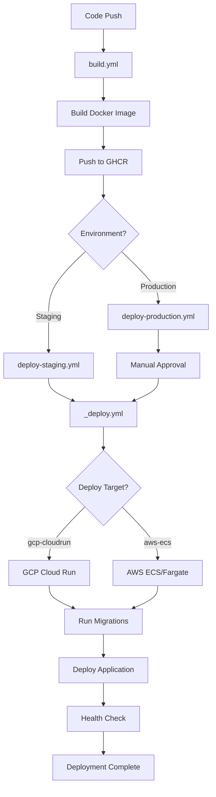

# Comprehensive Deployment Guide

This guide provides complete deployment documentation for the Kitchen Hub backend API, covering automated and manual deployment procedures for both GCP Cloud Run and AWS ECS/Fargate platforms.

## Table of Contents

1. [Overview](#overview)
2. [Deployment Architecture](#deployment-architecture)
3. [Deploy Process](#deploy-process)
4. [Platform-Specific Deployment](#platform-specific-deployment)
5. [Pre-Deployment Checklist](#pre-deployment-checklist)
6. [Post-Deployment Verification](#post-deployment-verification)
7. [Troubleshooting](#troubleshooting)
8. [Related Documentation](#related-documentation)

---

## Overview

The Kitchen Hub backend uses a containerized deployment strategy with automated CI/CD pipelines. The deployment infrastructure supports:

- **GCP Cloud Run**: Serverless container platform (currently used for staging and production)
- **AWS ECS/Fargate**: Container orchestration service (supported, ready for migration)
- **GitHub Actions**: Automated build and deployment workflows
- **GitHub Container Registry (GHCR)**: Docker image storage and distribution

### Supported Platforms

| Platform | Status | Use Case |
|----------|--------|----------|
| GCP Cloud Run | ✅ Active | Staging and Production |
| AWS ECS/Fargate | ✅ Supported | Ready for migration |
| Docker (Local) | ✅ Supported | Development and testing |

### Deployment Flow



---

## Deployment Architecture

### Components

1. **Build Workflow** (`.github/workflows/build.yml`)
   - Triggers on pushes to `develop` and `main` branches
   - Builds multi-stage Docker image
   - Pushes to GHCR with branch-based tags
   - Creates images: `branch-SHA` and `branch-latest`

2. **Reusable Deployment Workflow** (`.github/workflows/_deploy.yml`)
   - Cloud-agnostic deployment logic
   - Supports multiple deployment targets
   - Handles database migrations
   - Performs health checks

3. **Environment-Specific Workflows**
   - `deploy-staging.yml`: Automatic staging deployment
   - `deploy-production.yml`: Production deployment with manual approval

### Image Tagging Strategy

- **Latest**: `branch-latest` (e.g., `develop-latest`, `main-latest`)
- **Specific SHA**: `branch-SHA` (e.g., `main-abc123def456`)
- **Short SHA**: `SHA` (e.g., `abc123def456`)

---

## Deploy Process

### Automated Deployment

#### Staging Deployment

**Trigger**: Push to `develop` branch

**Process**:
1. `build.yml` builds and pushes Docker image to GHCR
2. `deploy-staging.yml` triggers automatically
3. Calls `_deploy.yml` with `environment=staging` and `deploy_target=gcp-cloudrun`
4. Runs database migrations using `STAGING_DIRECT_URL` or `STAGING_DATABASE_URL`
5. Deploys to GCP Cloud Run staging service
6. Performs optional health check if `STAGING_SERVICE_URL` is configured

**Configuration**:
- Image tag: `develop-latest`
- Environment: `staging`
- Deploy target: `gcp-cloudrun`
- No approval required

#### Production Deployment

**Trigger**: Push to `main` branch (with manual approval)

**Process**:
1. `build.yml` builds and pushes Docker image to GHCR
2. `deploy-production.yml` triggers automatically
3. **Manual approval required** via GitHub Environment protection
4. After approval, calls `_deploy.yml` with `environment=production` and `deploy_target=gcp-cloudrun`
5. Runs database migrations using `PROD_DIRECT_URL` or `PROD_DATABASE_URL`
6. Deploys to GCP Cloud Run production service
7. Performs optional health check if `PRODUCTION_SERVICE_URL` is configured

**Configuration**:
- Image tag: `main-latest` (or custom via manual dispatch)
- Environment: `production`
- Deploy target: `gcp-cloudrun`
- Manual approval required

**Manual Dispatch**:
You can manually trigger production deployment with a custom image tag:
1. Go to GitHub Actions → Deploy to Production
2. Click "Run workflow"
3. Select `main` branch
4. Optionally specify `image_tag` (e.g., `main-abc123def456` for specific commit)
5. Approve when prompted

### Manual Deployment

For manual deployments outside of CI/CD:

#### Using Docker

```bash
# Pull image from GHCR
docker pull ghcr.io/YOUR_GITHUB_USERNAME/kitchen-hub-api:main-latest

# Run migrations
docker run --rm \
  -e DATABASE_URL="$PROD_DIRECT_URL" \
  ghcr.io/YOUR_GITHUB_USERNAME/kitchen-hub-api:main-latest \
  npx prisma migrate deploy --schema=src/infrastructure/database/prisma/schema.prisma

# Deploy application
docker run -d \
  --name kitchen-hub-api \
  -p 3000:3000 \
  --env-file .env.prod \
  --restart unless-stopped \
  ghcr.io/YOUR_GITHUB_USERNAME/kitchen-hub-api:main-latest
```

#### Using Docker Compose

```bash
# Create docker-compose.prod.yml
# Update image tag in compose file
docker-compose -f docker-compose.prod.yml up -d
```

---

## Platform-Specific Deployment

### GCP Cloud Run

#### Prerequisites

1. **GCP Project Setup**:
   - Create or select a GCP project
   - Enable Cloud Run API
   - Enable Cloud SQL API (if using Cloud SQL)

2. **Service Account**:
   - Create service account with roles:
     - Cloud Run Admin
     - Service Account User
     - (Optional) Artifact Registry Reader (if using Artifact Registry)
   - Create JSON key and store in GitHub secret `GCP_SA_KEY`

3. **Cloud Run Service**:
   - Create service in Cloud Run console
   - Configure environment variables (or use Secret Manager)
   - Set minimum instances (optional, for cost optimization)
   - Configure concurrency (default: 80)

#### Deployment Process

**Automated** (via GitHub Actions):
- Uses `gcloud run deploy` command
- Pulls image from GHCR
- Updates service with new revision
- Routes traffic to new revision automatically

**Manual** (via gcloud CLI):
```bash
# Authenticate
gcloud auth login
gcloud config set project YOUR_PROJECT_ID

# Deploy
gcloud run deploy kitchen-hub-api \
  --image ghcr.io/YOUR_GITHUB_USERNAME/kitchen-hub-api:main-latest \
  --region us-central1 \
  --platform managed \
  --allow-unauthenticated
```

#### Environment Variables

Set environment variables in Cloud Run:
1. Go to Cloud Run console → Service → Edit & Deploy New Revision
2. Navigate to "Variables & Secrets" tab
3. Add environment variables or reference Secret Manager secrets
4. Deploy new revision

**Using Secret Manager**:
```bash
# Create secret
gcloud secrets create jwt-secret --data-file=- <<< "your-secret-value"

# Grant access to Cloud Run service account
gcloud secrets add-iam-policy-binding jwt-secret \
  --member="serviceAccount:SERVICE_ACCOUNT_EMAIL" \
  --role="roles/secretmanager.secretAccessor"

# Reference in Cloud Run (via console or gcloud)
# In console: Add secret reference as environment variable
```

#### Configuration Options

- **CPU**: 1-8 vCPU (default: 1)
- **Memory**: 128MB-32GB (default: 512MB)
- **Concurrency**: 1-1000 (default: 80)
- **Min Instances**: 0-1000 (default: 0, for cost optimization)
- **Max Instances**: 1-1000 (default: 100)
- **Timeout**: 0-3600s (default: 300s)

### AWS ECS/Fargate

#### Prerequisites

1. **AWS Account Setup**:
   - Create or select AWS account
   - Create ECS cluster (Fargate launch type)
   - Create VPC and subnets (if not using default)

2. **IAM Roles**:
   - Create task execution role with permissions:
     - `ecr:GetAuthorizationToken`
     - `ecr:BatchCheckLayerAvailability`
     - `ecr:GetDownloadUrlForLayer`
     - `ecr:BatchGetImage`
     - `logs:CreateLogStream`
     - `logs:PutLogEvents`
     - (Optional) `secretsmanager:GetSecretValue` (if using Secrets Manager)
   - Create task role for application permissions
   - Create service role for ECS service

3. **ECS Service**:
   - Create task definition with container image
   - Create ECS service in cluster
   - Configure load balancer (Application Load Balancer recommended)
   - Set up target group and health checks

#### Deployment Process

**Automated** (via GitHub Actions):
- Uses AWS CLI to update task definition
- Registers new task definition with updated image
- Updates ECS service to use new task definition
- Forces new deployment

**Manual** (via AWS CLI):
```bash
# Authenticate
aws configure

# Get current task definition
aws ecs describe-task-definition --task-definition kitchen-hub-api

# Update task definition with new image
aws ecs register-task-definition \
  --family kitchen-hub-api \
  --container-definitions '[{
    "name": "kitchen-hub-api",
    "image": "ghcr.io/YOUR_GITHUB_USERNAME/kitchen-hub-api:main-latest",
    "portMappings": [{"containerPort": 3000, "protocol": "tcp"}],
    "environment": [...],
    "logConfiguration": {...}
  }]'

# Update service
aws ecs update-service \
  --cluster kitchen-hub-cluster \
  --service kitchen-hub-api \
  --task-definition kitchen-hub-api:NEW_REVISION \
  --force-new-deployment
```

#### Environment Variables

**Task Definition**:
```json
{
  "environment": [
    {"name": "NODE_ENV", "value": "production"},
    {"name": "PORT", "value": "3000"},
    {"name": "DATABASE_URL", "value": "postgresql://..."}
  ]
}
```

**Secrets Manager**:
```bash
# Create secret
aws secretsmanager create-secret \
  --name kitchen-hub/jwt-secret \
  --secret-string "your-secret-value"

# Reference in task definition
{
  "secrets": [
    {
      "name": "JWT_SECRET",
      "valueFrom": "arn:aws:secretsmanager:region:account:secret:kitchen-hub/jwt-secret"
    }
  ]
}
```

#### Configuration Options

- **CPU**: 256-4096 (256 = 0.25 vCPU, 1024 = 1 vCPU)
- **Memory**: 512-30720 MB (must match CPU constraints)
- **Task Count**: 1-1000 (for service)
- **Health Check**: Configure in task definition and load balancer

### Platform Comparison

| Feature | GCP Cloud Run | AWS ECS/Fargate |
|---------|--------------|-----------------|
| **Deployment Model** | Serverless | Container orchestration |
| **Scaling** | Automatic (0 to N) | Automatic (min to max) |
| **Cold Starts** | Possible (if min instances = 0) | Minimal (always running) |
| **Cost Model** | Pay per request + compute | Pay for running tasks |
| **Networking** | Managed | VPC configuration required |
| **Load Balancing** | Built-in | Requires ALB/NLB |
| **Environment Variables** | Console or Secret Manager | Task definition or Secrets Manager |
| **Rollback** | Revision management | Task definition rollback |
| **Best For** | Simple, serverless needs | Complex orchestration needs |

**Selection Guide**:
- **Choose GCP Cloud Run** if: You want serverless simplicity, automatic scaling to zero, minimal configuration
- **Choose AWS ECS/Fargate** if: You need VPC control, complex networking, integration with other AWS services

---

## Pre-Deployment Checklist

### Code Quality

- [ ] Code review completed and approved
- [ ] All tests passing (unit, integration)
- [ ] Linting and formatting checks passed
- [ ] No security vulnerabilities in dependencies
- [ ] Database migrations tested in staging

### Database

- [ ] Database migrations created and tested
- [ ] Migration rollback plan documented
- [ ] Database backup created (for production)
- [ ] `DIRECT_URL` configured for migrations
- [ ] Database connection tested

### Environment Variables

- [ ] All required environment variables documented
- [ ] Environment variables configured in target platform
- [ ] Secrets stored securely (GitHub Secrets, Secret Manager)
- [ ] Environment variable validation passed
- [ ] See [Environment Variable Checklist](./ENV_VAR_CHECKLIST.md) for complete list

### Infrastructure

- [ ] Target platform configured (Cloud Run service or ECS cluster)
- [ ] Service account/IAM roles configured
- [ ] Network configuration verified
- [ ] Health check endpoints configured
- [ ] Monitoring and alerting set up
  - [ ] Sentry error tracking configured (optional)
  - [ ] Uptime monitoring service configured
  - [ ] Health endpoint tested and accessible
  - [ ] Alerts configured for downtime and errors
  - [ ] See [Monitoring Setup Guide](./MONITORING_SETUP.md) for details

### Deployment

- [ ] Docker image built and pushed to GHCR
- [ ] Image tag verified and correct
- [ ] GitHub Actions workflows configured
- [ ] Required secrets configured in GitHub
- [ ] Deployment workflow tested in staging

### Documentation

- [ ] Deployment notes documented
- [ ] Breaking changes documented
- [ ] Rollback procedure reviewed
- [ ] Team notified of deployment

---

## Post-Deployment Verification

### Health Checks

**Automated** (via GitHub Actions):
- Health check job runs after deployment
- Checks `/api/version` endpoint
- Retries up to 6 times with 20s intervals
- Fails deployment if health check fails

**Manual**:
```bash
# Check version endpoint
curl https://your-api-domain.com/api/version

# Expected response:
# {"version":"1.0.0","environment":"production"}
```

### Smoke Testing

**Basic Functionality**:
```bash
# 1. Health check
curl https://your-api-domain.com/api/version

# 2. API documentation
curl https://your-api-domain.com/api/docs/v1

# 3. Authentication (if public endpoint exists)
curl -X POST https://your-api-domain.com/api/v1/auth/test
```

**Database Connectivity**:
- Verify database connection in application logs
- Check for migration errors
- Verify data access (if safe to test)

### Monitoring

**GCP Cloud Run**:
- Check Cloud Run console for deployment status
- Review logs in Cloud Logging
- Monitor metrics: requests, latency, errors
- Check revision traffic distribution

**AWS ECS**:
- Check ECS console for service status
- Review CloudWatch logs
- Monitor metrics: CPU, memory, request count
- Check task health status

### Log Verification

**Check Application Logs**:
```bash
# GCP Cloud Run
gcloud logging read "resource.type=cloud_run_revision AND resource.labels.service_name=kitchen-hub-api" --limit 50

# AWS ECS
aws logs tail /ecs/kitchen-hub-api --follow
```

**Look for**:
- Application startup messages
- Database connection success
- No critical errors
- Health check responses

### Rollback Readiness

- [ ] Previous revision/image tag documented
- [ ] Rollback procedure reviewed
- [ ] Rollback tested in staging (if possible)
- [ ] Team knows how to trigger rollback

---

## Troubleshooting

### Deployment Failures

**Build Failures**:
- Check GitHub Actions build logs
- Verify Dockerfile syntax
- Check for dependency issues
- Verify build context and paths

**Migration Failures**:
- Verify `DIRECT_URL` or `DATABASE_URL` is correct
- Check database connectivity from CI/CD environment
- Review migration SQL for errors
- Check database user permissions
- See [MIGRATIONS.md](./MIGRATIONS.md) for detailed troubleshooting

**Deployment Failures**:
- **GCP Cloud Run**: Check service account permissions, image pull permissions, resource limits
- **AWS ECS**: Check IAM roles, task definition validity, service configuration
- Review platform-specific error messages in logs

### Application Startup Issues

**Container Won't Start**:
- Check environment variables are set correctly
- Verify database connection string
- Check application logs for errors
- Verify port configuration (Cloud Run uses PORT env var)

**Database Connection Errors**:
- Verify `DATABASE_URL` is correct
- Check database is accessible from deployment environment
- Verify SSL mode (`sslmode=require` for production)
- Check firewall/security group rules

**Health Check Failures**:
- Verify `/api/version` endpoint is accessible
- Check application is listening on correct port
- Review application logs for errors
- Verify health check configuration in platform

### Performance Issues

**High Latency**:
- Check database query performance
- Review application logs for slow operations
- Monitor resource utilization (CPU, memory)
- Consider scaling up resources

**High Error Rate**:
- Review error logs for patterns
- Check for database connection pool exhaustion
- Verify environment variables are correct
- Check for dependency issues

### Common Issues

**Prisma Engine Mismatch**:
- Error: `Prisma Client could not locate the Query Engine`
- Fix: Update Prisma schema to include both binary targets (Debian + musl)
- Rebuild and redeploy Docker image

**Image Pull Failures**:
- Verify GHCR authentication
- Check image exists in registry
- Verify image pull permissions
- Check network connectivity

**Environment Variable Missing**:
- Verify all required variables are set
- Check variable names (case-sensitive)
- Verify secrets are accessible
- See [Environment Variable Checklist](./ENV_VAR_CHECKLIST.md)

---

## Related Documentation

- **[ROLLBACK_GUIDE.md](./ROLLBACK_GUIDE.md)**: Detailed rollback procedures for all platforms
- **[ENV_VAR_CHECKLIST.md](./ENV_VAR_CHECKLIST.md)**: Complete environment variable checklist
- **[PLATFORM_MIGRATION.md](./PLATFORM_MIGRATION.md)**: Guide for migrating between platforms
- **[MIGRATIONS.md](./MIGRATIONS.md)**: Database migration and rollback procedures
- **[DEPLOYMENT.md](../DEPLOYMENT.md)**: Quick start deployment guide
- **[ENV_SETUP_GUIDE.md](../ENV_SETUP_GUIDE.md)**: Local development environment setup

---

## Support

For deployment issues:
1. Check this guide and related documentation
2. Review GitHub Actions workflow logs
3. Check platform-specific logs (Cloud Run, ECS)
4. Review application logs
5. Consult team or create issue in repository
