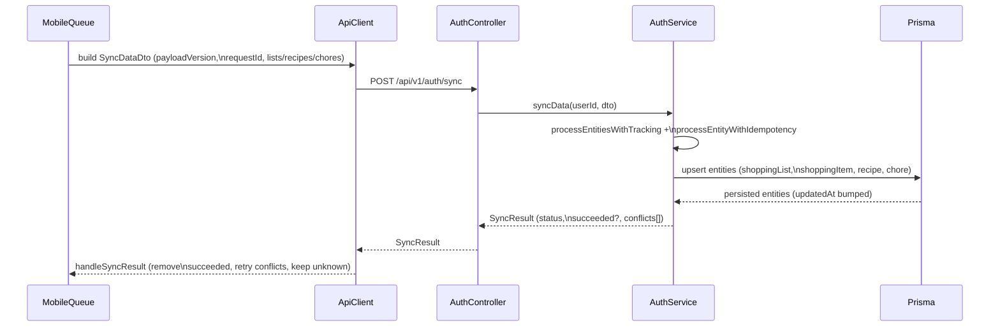

# API Sync & Conflict Strategy

This document describes how the Kitchen Hub backend currently handles signed‑in data synchronization via `POST /api/v1/auth/sync`, and how that behavior relates to the mobile client’s offline queue and conflict resolution utilities.

It is intended to be the **source of truth** for the sync contract and should be treated as authoritative when there is any disagreement with higher‑level summaries.

---

## Source of Truth: Behavior vs Design

### Current Behavior (Implemented)

- **Endpoint**
  - `POST /api/v1/auth/sync` (controller: `AuthController.syncData` in `backend/src/modules/auth/controllers/auth.controller.ts`).
  - Protected endpoint; requires an authenticated signed‑in user who belongs to a household.

- **Server‑side sync strategy**
  - Batch‑state sync: request may contain multiple shopping lists (with nested items), recipes, and chores in a single payload.
  - The backend performs **simple Prisma `upsert` operations** per entity:
    - `shoppingList.upsert`, `shoppingItem.upsert`, `recipe.upsert`, `chore.upsert`.
    - There is **no server‑side Last‑Write‑Wins gate** and **no timestamp or version comparison** when deciding whether to accept a write.
    - For existing rows, the `update` block overwrites the relevant fields unconditionally.

- **Idempotency (`operationId`)**
  - Each entity in the payload includes an `operationId: string` (UUID v4).
  - The backend uses a `SyncIdempotencyKey` table and an **insert‑first** pattern (`processEntityWithIdempotency` in `auth.service.ts`) to ensure:
    - First request with a `(userId, operationId)` pair “owns” the operation and is processed.
    - Subsequent requests with the same `(userId, operationId)` are **skipped** (treated as already processed).

- **Result shape and per‑entity outcomes**
  - The backend returns a `SyncResult`:
    - `status: 'synced' | 'partial' | 'failed'`.
    - `conflicts: SyncConflict[]` (one entry per failed entity, with `type`, `id`, `operationId`, `reason`).
    - `succeeded?: { operationId; entityType; id; clientLocalId? }[]` (one entry per successful entity for newer servers).
  - `AuthService.syncData` aggregates results from:
    - `syncShoppingLists` (lists plus nested items),
    - `syncRecipes`,
    - `syncChores`,
    - each of which uses `processEntitiesWithTracking` and `processEntityWithIdempotency`.

- **Timestamps and soft delete**
  - All syncable entities (`ShoppingList`, `ShoppingItem`, `Recipe`, `Chore`) have:
    - `createdAt: DateTime @default(now())`,
    - `updatedAt: DateTime @updatedAt`,
    - `deletedAt: DateTime?` (soft delete).
  - The **sync DTOs do not expose any timestamp fields**:
    - `SyncShoppingListDto`, `SyncShoppingItemDto`, `SyncRecipeDto`, `SyncChoreDto` only carry business data and `operationId`.
    - The backend therefore **ignores client timestamps** for sync; they are neither read nor trusted.
  - Prisma’s `@updatedAt` directive means:
    - Any successful `update` path in an `upsert` automatically bumps `updatedAt` to “now”.
    - `createdAt` is set once on insert and never changed by sync.
  - Soft delete (`deletedAt`) is:
    - Set by other parts of the API (e.g., delete endpoints) using `deletedAt = now()`.
    - **Not explicitly manipulated** by the sync upserts:
      - `update` blocks in sync upserts never touch `deletedAt`.
      - If a row is soft‑deleted, a sync upsert will update business fields but leave `deletedAt` non‑null, so it remains filtered out by `ACTIVE_RECORDS_FILTER` in normal queries.
      - Sync **does not currently “resurrect”** soft‑deleted records; resurrection would require a separate explicit API.

- **Invariant checking (backend side)**
  - `AuthService.syncData` builds:
    - `incomingOperationIds`: the set of all `operationId`s present in the request (lists, nested items, recipes, chores).
    - `seenOperationIds`: the set of `operationId`s present in `succeeded[]` and `conflicts[]`.
  - If the sizes differ, the service logs an **error** indicating missing `operationId`s (with context) but **does not throw**:
    - The sync response is still returned to the client.
    - This makes the invariant a **soft contract**: violations are observable in logs but do not break the endpoint.

### Planned/Design (Not Implemented Yet)

The following behaviors are part of the **design direction** but are **not yet implemented** on the backend:

- **Server‑side timestamp‑aware conflict checks**
  - Comparing client and server `updatedAt` values to reject clearly stale writes.
  - Coordinating with the mobile client’s LWW semantics to avoid overwriting newer data with older changes accepted later.

- **Payload version branching**
  - Using `payloadVersion` in `SyncDataDto` to evolve the sync contract while keeping `/api/v1/auth/sync` stable.
  - Behavior differences (e.g., stricter invariants or new fields) keyed off `payloadVersion`.

- **Resurrection semantics for soft‑deleted entities**
  - Explicit policies around when and how a soft‑deleted entity can be “brought back” via sync or other endpoints (including `deletedAt` clearing rules).

Any future backend work that implements these behaviors **must** update this document accordingly and keep the “Current Behavior” section accurate.

---

## Code Reference (Where to Look)

This section provides exact file paths, class names, and function names for verification. Use this to trace the documented behavior directly in code.

### Request DTOs

**File**: `backend/src/modules/auth/dtos/sync-data.dto.ts`

| DTO Class | Lines | Purpose |
|-----------|-------|---------|
| `SyncDataDto` | 127-154 | Top-level sync request payload |
| `SyncShoppingListDto` | 41-60 | Shopping list with nested items |
| `SyncShoppingItemDto` | 14-39 | Individual shopping item |
| `SyncRecipeDto` | 83-102 | Recipe with ingredients/instructions |
| `SyncRecipeIngredientDto` | 62-73 | Recipe ingredient structure |
| `SyncRecipeInstructionDto` | 75-81 | Recipe instruction step |
| `SyncChoreDto` | 104-125 | Chore task |

**Key fields to verify**:
- Each DTO has `operationId: string` field (idempotency key)
- Top-level `SyncDataDto` has `payloadVersion?: number` and `requestId?: string`
- **No timestamp fields** (`createdAt`, `updatedAt`, `deletedAt`) in any DTO

### Response Types

**File**: `backend/src/modules/auth/types/sync-conflict.interface.ts`

| Interface | Lines | Purpose |
|-----------|-------|---------|
| `SyncResult` | 14-18 | Top-level sync response |
| `SyncConflict` | 4-12 | Per-entity failure details |

**Key fields to verify**:
- `SyncResult.status: 'synced' \| 'partial' \| 'failed'`
- `SyncResult.succeeded?: Array<{operationId, entityType, id, clientLocalId?}>`
- `SyncResult.conflicts: SyncConflict[]`
- `SyncConflict` has `operationId`, `type`, `id`, `reason`

### Service Layer

**File**: `backend/src/modules/auth/services/auth.service.ts`

| Function | Approx Line | Purpose |
|----------|-------------|---------|
| `syncData()` | 181-240 | Main sync orchestrator |
| `syncShoppingLists()` | 440-520 | Process lists + nested items |
| `syncRecipes()` | 580-620 | Process recipes |
| `syncChores()` | 680-720 | Process chores |
| `processEntitiesWithTracking()` | 730-780 | Generic entity processor with result tracking |
| `processEntityWithIdempotency()` | 790-850 | Idempotency wrapper for single entity |

**Key behavior to verify**:
- `syncData()` calls `syncShoppingLists()`, `syncRecipes()`, `syncChores()`
- Each returns `{ succeeded: SucceededEntity[], conflicts: SyncConflict[] }`
- `syncData()` aggregates all results and computes `status`
- Invariant checking: compares `incomingOperationIds` vs. `seenOperationIds` (logs error if mismatch)

### Controller Layer

**File**: `backend/src/modules/auth/controllers/auth.controller.ts`

| Endpoint | Method | Approx Line | Purpose |
|----------|--------|-------------|---------|
| `POST /auth/sync` | `syncData()` | ~150-170 | Sync endpoint handler |

**Key behavior to verify**:
- Decorated with `@Post('sync')` (maps to `/api/v1/auth/sync` via global prefix)
- Calls `this.authService.syncData(user.userId, syncDataDto)`
- Returns `SyncResult` wrapped in standard API response format

### Database Models

**File**: `backend/src/infrastructure/database/prisma/schema.prisma`

| Model | Line | Key Fields |
|-------|------|------------|
| `ShoppingList` | 65 | `id`, `name`, `color`, `createdAt`, `updatedAt`, `deletedAt` |
| `ShoppingItem` | 81 | `id`, `listId`, `name`, `quantity`, `unit`, `category`, `isChecked`, `createdAt`, `updatedAt`, `deletedAt` |
| `Recipe` | 120 | `id`, `title`, `prepTime`, `ingredients` (JSON), `instructions` (JSON), `createdAt`, `updatedAt`, `deletedAt` |
| `Chore` | 138 | `id`, `title`, `assigneeId`, `dueDate`, `isCompleted`, `createdAt`, `updatedAt`, `deletedAt` |
| `SyncIdempotencyKey` | 197 | `id`, `userId`, `key` (operationId), `entityType`, `entityId`, `status`, `processedAt`, `createdAt` |

**Key directives to verify**:
- `createdAt DateTime @default(now())`
- `updatedAt DateTime @updatedAt` - Prisma auto-manages this
- `deletedAt DateTime? @map("deleted_at")` - Nullable, for soft-delete

### Idempotency Key Table

**Table**: `sync_idempotency_keys`  
**Model**: `SyncIdempotencyKey` (Line 197 in schema.prisma)

| Field | Type | Purpose |
|-------|------|---------|
| `key` | String | The `operationId` from sync request |
| `userId` | UUID | User who initiated the sync |
| `entityType` | String | `'recipe' \| 'shoppingList' \| 'shoppingItem' \| 'chore'` |
| `entityId` | String | ID of the synced entity |
| `status` | String | `'PENDING' \| 'COMPLETED'` |
| `processedAt` | DateTime? | When operation completed |

**Unique constraint**: `(userId, key)` - Ensures exactly-once processing per user per `operationId`

### Upsert Logic

**Location**: Each entity-specific sync function in `auth.service.ts`

Example from `syncShoppingLists()` (approx line 480):
```typescript
await this.prisma.shoppingList.upsert({
  where: { id: listDto.id },
  update: {
    name: listDto.name,
    color: listDto.color,
    // Note: updatedAt is auto-bumped by Prisma @updatedAt
    // Note: deletedAt is NOT touched (preserves soft-delete)
  },
  create: {
    id: listDto.id,
    householdId: user.householdId,
    name: listDto.name,
    color: listDto.color,
    // Note: createdAt and updatedAt are set by Prisma defaults
  },
});
```

**Key to verify**: 
- `update` block does NOT include `createdAt`, `updatedAt`, or `deletedAt`
- Prisma handles `updatedAt` automatically via `@updatedAt` directive
- `deletedAt` is never cleared by sync (no resurrection)

---

## Endpoint and Payload

### Endpoint

- **HTTP method**: `POST`
- **Route**: `/api/v1/auth/sync`
- **Controller**: `AuthController.syncData` in `backend/src/modules/auth/controllers/auth.controller.ts`.
- **Auth**: JWT‑protected; user must belong to a household (`validateUserHasHousehold` in `AuthService`).

### Request DTOs

Defined in `backend/src/modules/auth/dtos/sync-data.dto.ts`:

- `SyncDataDto`
  - `payloadVersion?: number` (currently `1` or omitted; treated equivalently).
  - `requestId?: string` (UUID v4, optional, for observability/correlation).
  - `lists?: SyncShoppingListDto[]`
  - `recipes?: SyncRecipeDto[]`
  - `chores?: SyncChoreDto[]`

- `SyncShoppingListDto`
  - `id: string`
  - `operationId: string` (UUID v4; idempotency key)
  - `name: string`
  - `color?: string`
  - `items?: SyncShoppingItemDto[]`

- `SyncShoppingItemDto`
  - `id: string`
  - `operationId: string` (UUID v4; idempotency key)
  - `name: string`
  - `quantity?: number`
  - `unit?: string`
  - `category?: string`
  - `isChecked?: boolean`

- `SyncRecipeDto`
  - `id: string`
  - `operationId: string` (UUID v4; idempotency key)
  - `title: string`
  - `ingredients: { name; quantity?; unit? }[]`
  - `instructions: { step; instruction }[]`

- `SyncChoreDto`
  - `id: string`
  - `operationId: string` (UUID v4; idempotency key)
  - `title: string`
  - `assigneeId?: string`
  - `dueDate?: string` (ISO string)
  - `isCompleted?: boolean`

> **Note:** None of these DTOs include `createdAt`, `updatedAt`, or `deletedAt`. Those fields are **server‑only** and are managed exclusively by Prisma.

### Response DTOs

Defined in `backend/src/modules/auth/types/sync-conflict.interface.ts`:

- `SyncResult`
  - `status: 'synced' | 'partial' | 'failed'`
  - `conflicts: SyncConflict[]`
  - `succeeded?: Array<{ operationId; entityType; id; clientLocalId? }>`

- `SyncConflict`
  - `type: 'list' | 'recipe' | 'chore' | 'shoppingItem'`
  - `id: string`
  - `operationId: string`
  - `reason: string`

### High‑Level Flow

- `AuthController.syncData` receives the request and passes `user.userId` and `SyncDataDto` to `AuthService.syncData`.
- `AuthService.syncData`:
  - Validates payload size (`validateSyncDataSize`).
  - Validates user and household membership.
  - Delegates to:
    - `syncShoppingLists` (lists + items),
    - `syncRecipes`,
    - `syncChores`,
    - each returning `{ succeeded, conflicts }`.
  - Aggregates all `succeeded` and `conflicts`.
  - Computes `status` based on presence of conflicts.
  - Performs soft invariant checking for `operationId` coverage (see below).

### Sync Sequence Diagram



---

## Timestamp Semantics

### What the Backend Accepts from the Client

- The sync payload **does not carry** any timestamp fields.
- The backend **never** reads client‑supplied `createdAt`, `updatedAt`, or `deletedAt` for entities synchronized via `/api/v1/auth/sync`.
- All server‑side timestamps for synced entities are derived from:
  - Prisma `@default(now())` on insert.
  - Prisma `@updatedAt` on update.
  - Explicit soft‑delete operations elsewhere in the API that set `deletedAt`.

### How Prisma Timestamps Behave

For each syncable model (`ShoppingList`, `ShoppingItem`, `Recipe`, `Chore` in `schema.prisma`):

- **`createdAt`**
  - Set automatically on insert via `@default(now())`.
  - Not updated by sync operations (no explicit writes in sync upserts).

- **`updatedAt`**
  - Managed by Prisma with `@updatedAt`.
  - Any `update` path in an `upsert` will set `updatedAt` to the current timestamp on the database server.
  - This means:
    - A sync write that hits the `update` branch will **always bump `updatedAt`**, regardless of any client notion of recency.
    - In case of concurrent writes from multiple devices, the **last successfully processed request wins at the database layer**—even if that request originated from a device with an older local `updatedAt`.

- **`deletedAt` (soft delete)**
  - Not manipulated by sync upserts.
  - If an entity has `deletedAt` set (soft‑deleted), a sync upsert:
    - Updates business fields (e.g., `name`, `quantity`), but
    - Leaves `deletedAt` untouched (still non‑null).
  - Because most read queries use `ACTIVE_RECORDS_FILTER` (`deletedAt: null`), such entities remain **logically deleted** from the perspective of the main API.
  - **Resurrection behavior**:
    - There is currently **no general “undelete via sync” path**:
      - Sync does not explicitly clear `deletedAt`.
      - Any resurrection would have to happen via another dedicated endpoint that intentionally resets `deletedAt`.
    - Model‑specific delete behavior may still vary by module; this document only covers the sync module’s behavior.

### Re-Upsert After Soft-Delete (Edge Case)

**Scenario**: Client syncs an entity that has been soft-deleted on the server.

**Current Behavior**:
- Sync upsert hits the `update` branch (entity exists by `id`)
- Business fields (e.g., `name`, `quantity`) are updated
- `deletedAt` remains **non-null** (unchanged)
- Entity stays **logically deleted** (filtered by `ACTIVE_RECORDS_FILTER`)
- `updatedAt` is bumped by Prisma

**Result**: The entity is updated in the database but remains invisible to normal queries.

**Resurrection**: Not supported via sync endpoint. Requires explicit restore API.

**Status**: This behavior is **implemented** but may be **undefined/unexpected** from a product perspective. Future work may introduce explicit resurrection policies or reject updates to soft-deleted entities.

### Implications for Conflict Resolution

- The backend does **not** perform any comparison between:
  - Client‑side timestamps (which it never sees in the sync payload) and
  - Server‑side `updatedAt` / `deletedAt`.
- As a result:
  - The database reflects the **order in which sync writes are successfully processed**, not necessarily the order in which user edits happened on devices.
  - The **mobile client’s conflict resolution logic** (see below) is responsible for reconciling its local state with the server’s state using LWW + tombstones when it pulls data.

---

## Invariants & Failure Modes

This section documents the **contracts and non‑contracts** between backend and client around sync results and idempotency.

### Backend Result Invariants (Target)

- For a single `POST /api/v1/auth/sync` request:
  - Every `operationId` present in the request payload is **intended** to appear in exactly one of:
    - `result.succeeded[].operationId`, or
    - `result.conflicts[].operationId`.
  - This invariant allows the client to:
    - Remove only confirmed successes from its queue.
    - Keep explicit failures for retry (subject to backoff).
    - Treat “unknown operationId” (not present in either array) as a server bug or partial response and retry safely.

### Actual Behavior Today

- **Newer backend behavior (with `succeeded[]`):**
  - When `AuthService.syncData` aggregates results from the entity‑specific helpers:
    - All calls that complete successfully add entries to `allSucceeded`.
    - All thrown errors inside entity processors are caught and converted into `SyncConflict` entries.
  - After aggregation, `AuthService.syncData`:
    - Builds `incomingOperationIds` from the request payload.
    - Builds `seenOperationIds` from `succeeded` + `conflicts`.
    - If the sizes differ, logs a **“Sync result invariant violated: missing operationIds”** error, but still returns the response.
  - **Client assumption:**
    - The mobile sync queue processor treats unknown `operationId`s as “no confirmation”:
      - Logs a warning.
      - Keeps the item in the queue for retry (idempotency makes retries safe).

- **Backward‑compatibility behavior (older servers without `succeeded[]`):**
  - If `result.succeeded` is missing:
    - When `result.status === 'synced'`:
      - The client treats that as “all succeeded” and clears the entire batch (older behavior).
    - When `result.status !== 'synced'`:
      - The client does **not** delete any items from the queue (can’t prove success).
      - All items are kept for retry.

### Idempotency Behavior

- Each entity operation uses `processEntityWithIdempotency`:
  - **Step 1** – Insert idempotency key:
    - Attempts `syncIdempotencyKey.create` with `(userId, key = operationId)` and associated metadata.
    - If a **unique constraint violation** occurs:
      - The operation is treated as already processed and is **skipped** (no further work).
  - **Step 2** – Process entity:
    - Executes the provided `processFn` (which performs the Prisma `upsert`).
  - **Step 3** – Mark as completed:
    - Updates the idempotency key row to `status: 'COMPLETED'` and sets `processedAt`.
  - **Failure** – If `processFn` throws:
    - The idempotency key row is deleted (best‑effort).
    - The error is re‑thrown and becomes a `SyncConflict` entry.
- Implications:
  - Retrying with the **same `operationId`** after an error:
    - Is allowed (previous key row was deleted).
    - Will re‑attempt the same `upsert` logic.
  - Retrying with the same `operationId` after a **success**:
    - Will be treated as a **no‑op** (unique constraint prevents reprocessing).

### Non‑Guarantees (Today)

The backend **does not** guarantee the following at this time:

- **No server‑side LWW gate**
  - The backend does not compare any client timestamps against server `updatedAt`.
  - An older client write can be accepted **after** a newer one if it arrives later and passes idempotency checks (i.e., uses a different `operationId`).

- **No per‑field merges**
  - Sync upserts overwrite the fields provided in the DTO’s `update` block wholesale.
  - There is no per‑field merge or patch semantics on the server side.

- **No resurrection via sync**
  - Sync does not clear `deletedAt` and therefore does not “undead” soft‑deleted records.
  - Resurrection, if supported, must go through a separate, explicit API.

The mobile client is designed to tolerate these non‑guarantees by treating the server as the source of truth and applying its own LWW + tombstone merge when consuming remote state.

---

## Relationship to Mobile Client Behavior

### Client‑Side Conflict Resolution (Summary)

On the client, conflict resolution is implemented in:

- `mobile/src/common/utils/conflictResolution.ts`
  - `compareTimestamps`, `determineConflictWinner`, `mergeEntitiesLWW`, `mergeEntitiesWithTombstones`, `mergeEntityArrays`.
  - Strategy:
    - LWW by `updatedAt` (newer wins).
    - When timestamps are equal, **remote wins** (server is authoritative).
    - `deletedAt` acts as a tombstone:
      - Delete always wins over updates.
      - Once deleted, the entity stays deleted unless recreated with a **new ID**.

- `mobile/src/common/utils/syncApplication.ts`
  - `applyRemoteUpdatesToLocal(entityType, remoteEntities, getId)`:
    - Reads local cached entities from AsyncStorage.
    - Uses `mergeEntityArrays` to merge remote and local sets using LWW + tombstones.
    - Writes merged results back and updates cache metadata (`lastSyncedAt` per entity type).

### Client Sync Queue & Partial Batch Recovery (Summary)

In `mobile/src/common/utils/syncQueue/processor/index.ts`:

- Writes are queued with:
  - `operationId` (UUID v4, stable across retries and compaction).
  - `clientTimestamp` and full entity payload.
- The processor:
  - Groups queued writes by entity type + `localId`, keeping only the latest per entity (batch‑state sync).
  - Transforms entities into `SyncDataDto` (including `operationId` for each list, item, recipe, chore).
  - Sends the payload to `/api/v1/auth/sync`.

**Partial batch recovery:**

- When `SyncResult.succeeded` is present:
  - Items whose `operationId` is in `succeeded[]` are removed from the queue.
  - Items whose `operationId` is in `conflicts[]` are kept with incremented retry or dead‑letter status, depending on error classification.
  - Items whose `operationId` is in **neither** array:
    - Are treated as “unknown” (likely server bug or partial response).
    - Are **kept for retry** (safety‑first).
- When `SyncResult.succeeded` is missing (older servers):
  - `status === 'synced'` → treat as “all succeeded” for backward compatibility.
  - Otherwise → do not delete anything; keep all for retry.

---

## Worked Example: Conflicting Updates from Two Devices

This example illustrates the **current behavior** given two devices editing the same entity, and where the risk window lies.

### Scenario

- Entity: a shopping list `L1`.
- Devices:
  - **Device A** edits `L1` at local time `tA` and enqueues a write with `operationId = opA`.
  - **Device B** edits `L1` at local time `tB` and enqueues a write with `operationId = opB`.
- Assume `tA < tB` (B’s edit is logically newer), but due to connectivity:
  - Device B’s sync runs first.
  - Device A’s sync runs later.

### 1. What the Backend Does Today

1. **Device B sync**
   - Client sends payload with `L1` and `operationId = opB` in `SyncShoppingListDto`.
   - Backend:
     - Inserts a `SyncIdempotencyKey` row for `(userId, opB)`.
     - Executes `shoppingList.upsert`:
       - If `L1` already exists, it hits the `update` block, sets `name`/`color`, and **bumps `updatedAt`**.
       - If `L1` does not exist, it creates it and sets `createdAt` / `updatedAt`.
     - Returns `SyncResult` with `succeeded[]` containing `opB`.

2. **Device A sync (later)**
   - Client sends its (older) view of `L1` with `operationId = opA`.
   - Backend:
     - Inserts a `SyncIdempotencyKey` row for `(userId, opA)` (first time seen, so allowed).
     - Executes `shoppingList.upsert` for `L1` **again**:
       - Hits `update` branch.
       - Overwrites `name`/`color` with **Device A’s older values**.
       - Bumps `updatedAt` again to a new server timestamp (later than B’s).
     - Returns `SyncResult` with `succeeded[]` containing `opA`.

Result at the database layer:

- `L1` now reflects **Device A’s older edit**, but with the **newest `updatedAt`** value.

### 2. How the Client Resolves on Merge

Later, when both devices (or any other client) fetch data and run `applyRemoteUpdatesToLocal`:

- The remote entity for `L1` has:
  - `updatedAt` equal to the **last successful sync’s timestamp** (Device A’s request).
  - Business fields (`name`, `color`) equal to Device A’s older edit.
- Client‑side merge:
  - Compares local and remote `updatedAt`:
    - If local `updatedAt` < remote `updatedAt`, **remote wins** (LWW).
  - Because the server timestamp is highest, the **remote copy wins**, even though its business fields may represent an older logical edit.

### 3. Risk Window

- The risk is not data corruption (writes are idempotent and well‑formed), but **semantic staleness**:
  - The “last write on the server” might not be the “latest user intent” across devices.
  - The client will accept what the server says is latest, based purely on `updatedAt`.
- Today:
  - This scenario is **possible** and is not prevented by the backend.
  - It is mitigated somewhat by:
    - Most real‑world usage patterns (rare truly concurrent edits).
    - Mobile LWW semantics always treating server as authoritative when timestamps tie or conflict.
- **Future work (Not Implemented)**:
  - A server‑side LWW gate (rejecting clearly out‑of‑date writes based on stored `updatedAt`) would shrink this window and align database history more closely with user edit history.

### 4. Code Verification

**To verify this behavior yourself**:

1. **Check the upsert logic** in `backend/src/modules/auth/services/auth.service.ts`:
   - Function: `syncShoppingLists()` (approx line 480)
   - Look for: `prisma.shoppingList.upsert({ where: { id }, update: {...}, create: {...} })`
   - Confirm: The `update` block overwrites `name` and `color` **unconditionally**
   - Confirm: No comparison against `updatedAt` before applying update

2. **Check the Prisma schema** in `backend/src/infrastructure/database/prisma/schema.prisma`:
   - Model: `ShoppingList` (line 65)
   - Look for: `updatedAt DateTime @updatedAt`
   - Confirm: The `@updatedAt` directive auto-bumps timestamp on any update

3. **Check the idempotency logic** in `auth.service.ts`:
   - Function: `processEntityWithIdempotency()` (approx line 790)
   - Confirm: Only checks for **duplicate `operationId`**, not timestamp comparison
   - Confirm: Different `operationId` = different operation, always processed

4. **Run this scenario in tests**:
   ```typescript
   // In auth.service.spec.ts:
   // 1. Sync list L1 with operationId=opB, name="Newer Edit"
   // 2. Sync list L1 with operationId=opA, name="Older Edit"
   // 3. Verify: Database has name="Older Edit" (last write wins)
   // 4. Verify: Both succeeded[] arrays contain their respective operationIds
   ```

**Expected result**: Both syncs succeed, last write wins at database level, no conflict returned to client.

---

## Summary

- `/api/v1/auth/sync` implements:
  - Batch‑state sync with simple `upsert` per entity.
  - Idempotency via `SyncIdempotencyKey` and `operationId`.
  - Soft invariant checking for result coverage of `operationId`s.
  - No server‑side timestamp or version‑based conflict resolution today.
- Prisma timestamps and soft delete are:
  - Fully server‑managed,
  - Not influenced by client payloads,
  - Central to how the mobile client interprets “latest” when merging remote state.
- The mobile client:
  - Handles conflict resolution using LWW + tombstones on **pull**.
  - Implements safety‑first partial batch recovery on **push**.
- This document is the **truth anchor** for the sync contract; any changes to backend behavior around sync, timestamps, or conflict resolution should be reflected here first.

