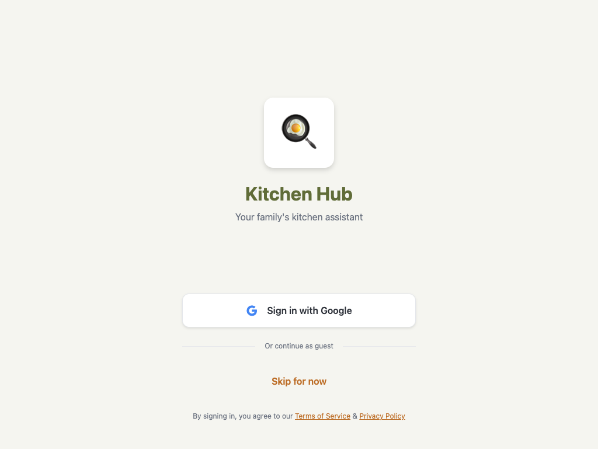

# Auth Feature

## Overview

The Auth feature handles user authentication for Kitchen Hub, providing two sign-in methods: Google authentication and guest mode. It serves as the entry point for new users and manages the authentication flow.

## Screenshot



## Screens

### LoginScreen

- **File**: `src/features/auth/screens/LoginScreen.tsx`
- **Purpose**: Main authentication UI displaying branding, sign-in options, and legal footer
- **Key functionality**:
  - Display Kitchen Hub branding with emoji logo
  - Google sign-in with loading state handling
  - Guest mode sign-in option ("Skip for now")
  - Terms of Service and Privacy Policy links

#### Code Snippet

```typescript
export function LoginScreen() {
  const { signInWithGoogle, signInAsGuest } = useAuth();
  const [isLoading, setIsLoading] = useState(false);

  const handleGoogleSignIn = async () => {
    setIsLoading(true);
    try {
      await signInWithGoogle();
    } catch (error) {
      console.error('Google sign-in error:', error);
    } finally {
      setIsLoading(false);
    }
  };

  const handleGuestSignIn = async () => {
    try {
      await signInAsGuest();
    } catch (error) {
      console.error('Guest sign-in error:', error);
    }
  };
  // ... render JSX
}
```

## Components

### GoogleSignInButton

- **File**: `src/features/auth/components/GoogleSignInButton/`
- **Purpose**: Reusable button component for Google authentication
- **Props**:

```typescript
interface GoogleSignInButtonProps {
  onPress: () => void;
  isLoading?: boolean;
}
```

- **Features**:
  - Shows Google icon with branded styling
  - Displays loading spinner when authentication is in progress
  - Disabled state during loading to prevent double-clicks

#### Code Snippet

```typescript
export function GoogleSignInButton({ onPress, isLoading }: GoogleSignInButtonProps) {
  return (
    <TouchableOpacity
      style={styles.button}
      onPress={onPress}
      disabled={isLoading}
      activeOpacity={0.8}
    >
      {isLoading ? (
        <ActivityIndicator color={colors.textPrimary} />
      ) : (
        <>
          <View style={styles.iconContainer}>
            <Ionicons name="logo-google" size={20} color={colors.google} />
          </View>
          <Text style={styles.text}>Sign in with Google</Text>
        </>
      )}
    </TouchableOpacity>
  );
}
```

## State Management

- **AuthContext**: Global authentication state via `useAuth()` hook
- **Local state**: `isLoading` boolean to track Google sign-in progress
- **Persistence**: User data stored in AsyncStorage under `@kitchen_hub_user`

## Key Dependencies

- `@expo/vector-icons` - Ionicons for Google logo
- `AuthContext` - Custom context for authentication state
- Theme system (`colors`, `spacing`, `borderRadius`, `typography`)
