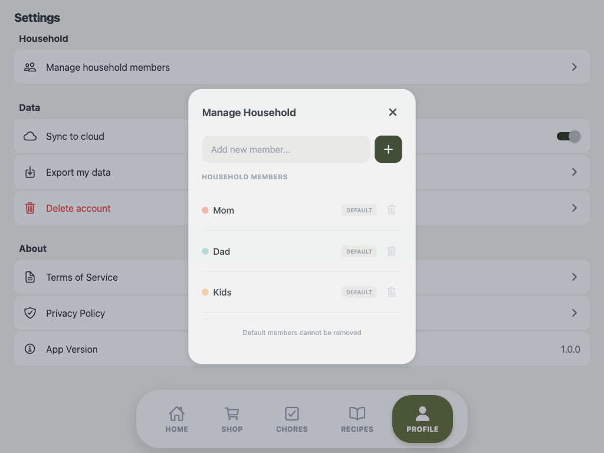

# Auth Feature

**Exports** (from `mobile/src/features/auth/index.ts`): `LoginScreen`, `GoogleSignInButton`.

**Current source map**: see [`mobile-ui-map.md`](./mobile-ui-map.md). The auth/onboarding flow is larger than this feature barrel export: it includes `LoginScreen`, `RegisterScreen`, `EnterInviteCodeScreen`, `HouseholdNameScreen`, `HouseholdOnboardingScreen`, `OnboardingContext`, `useOAuthSignIn`, `authApi`, `sessionManager`, `tokenStorage`, and guest-data import support.

**Important source directories/files**:
- `mobile/src/features/auth/`
- `mobile/src/features/onboarding/screens/HouseholdOnboardingScreen.tsx`
- `mobile/src/features/households/services/inviteApi.ts`
- `mobile/src/navigation/AuthStackNavigator.tsx`
- `mobile/src/contexts/AuthContext.tsx`

## Overview

The Auth feature handles user authentication, registration, invite-code joining, household onboarding, guest-mode transition/import, and token/session persistence. Google sign-in is one important path, but it is not the only auth surface.

## Screenshot



## Screens

### LoginScreen

- **File**: `mobile/src/features/auth/screens/LoginScreen.tsx`
- **Purpose**: Main authentication UI displaying branding, Google and email sign-in options, invite-join context, and legal footer
- **Key functionality**:
  - Display Kitchen Hub branding with emoji logo
  - Google sign-in with loading state handling
  - Email/password sign-in form toggled from the login screen
  - Join household navigation to `EnterInviteCode`
  - Invite-context sign-in through `OnboardingContext` when joining a household
  - Terms of Service and Privacy Policy links from `LegalLinksContext` / `openLegalUrl`
  - Redirect to `HouseholdName` when `showHouseholdNameScreen` is set after OAuth

#### Code Snippet

```typescript
export function LoginScreen({ navigation }: LoginScreenProps) {
  const { signInWithGoogle, showHouseholdNameScreen } = useAuth();
  const [isLoading, setIsLoading] = useState(false);

  useEffect(() => {
    if (showHouseholdNameScreen) {
      navigation.navigate('HouseholdName');
    }
  }, [showHouseholdNameScreen, navigation]);

  const handleGoogleSignIn = async () => {
    setIsLoading(true);
    try {
      await signInWithGoogle();
    } catch (error) {
      Alert.alert(
        'Sign In Failed',
        error instanceof Error
          ? error.message
          : 'Unable to sign in with Google. Please try again.',
        [{ text: 'OK' }]
      );
    } finally {
      setIsLoading(false);
    }
  };
  // ... render JSX
}
```

### RegisterScreen

- **File**: `mobile/src/features/auth/screens/RegisterScreen.tsx`
- **Purpose**: Email/password registration with name/email/password validation and login navigation after successful signup.
- **Key functionality**:
  - validates email format and password requirements
  - calls `signUpWithEmail(email, password, name)` from `AuthContext`
  - routes back to `Login` after success

### EnterInviteCodeScreen

- **File**: `mobile/src/features/auth/screens/EnterInviteCodeScreen.tsx`
- **Purpose**: Validates a household invite code and sets invite context for sign-in.
- **Key functionality**:
  - calls `inviteApi.validateInviteCode(trimmedCode)`
  - stores invite context in `OnboardingContext`
  - navigates back to `Login` so the next Google sign-in joins the validated household

### HouseholdNameScreen

- **File**: `mobile/src/features/auth/screens/HouseholdNameScreen.tsx`
- **Purpose**: Lets a new household owner confirm/update household name after OAuth sign-in.
- **Key functionality**:
  - fetches/updates household name through household APIs
  - clears `showHouseholdNameScreen` after completion or skip

### HouseholdOnboardingScreen

- **File**: `mobile/src/features/onboarding/screens/HouseholdOnboardingScreen.tsx`
- **Purpose**: Onboarding screen for signed-in users without a household.

## Components

### GoogleSignInButton

- **File**: `mobile/src/features/auth/components/GoogleSignInButton/`
- **Purpose**: Reusable button component for Google authentication
- **Props**:

```typescript
interface GoogleSignInButtonProps {
  onPress: () => void;
  isLoading?: boolean;
}
```

- **Features**:
  - Shows Google icon with branded styling
  - Displays loading spinner when authentication is in progress
  - Disabled state during loading to prevent double-clicks

#### Code Snippet

```typescript
export function GoogleSignInButton({ onPress, isLoading }: GoogleSignInButtonProps) {
  return (
    <TouchableOpacity
      style={styles.button}
      onPress={onPress}
      disabled={isLoading}
      activeOpacity={0.8}
    >
      {isLoading ? (
        <ActivityIndicator color={colors.textPrimary} />
      ) : (
        <>
          <View style={styles.iconContainer}>
            <Ionicons name="logo-google" size={20} color={colors.google} />
          </View>
          <Text style={styles.text}>Sign in with Google</Text>
        </>
      )}
    </TouchableOpacity>
  );
}
```

## State Management

- **AuthContext**: Global authentication state via `useAuth()` hook
  - `signInWithGoogle()` - Initiates Google OAuth flow, optionally with invite context
  - `signInWithEmail()` - Signs in with email/password from `LoginScreen`
  - `signUpWithEmail()` - Registers email/password users from `RegisterScreen`
  - `signOut()` - Signs out current user
  - `showHouseholdNameScreen` - Boolean indicating if user should see household name screen
  - `setShowHouseholdNameScreen()` - Sets household name screen visibility
- **OnboardingContext**: Stores onboarding mode and invite context for household-join flows
- **Local state**: loading flags plus email/password form visibility and input state
- **Persistence**: User/session/token data is handled by auth/session services and AsyncStorage-backed token/user storage

## Key Dependencies

- `@expo/vector-icons` - Ionicons for Google logo and icons
- `react-native` - Core React Native components (TouchableOpacity, Text, View, ActivityIndicator, Alert, SafeAreaView)
- `AuthContext` - Custom context for authentication state (`useAuth` hook)
- `OnboardingContext` - Stores join/create mode and invite context
- `authApi`, `sessionManager`, `tokenStorage` - API/session/token persistence services
- `inviteApi` - Household invite-code validation for join flow
- `LegalLinksContext` and `openLegalUrl` - Source-backed legal footer links
- Theme system (`colors`, `spacing`, `borderRadius`, `typography`) - Centralized design tokens

## Error Handling

- **Google Sign-In Errors**: Displays user-friendly Alert dialog with error message
