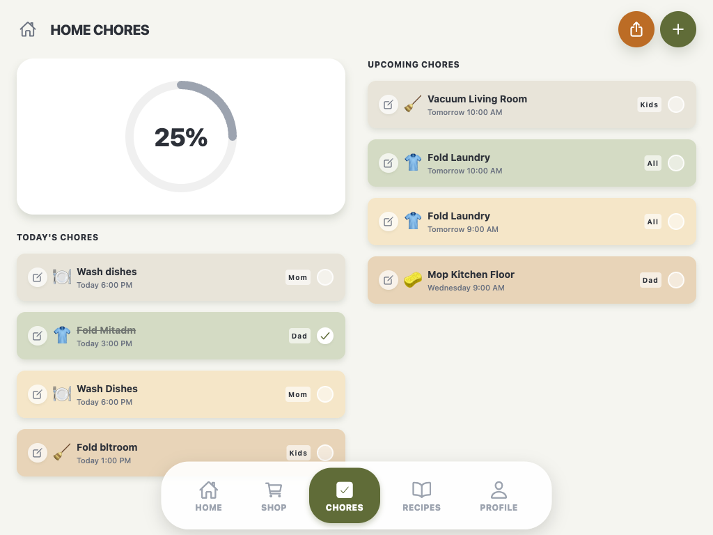
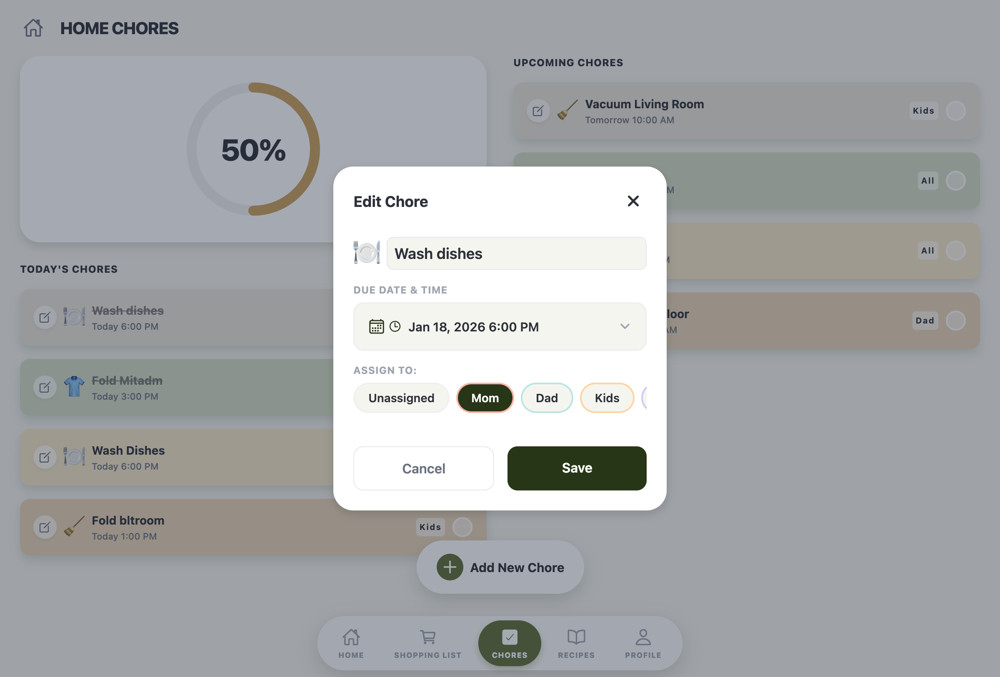
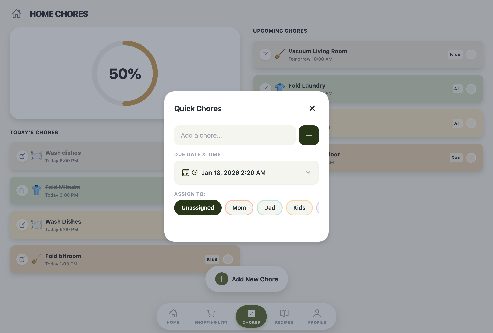

# Chores Feature

## Overview

The Chores feature provides household chore tracking with a visual progress ring, swipeable cards for today's and upcoming chores, and the ability to assign chores to household members. It features a responsive layout that adapts between single-column (mobile) and two-column (tablet) layouts.

## Screenshots

### Main Chores View


### Edit Chore Modal


### Quick Add Chore Modal


## Screens

### ChoresScreen

- **File**: `src/features/chores/screens/ChoresScreen.tsx`
- **Purpose**: Comprehensive chore management with progress tracking
- **Key functionality**:
  - Header with home icon and "HOME CHORES" title
  - Progress ring showing completion percentage for today's chores
  - Responsive layout: single-column (mobile) or two-column (768px+)
  - Two sections: "TODAY'S CHORES" and "UPCOMING CHORES"
  - Swipeable chore cards with edit and delete capabilities
  - Floating action button to add chores

#### Props Interface

```typescript
interface ChoresScreenProps {
  onOpenChoresModal?: () => void;
  onRegisterAddChoreHandler?: (handler: (newChore: {
    name: string;
    icon: string;
    assignee?: string;
    dueDate: string;
    dueTime?: string;
    section: 'today' | 'thisWeek';
  }) => void) => void;
}
```

#### Code Snippet - Progress Calculation

```typescript
const progress = useMemo(() => {
  const total = todayChores.length;
  const completed = todayChores.filter(c => c.completed).length;
  const progressValue = total > 0 ? (completed / total) * 100 : 0;
  return progressValue;
}, [todayChores]);
```

#### Code Snippet - Responsive Layout

```typescript
const { width } = useWindowDimensions();
const isWideScreen = width >= 768;

// Renders different layouts based on isWideScreen
{isWideScreen ? (
  <View style={styles.wideLayout}>
    {/* Two-column layout */}
  </View>
) : (
  <View style={styles.narrowLayout}>
    {/* Single-column layout */}
  </View>
)}
```

## Components

### ProgressRing

- **File**: `src/features/chores/components/ProgressRing/`
- **Purpose**: Animated circular progress indicator
- **Props**:

```typescript
interface ProgressRingProps {
  progress: number; // 0-100
  size?: number;
  strokeWidth?: number;
  progressColor?: string;
  backgroundColor?: string;
  showPercentage?: boolean;
  showEmoji?: boolean;
}
```

- **Features**:
  - SVG-based progress visualization
  - Dynamic color progression (gray -> yellow -> green)
  - Smooth animations with 1000ms duration
  - Shows percentage and thumbs-up emoji when >= 75%
  - Uses react-native-reanimated for animations

### SwipeableChoreCard

- **File**: `src/features/chores/components/SwipeableChoreCard/`
- **Purpose**: Gesture-driven chore card with swipe-to-delete
- **Props**:

```typescript
interface SwipeableChoreCardProps {
  children: React.ReactNode;
  onDelete: () => void;
  backgroundColor: string;
}
```

- **Features**:
  - Pan gesture handler for swipe-to-delete
  - Swipe left or right to delete (30% threshold or high velocity)
  - Animated background reveals trash icon
  - Smooth spring animations
  - Direction locking to prevent multi-directional swipes

### ChoreDetailsModal

- **File**: `src/features/chores/components/ChoreDetailsModal/`
- **Purpose**: Edit existing chore details
- **Features**:
  - Edit chore name and icon
  - Change assignee selection
  - Update due date and time
  - Date/time picker integration

### ChoresQuickActionModal

- **File**: `src/features/chores/components/ChoresQuickActionModal/`
- **Purpose**: Quick chore creation form
- **Features**:
  - Chore name input
  - Icon selection
  - Assignee picker
  - Due date and time selection
  - Section selection (today/this week)

## Key Types

```typescript
interface Chore {
  id: string;
  name: string;
  icon: string;
  assignee?: string;
  dueDate: string;
  dueTime?: string;
  completed: boolean;
  section: 'today' | 'thisWeek' | 'recurring';
}

export type AddChoreHandler = (newChore: {
  name: string;
  icon: string;
  assignee?: string;
  dueDate: string;
  dueTime?: string;
  section: 'today' | 'thisWeek';
}) => void;
```

## State Management

- **Local state**:
  - `chores` - Array of Chore objects
  - `selectedChore` - Currently selected chore for editing
  - `showDetailsModal` - Modal visibility
- **Computed values**:
  - `todayChores` - Filtered chores for today section
  - `upcomingChores` - Filtered chores for this week/recurring
  - `progress` - Percentage completion (memoized)
- **Parent communication**:
  - `onOpenChoresModal` - Callback to open quick add modal
  - `onRegisterAddChoreHandler` - Registers add function with parent

## Key Dependencies

- `react-native-gesture-handler` - GestureDetector for swipe interactions
- `react-native-reanimated` - Smooth animations for progress ring and swipes
- `mockChores` - Initial chore data
- `pastelColors` - Theme colors for card backgrounds
- `useWindowDimensions` - For responsive layout detection

## UI Flow

1. User views chores split into "Today" and "Upcoming" sections
2. Progress ring shows percentage of today's chores completed
3. Tap chore card to toggle completion status
4. Tap edit icon on chore to open details modal
5. Swipe chore left/right to delete it
6. Click FAB to open quick add modal for new chores
7. Assign chores to household members (Mom, Dad, Kids, All)

## Responsive Behavior

- **Mobile (< 768px)**: Single column layout
  - Progress ring at top
  - Today's chores below
  - Upcoming chores at bottom

- **Tablet (>= 768px)**: Two column layout
  - Left column: Progress ring + Today's chores
  - Right column: Upcoming chores
