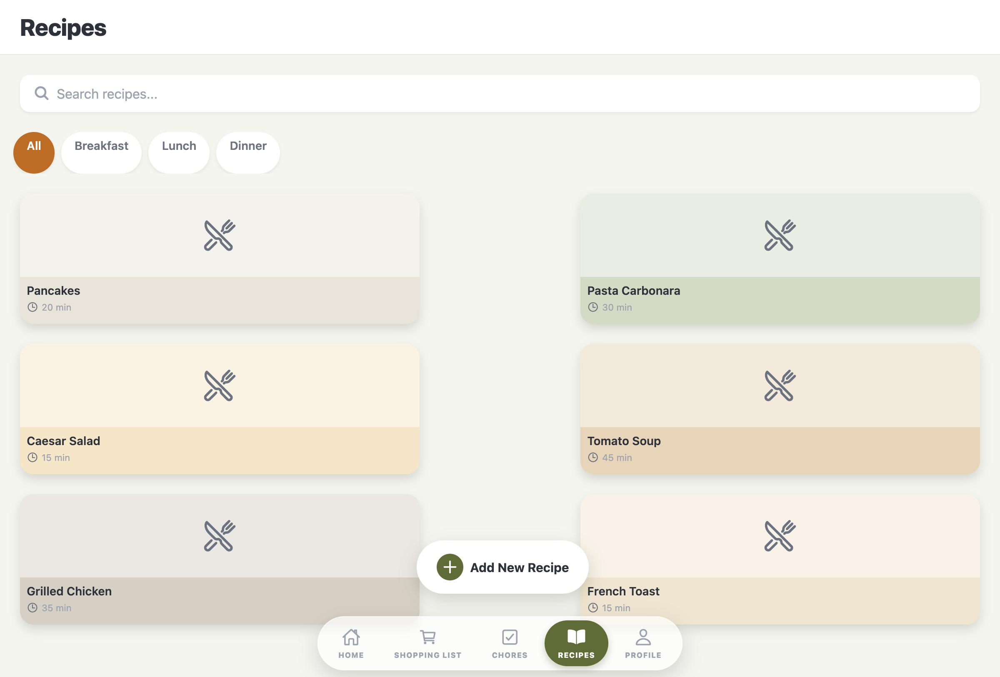
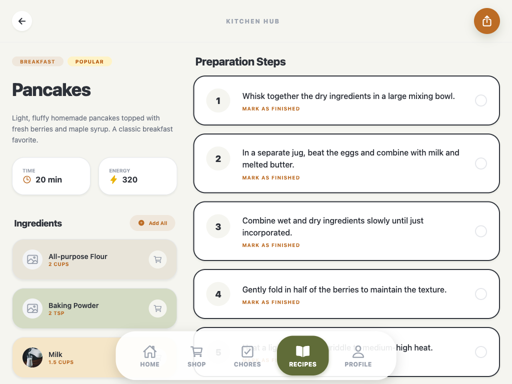
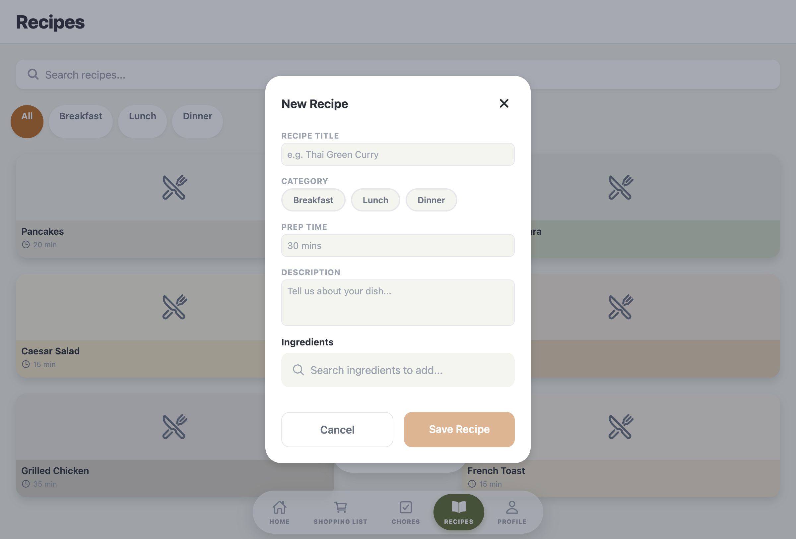

# Recipes Feature

## Overview

The Recipes feature allows users to browse, search, filter, and create recipes. It displays recipes in a card grid with category filtering and provides a comprehensive recipe creation form with ingredients and step-by-step instructions.

## Screenshots

### Main Recipes View


### Recipe Detail Screen


### Add Recipe Modal


## Screens

### RecipesScreen

- **File**: `mobile/src/features/recipes/screens/RecipesScreen.tsx`
- **Purpose**: Recipe discovery and creation
- **Key functionality**:
  - Search bar for finding recipes by name
  - Category filter chips (All, Breakfast, Lunch, Dinner, Dessert, Snack)
  - Grid layout displaying recipe cards (2 columns)
  - Floating action button to add new recipes
  - Pastel colors for visual variety
  - **Mock Data Toggle**: Loads grocery items from `mockGroceriesDB` or API (`/groceries/search?q=`) based on `config.mockData.enabled`
  - **Image Upload**: Handles recipe image uploads with guest/authenticated user logic

#### Code Snippet - Filtering Logic

```typescript
const filteredRecipes = recipes.filter(recipe => {
  const matchesCategory = selectedCategory === 'All' || recipe.category === selectedCategory;
  const matchesSearch = recipe.name.toLowerCase().includes(searchQuery.toLowerCase());
  return matchesCategory && matchesSearch;
});
```

#### Code Snippet - Card Width Calculation

```typescript
const { width } = Dimensions.get('window');
const cardWidth = ((width - spacing.lg * 3) / 2) * 0.85;
```

## Components

### RecipeDetailScreen

- **File**: `mobile/src/features/recipes/screens/RecipeDetailScreen.tsx`
- **Purpose**: Detailed view of a single recipe with ingredients and instructions
- **Key functionality**:
  - **Responsive Layout**: Adapts between phone (tabs) and tablet (split view)
  - **Sticky Header**: "Ingredients | Steps" header sticks to top on scroll
  - **Interaction**: Toggle step completion, add ingredients to shopping list
  - **Animatons**: Smooth fade/slide for sticky header
  - **Sharing**: Share recipe text via system share sheet

#### Sticky Header Logic (`RecipeDetailScreen.utils.ts`)

Pure utility functions manage the complex sticky header behavior:

- `calculateStickyHeaderTopPosition`: Determines precision placement accounting for safe areas
- `calculateIsHeaderScrolled`: Detects when main header passes threshold
- `calculateSpacerHeight`: Prevents layout shift when header becomes sticky

## Components

### RecipeContentWrapper

- **File**: `mobile/src/features/recipes/components/RecipeContentWrapper/`
- **Purpose**: Main content container handling responsive layout strategies
- **Refactoring Note**: Internally splits into `TabletRecipeContent` and `MobileRecipeContent` to manage distinct scrolling behaviors (independent columns vs single page).
- **Props**:

```typescript
interface RecipeContentWrapperProps {
  recipe: Recipe;
  completedSteps: Set<string>;
  onToggleStep: (stepId: string) => void;
  onAddIngredient: (ingredient: Ingredient) => void;
  onAddAllIngredients: () => void;
  renderHeaderOnly?: boolean;       // For sticky header rendering
  hideHeaderWhenSticky?: boolean;   // Hides static header when sticky is active
  activeTab?: 'ingredients' | 'steps';
  onTabChange?: (tab: 'ingredients' | 'steps') => void;
}
```

### RecipeHeader

- **File**: `mobile/src/features/recipes/components/RecipeHeader/`
- **Purpose**: Displays top-level recipe info (image, stats, description)
- **Features**:
  - Hero image with gradient overlay
  - Stats row (Prep time, Cook time, Calories, Servings)
  - Description text

### RecipeCard

- **File**: `mobile/src/features/recipes/components/RecipeCard/`
- **Purpose**: Individual recipe display card
- **Props**:

```typescript
interface RecipeCardProps {
  recipe: Recipe;
  backgroundColor: string;
  onPress: () => void;
  width: number;
}

interface Recipe {
  id: string;
  name: string;
  cookTime: string;
  category: string;
  imageUrl?: string;
}
```

- **Features**:
  - Shows recipe name and cook time
  - Placeholder icon for recipe image
  - Configurable width and background color (pastel)
  - Touch handler for recipe selection

### RecipeSidebar

- **File**: `mobile/src/features/recipes/components/RecipeSidebar/`
- **Status**: *Legacy/Removed in favor of RecipeContentWrapper*

### IngredientCard

- **File**: `mobile/src/features/recipes/components/IngredientCard/`
- **Purpose**: Individual ingredient display with shopping list integration
- **Features**:
  - Ingredient image placeholder
  - Name and quantity display
  - Add to shopping list button
  - Color-coded background

### InstructionStep

- **File**: `mobile/src/features/recipes/components/InstructionStep/`
- **Purpose**: Individual recipe instruction step with completion tracking
- **Features**:
  - Step number indicator
  - Instruction text
  - "Mark as finished" toggle
  - Visual feedback for completed steps

### AddRecipeModal

- **File**: `mobile/src/features/recipes/components/AddRecipeModal/`
- **Purpose**: Comprehensive recipe creation form
- **Props**:

```typescript
interface AddRecipeModalProps {
  visible: boolean;
  onClose: () => void;
  onSave: (recipe: NewRecipeData) => void;
  categories?: string[];
  groceryItems?: GroceryItem[];
}

interface NewRecipeData {
  title: string;
  category: string;
  prepTime: string;
  description: string;
  ingredients: Ingredient[];
  instructions: Instruction[];
  imageLocalUri?: string;
  imageUrl?: string;
}

interface Ingredient {
  id: string;
  quantity: string;
  unit: string;
  name: string;
  }

interface Instruction {
  id: string;
  text: string;
}
```

- **Features**:
  - Recipe title input
  - Category selection with horizontal scroll
  - Prep time input
  - Description textarea
  - Recipe photo picker (optional)
  - **Ingredients section**:
    - Integrated grocery search bar
    - Quantity, unit, and name inputs for each ingredient
    - Add/remove ingredients
    - Auto-populate from grocery database
  - **Instructions section**:
    - Numbered steps
    - Add/remove step functionality
    - Minimum 1 step required
  - Form validation (title and at least one ingredient required)

## Recipe Image Uploads (Mobile)

Recipe images are resized client-side before upload to reduce bandwidth and storage costs. The upload flow prevents orphaned images by creating the recipe first, then uploading the image, and finally updating the recipe with the image URL.

### Constraints

- Max resolution: `1024x1024` (aspect ratio preserved)
- Output format: JPEG
- Compression quality: `0.8`
- Max file size after resize: `2MB`

### Upload Flow

1. User selects a photo in `AddRecipeModal`.
2. Client resizes/compresses via `resizeAndValidateImage`:
   - File: `mobile/src/common/utils/imageResize.ts`
3. **Recipe Creation Flow** (prevents orphaned uploads):
   - **Step 1**: Create recipe first (without image) via `addRecipe()`
   - **Step 2**: Upload image to Supabase Storage using the server recipe ID:
     - Bucket: `household-uploads`
     - Path: `households/{householdId}/recipes/{recipeId}/{timestamp}.jpg`
     - File: `mobile/src/services/imageUploadService.ts`
   - **Step 3**: Update recipe with image URL via `updateRecipe()`
   - **Step 4**: If update fails, cleanup uploaded image via `deleteRecipeImage()`
4. The signed URL is stored in `imageUrl` when saving the recipe.

### Helper Functions

The upload flow uses helper functions to maintain clean separation of concerns:

- **`attachGuestImage`**: Updates recipe with local image URI for guest users
- **`uploadImageWithCleanup`**: Handles authenticated user uploads with automatic cleanup on failure
- **`deleteRecipeImage`**: Removes orphaned images from Supabase Storage when recipe update fails

### Notes

- **Guest mode**: Images are kept as local file URIs for the current session. When signing in with Google later, these images will **not** be uploaded automatically—users would need to re-add photos after sign-in if they want them persisted to cloud storage.
- **Orphan Prevention**: The create → upload → update flow ensures that if recipe creation fails, no orphaned images remain in storage. If the update step fails after upload, the uploaded image is automatically deleted.

## Entity Creation (New)

The feature implementation now uses a Factory Pattern to separate business logic from UI components and ensure TDD compliance.

- **Factory**: `mobile/src/features/recipes/utils/recipeFactory.ts`
- **Tests**: `mobile/src/features/recipes/utils/__tests__/recipeFactory.test.ts`
- **Logic**: Generates `localId` using `expo-crypto` UUIDs.

```typescript
// Example usage
import { createRecipe } from '../utils/recipeFactory';
const newRecipe = createRecipe(data);
```

## Key Types

```typescript
// Recipe entity now extends BaseEntity with shared metadata
import type { BaseEntity } from '../../../common/types/entityMetadata';

interface Recipe extends BaseEntity {
  // BaseEntity provides: id, localId, createdAt?, updatedAt?, deletedAt?
  name: string;
  cookTime: string;
  prepTime?: string;
  category: string;
  imageUrl?: string;
  description?: string;
  calories?: number;
  servings?: number;
  ingredients: Ingredient[];
  instructions: Instruction[];
}

// Nested sub-entities (do not extend BaseEntity)
interface Ingredient {
  id: string;
  quantity: string;
  unit: string;
  name: string;
  image?: string;
}

interface Instruction {
  id: string;
  text: string;
}

// Categories available
const recipeCategories = ['All', 'Breakfast', 'Lunch', 'Dinner', 'Dessert', 'Snack'];
```

**Entity Metadata (from `BaseEntity`):**
- `id: string` - Legacy/Display ID for UI
- `localId: string` - Stable UUID for sync/merge operations
- `createdAt?: Date | string` - Creation timestamp
- `updatedAt?: Date | string` - Last modification timestamp
- `deletedAt?: Date | string` - Soft-delete timestamp (tombstone pattern)

**Note:** `Ingredient` and `Instruction` are nested sub-entities and do not extend `BaseEntity`. Metadata is managed at the `Recipe` level.

See [`mobile/src/common/types/entityMetadata.ts`](../../mobile/src/common/types/entityMetadata.ts) for shared entity metadata interfaces and helpers.

## State Management

- **Local state**:
  - `searchQuery` - Search input text
  - `selectedCategory` - Active category filter
  - `showAddRecipeModal` - Modal visibility
  - `groceryItems` - Grocery items loaded from mock or API based on toggle
  - `recipes` - Managed by `useRecipes` hook (switches between Local/Remote sources)
  - `isLoading` - Loading state for async operations
- **Hook**: `useRecipes()` (`mobile/src/features/recipes/hooks/useRecipes.ts`)
  - Returns: `recipes`, `isLoading`, `error`, `addRecipe`, `updateRecipe`
  - Uses `createRecipeService(mode)` factory to select service implementation based on data mode
  - Determines mode using `determineUserDataMode()`: 'guest' for guest users or when `config.mockData.enabled` is true, 'signed-in' for authenticated users
  - `addRecipe` and `updateRecipe` automatically persist to guest storage when in guest mode
  - `updateRecipe` merges updates with existing recipe data to prevent data loss

## Service Layer

The feature uses a **Strategy Pattern** with a **Factory Pattern** to handle data fetching, switching transparently between local guest storage and backend API based on user authentication state.

- **Factory**: `createRecipeService(mode: 'guest' | 'signed-in')` (`mobile/src/features/recipes/services/recipeService.ts`)
  - Returns `LocalRecipeService` when mode is 'guest'
  - Returns `RemoteRecipeService` when mode is 'signed-in'
  - Validates service compatibility with data mode
- **Entity Factory**: `createRecipe()` (`mobile/src/features/recipes/utils/recipeFactory.ts`)
  - Creates new recipe objects with required fields
  - **Automatically populates `createdAt`** using `withCreatedAt()` helper
- **Interface**: `IRecipeService`
  - `getRecipes(): Promise<Recipe[]>`
  - `createRecipe(recipe: Partial<Recipe>): Promise<Recipe>`
  - `updateRecipe(recipeId: string, updates: Partial<Recipe>): Promise<Recipe>` - Updates recipe with partial data, used for adding image URLs after upload
    - **Automatically updates `updatedAt`** using `withUpdatedAt()` helper
- **Strategies**:
  - `LocalRecipeService`: 
    - Reads from `guestStorage.getRecipes()` (AsyncStorage) instead of mocks
    - Returns empty array when no guest data exists (not mock data)
    - Persists recipes to AsyncStorage via `guestStorage.saveRecipes()` on create/update
    - Includes retry logic for concurrent write operations
    - Validates recipe data before saving
    - **Timestamp Management**: 
      - `createRecipe()`: Automatically populates `createdAt` via `withCreatedAt()` helper
      - `updateRecipe()`: Automatically updates `updatedAt` via `withUpdatedAt()` helper
      - Timestamps are serialized to ISO strings when persisting to AsyncStorage
  - `RemoteRecipeService`: Calls backend via `api.ts` (`/recipes` endpoint)
- **Guest Storage**: `mobile/src/common/utils/guestStorage.ts`
  - `getRecipes()`: Retrieves recipes from AsyncStorage key `@kitchen_hub_guest_recipes`
    - Normalizes timestamps from ISO strings to Date objects (shallow normalization)
  - `saveRecipes(recipes)`: Persists recipes to AsyncStorage
    - Serializes timestamps from Date objects to ISO strings (shallow serialization)
  - Returns empty arrays when no data exists or on parse errors
  - Validates data format (ensures array and required fields)
- **Timestamp Utilities**: `mobile/src/common/utils/timestamps.ts`
  - `withCreatedAt()`: Auto-populates `createdAt` on entity creation (used in `recipeFactory.ts`)
  - `withUpdatedAt()`: Auto-updates `updatedAt` on entity modification (used in `recipeService.ts`)
  - `markDeleted()`: Sets `deletedAt` for soft-delete operations
  - See [`mobile/src/common/types/entityMetadata.ts`](../../mobile/src/common/types/entityMetadata.ts) for serialization helpers
- **Configuration**: `config.mockData.enabled` (`mobile/src/config/index.ts`)
  - Controlled by `EXPO_PUBLIC_USE_MOCK_DATA` environment variable
  - When enabled, forces 'guest' mode regardless of user authentication state
  - Guest users always use 'guest' mode (local service)
- **API Client**: `mobile/src/services/api.ts` - Generic HTTP client wrapper

## Key Dependencies

- `@expo/vector-icons` - Ionicons for icons
- `config` - Application configuration (`mobile/src/config/index.ts`) for mock data toggle
- `createRecipeService` - Service factory for selecting guest/signed-in data source based on mode
- `guestStorage` - Guest data persistence utilities (`mobile/src/common/utils/guestStorage.ts`)
- `determineUserDataMode` - Utility to determine data mode from user state (`mobile/src/common/types/dataModes.ts`)
- `mockGroceriesDB` - For ingredient search in add modal (when mock enabled)
- `mockRecipes` - Initial recipe data (used by LocalRecipeService)
- `api` - HTTP client (`mobile/src/services/api.ts`) for remote service calls
- `deleteRecipeImage` - Image cleanup utility (`mobile/src/services/imageUploadService.ts`) for removing orphaned uploads
- `pastelColors` - Theme colors for card backgrounds
- `GrocerySearchBar` - Reused from shopping feature for ingredient search
- `CenteredModal` - Shared modal component
- `ScreenHeader` - Shared header component
- `useAuth` - Authentication context hook
- `useResponsive` - Responsive layout hook

## UI Flow

1. User views recipe grid with all recipes
2. Can filter by category chips (All, Breakfast, Lunch, etc.)
3. Can search recipes by name
4. Clicking FAB opens Add Recipe modal
5. In modal, user fills out recipe details:
   - Title (required)
   - Category selection
   - Prep time
   - Description
   - Ingredients (search from database or add custom)
   - Step-by-step instructions
6. Save creates new recipe and adds to grid

## Styling Notes

- Uses `pastelColors` array for card backgrounds (cycles through)
- Grid uses flexWrap with space-between justification
- Cards have calculated width based on screen size
- **Scroll Padding**: `SCROLL_CONTENT_BOTTOM_PADDING` (180px) is used in `RecipeDetailScreen` to ensure content isn't hidden behind navigation bars or safe areas.
