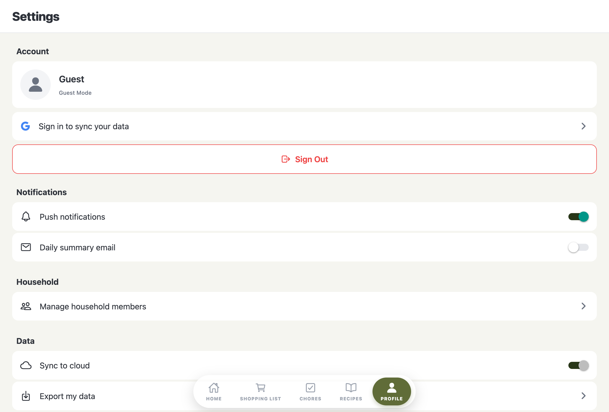

# Settings Feature

## Overview

The Settings feature provides user account management, notification preferences, household member management, data controls, and app information. It displays the current user's profile and offers various configuration options.

## Screenshots

### Main Settings View


### Manage Household Modal


## Screens

### SettingsScreen

- **File**: `mobile/src/features/settings/screens/SettingsScreen.tsx`
- **Purpose**: Comprehensive settings interface with multiple sections
- **Key functionality**:
  - **Account Section**: User profile card, sign-in prompt for guests, sign out button
  - **Notifications Section**: Push notifications and daily summary email toggles
  - **Household Section**: Button to manage household members
  - **Guest Data Section**: Import or delete local guest data (visible when signed in and has guest data)
  - **Data Section**: Cloud sync toggle, export data, delete account options
  - **About Section**: Terms of Service, Privacy Policy, app version

#### Code Snippet - State Management

```typescript
const { user, signOut, signInWithGoogle, hasGuestData, importGuestData, clearGuestData } = useAuth();
const [pushNotifications, setPushNotifications] = React.useState(true);
const [dailySummary, setDailySummary] = React.useState(false);
const [cloudSync, setCloudSync] = React.useState(true);
const [showManageHousehold, setShowManageHousehold] = React.useState(false);
const [showClearDataConfirm, setShowClearDataConfirm] = React.useState(false);
const [toastMessage, setToastMessage] = React.useState<string | null>(null);
const [toastType, setToastType] = React.useState<'success' | 'error'>('success');
```

#### Code Snippet - Guest Data Management

```typescript
const handleImportGuestData = async () => {
  try {
    await importGuestData();
    setToastType('success');
    setToastMessage('Guest data imported successfully');
  } catch (error) {
    setToastType('error');
    setToastMessage('Failed to import guest data. Please try again.');
  }
};

const handleClearGuestData = async () => {
  try {
    await clearGuestData();
    setShowClearDataConfirm(false);
    setToastType('success');
    setToastMessage('Guest data deleted');
  } catch (error) {
    setToastType('error');
    setToastMessage('Failed to delete guest data. Please try again.');
  }
};
```

## Components

### ManageHouseholdModal

- **File**: `mobile/src/features/settings/components/ManageHouseholdModal/`
- **Purpose**: Household member management interface
- **Props**:

```typescript
interface ManageHouseholdModalProps {
  visible: boolean;
  onClose: () => void;
}
```

- **Features**:
  - Input field to add new household members
  - List of current members with color indicators
  - Delete buttons (disabled for default members)
  - "Default" badge for built-in members
  - Uses `HouseholdContext` for state management
  - Async operations for adding/removing members

## UI Sections

### Account Section
- **Profile Card**:
  - User avatar (Google photo or placeholder icon)
  - User name (or "Guest")
  - Email (if signed in)
  - Provider info ("Guest Mode" or "Connected via Google")
- **Sign In Prompt** (guests only): Google sign-in button
- **Sign Out Button**: Red-bordered button with logout icon

### Notifications Section
- **Push notifications**: Toggle switch (default: on)
- **Daily summary email**: Toggle switch (default: off)

### Household Section
- **Manage household members**: Opens ManageHouseholdModal

### Guest Data Section
- **Visibility**: Only shown when user is signed in (not guest) AND `hasGuestData` is true
- **Import local guest data**: Imports guest session data to authenticated account
  - Shows success toast on success
  - Shows error toast on failure
- **Delete local guest data**: Permanently removes guest data
  - Opens confirmation modal before deletion
  - Shows success toast on success
  - Shows error toast on failure

### Data Section
- **Sync to cloud**: Toggle switch (disabled for guests)
- **Export my data**: Navigation row
- **Delete account**: Red text, navigation row

### About Section
- **Terms of Service**: Navigation row
- **Privacy Policy**: Navigation row
- **App Version**: Displays "1.0.0"

## State Management

- **AuthContext**: User data and auth functions via `useAuth()` hook
  - `user` - Current user object
  - `signOut()` - Sign out function
  - `signInWithGoogle()` - Google sign-in function (used in guest sign-in prompt)
  - `hasGuestData` - Boolean indicating if guest data exists
  - `importGuestData()` - Function to import guest data
  - `clearGuestData()` - Function to delete guest data
- **HouseholdContext**: Household members state (used in modal)
- **Local state**:
  - `pushNotifications` - Push notification toggle state
  - `dailySummary` - Email summary toggle state
  - `cloudSync` - Cloud sync toggle state
  - `showManageHousehold` - Manage household modal visibility
  - `showClearDataConfirm` - Guest data deletion confirmation modal visibility
  - `toastMessage` - Toast notification message (null when hidden)
  - `toastType` - Toast type ('success' or 'error')

## Key Dependencies

- `@expo/vector-icons` - Ionicons for all icons
- `AuthContext` - User authentication state and guest data management
- `HouseholdContext` - Household member management
- `CenteredModal` - Shared modal component (used by ManageHouseholdModal and guest data deletion confirmation)
- `Toast` - Shared toast component for user feedback
- `Switch` - React Native switch component for toggles

## Conditional Rendering

- **Guest users**:
  - Show "Sign in to sync your data" prompt
  - Cloud sync toggle is disabled
  - Profile shows "Guest Mode"
  - Guest Data section is hidden

- **Authenticated users**:
  - Show email in profile
  - Cloud sync toggle is enabled
  - Profile shows "Connected via Google"
  - Guest Data section shown only if `hasGuestData` is true

## Household Members

Default members (cannot be removed):
- Mom (red indicator)
- Dad (green indicator)
- Kids (orange indicator)
- All (purple indicator)

Users can add custom household members which can be deleted.

## User Feedback

- **Toast Notifications**: Used for guest data operations
  - Success toast: Green toast with checkmark icon
  - Error toast: Red toast with error icon
  - Auto-dismisses after 2.5 seconds
  - Shows at top of screen

- **Confirmation Modal**: Used for destructive actions
  - Guest data deletion requires confirmation
  - Shows warning message about permanent deletion
  - Red "Delete" button for emphasis
