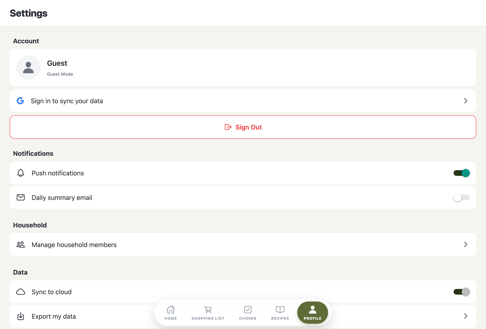
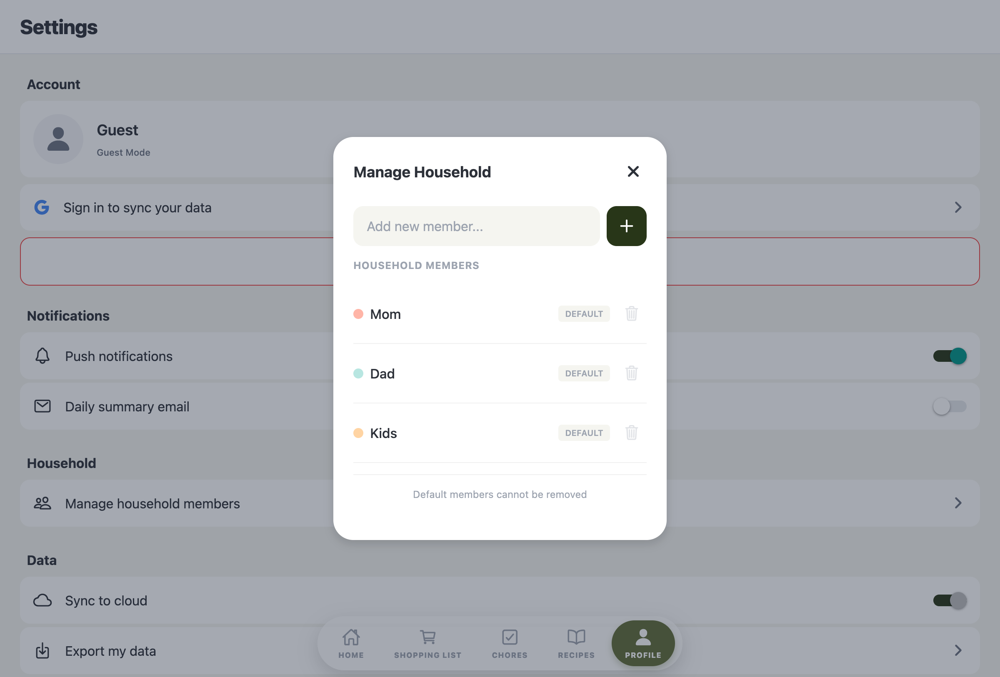

# Settings Feature

**Exports** (from `mobile/src/features/settings/index.ts`): `SettingsScreen`, `ManageHouseholdModal`, `LanguageSelectorModal`, `LegalConsentGate`.

**Current source map**: see [`mobile-ui-map.md`](./mobile-ui-map.md). Settings now includes household management, invite flow UI, language/RTL support, legal consent, import/data controls, account deletion/export services, premium/subscription UI, premium demo support, and a Help & Support entry into the guided support ticket flow.

## Overview

The Settings feature provides user account management, household member/invite controls, language selection, premium/subscription surfaces, legal links/consent, data controls, app information, and support entry points. It displays the current user's profile and routes account/privacy actions through source-backed services and context providers.

## Screenshots

### Main Settings View


### Manage Household Modal


## Screens

### SettingsScreen

- **File**: `mobile/src/features/settings/screens/SettingsScreen.tsx`
- **Purpose**: Comprehensive settings interface with multiple sections
- **Key functionality**:
  - **Language Section**: Row showing current language (native name) and RTL-aware chevron (`getDirectionalIcon('chevron-forward')`); opens LanguageSelectorModal to change app language (persisted to AsyncStorage, applied app-wide via i18n; RTL languages may trigger app restart)
  - **Account Section**: User profile card and sign out button
  - **Premium Section**: `PremiumSection` plus `PremiumDemoSection`; opens `PremiumPaywall` via navigation
  - **Household Section**: Manage household members, generate invite code, and share invite code through `InviteMemberModal`
  - **Data Section**: Export data row and delete account flow through `accountService.deleteMyAccount()` with confirmation/error handling
  - **About Section**: Help & Support row that opens the guided support ticket flow, Privacy Policy and Terms of Service rows opened through `LegalLinksContext` / `openLegalUrl`, plus app version

#### Code Snippet - State Management

```typescript
const { t } = useTranslation('settings');
const { user, signOut } = useAuth();
const [pushNotifications, setPushNotifications] = React.useState(true);
const [showLanguageSelector, setShowLanguageSelector] = React.useState(false);
const [showManageHousehold, setShowManageHousehold] = React.useState(false);
const currentLanguageCode = normalizeLocale(i18n.language ?? '');
const currentLanguageDisplayName = getNativeNameForCode(currentLanguageCode);
```

## Components

### ManageHouseholdModal

- **File**: `mobile/src/features/settings/components/ManageHouseholdModal/`
- **Purpose**: Household member management interface
- **Props**:

```typescript
interface ManageHouseholdModalProps {
  visible: boolean;
  onClose: () => void;
}
```

- **Features**:
  - Lists household members from `HouseholdContext`
  - Delete buttons for removable members
  - Protected/default member press shows explanatory feedback instead of removing
  - Provides actions for `onInviteMember` and `onShareInviteCode`
  - Uses `CenteredModal` with custom action rows

### LanguageSelectorModal

- **File**: `mobile/src/features/settings/components/LanguageSelectorModal/`
- **Purpose**: Lists available languages with native names; user selects one to change app language (persisted to AsyncStorage, applied app-wide). Shows "(Restart required)" when switching between LTR and RTL languages (Hebrew, Arabic).
- **Props**:

```typescript
interface LanguageSelectorModalProps {
  visible: boolean;
  onClose: () => void;
  /** Normalized current language code (e.g. from normalizeLocale(i18n.language)). */
  currentLanguageCode: string;
}
```

- **Features**:
  - Scrollable list from `AVAILABLE_LANGUAGES` (i18n constants); each row shows native name and checkmark when selected
  - **RTL restart badge**: When current language direction (LTR/RTL) differs from the selected option, shows `t('restartRequired')` (e.g. "(Restart required)") via `isRtlLanguage(currentLanguageCode)` and `isRtlLanguage(entry.code)`; `showRestartBadge = currentIsRtl !== entryIsRtl`
  - On row press: calls `setAppLanguage(code)` then `onClose()`; on failure still closes modal (switching to/from RTL may trigger app restart via `Updates.reloadAsync()`)
  - Uses `CenteredModal` with `showActions={false}`; title from `t('settings:language')`
  - Row layout: `labelBlock` (column) with `nativeName` and optional `restartBadge`; checkmark on the right when selected
  - Accessibility: `accessibilityRole="button"`, `accessibilityLabel` (e.g. "Select language: English"), `accessibilityState={{ selected: true }}` for current language
  - Min row height 44pt; uses theme (colors, spacing, borderRadius, typography)

## UI Sections

### Language Section
- **Language**: Row labeled "Language" (from `t('settings:language')`) with current language’s native name (e.g. "English") and directional chevron (`getDirectionalIcon('chevron-forward')` for RTL-aware layout); opens LanguageSelectorModal on press. Display name resolved via `getNativeNameForCode(normalizeLocale(i18n.language))` with defensive fallback.

### Account Section
- **Profile Card**:
  - User avatar (Google photo or placeholder icon)
  - User name (or "User")
  - Email (if signed in)
  - Provider info ("Connected via Google")
- **Sign Out Button**: Red-bordered button with logout icon

### Notifications Section
- **Push notifications**: Toggle switch (default: on)

### Premium Section
- **PremiumSection**: Shows current household premium state and opens `PremiumPaywall` when the user chooses to manage/upgrade.
- **PremiumDemoSection**: Premium-gated demo surface used for entitlement verification.

### Household Section
- **Manage household members**: Opens `ManageHouseholdModal`.
- **Invite household member / share invite code**: Opens `InviteMemberModal` with either generate or share initial action.

### Data Section
- **Export my data**: Navigation row / data-control surface.
- **Delete account**: Opens a destructive confirmation alert, then calls `accountService.deleteMyAccount()` and signs out on success.

### About Section
- **Help & Support**: Opens the `SupportTicket` route (`mobile/src/features/support/screens/SupportTicketScreen.tsx`). The support flow collects platform/source, issue category, summary, expected/actual behavior, frequency, reproduction steps, contact email, device/app context, attachment notes, and privacy acknowledgment. Signed-in primary submission calls `mobile/src/features/support/supportTicketApi.ts`, which posts to protected `POST /api/v1/support/tickets`; the backend forwards the ticket by Resend/`EMAIL_FROM` to `yair.solutions.19@gmail.com` with `reply_to` set to the submitter contact email. It persists drafts in `AsyncStorage` under `fullhouse.supportTicketDraft.v1`, clears the draft after backend success, and keeps the draft plus visible error on backend/offline/unauthenticated failure. The `Email support instead` action remains a `mailto:` fallback with subject format `[FullHouse Support][{platform}][{category}] {summary}`.
- **Privacy Policy**: Opens URL from `LegalLinksContext` via `openLegalUrl(privacyPolicyUrl)`.
- **Terms of Service**: Opens URL from `LegalLinksContext` via `openLegalUrl(termsOfServiceUrl)`.
- **App Version**: Displays "1.0.0".

## State Management

- **AuthContext**: User data and auth functions via `useAuth()` hook
  - `user` - Current user object
  - `signOut()` - Sign out function
- **HouseholdContext**: Household members state (used in modal)
- **Local state**:
  - `pushNotifications` - Push notification toggle state
  - `showLanguageSelector` - Language selector modal visibility
  - `showManageHousehold` - Manage household modal visibility
  - `showInviteModal` - Invite member modal visibility
  - `inviteModalInitialAction` - Initial invite modal mode: `generate` or `share`
- **Derived (i18n)**: `currentLanguageCode` = `normalizeLocale(i18n.language ?? '')`; `currentLanguageDisplayName` = `getNativeNameForCode(currentLanguageCode)` for the Language row
- **Legal links**: `useLegalLinks()` provides `privacyPolicyUrl` and `termsOfServiceUrl` for settings rows
- **Account service**: `accountService.deleteMyAccount()` performs account deletion after confirmation
- **Support ticket draft**: `SupportTicketScreen` uses `AsyncStorage` key `fullhouse.supportTicketDraft.v1` for best-effort draft restore/persistence until backend submission succeeds; backend/offline/unauthenticated failure keeps the draft for retry or mailto fallback.

## Key Dependencies

- `@expo/vector-icons` - Ionicons for all icons throughout the screen
- `react-native` - Core React Native components (View, Text, ScrollView, TouchableOpacity, Switch, Image, SafeAreaView)
- `AuthContext` - User authentication state (`useAuth` hook)
- `HouseholdContext` - Household member management (`useHousehold` hook)
- `ScreenHeader` - Shared header component for consistent navigation
- `CenteredModal` - Shared modal component (used by ManageHouseholdModal, LanguageSelectorModal)
- `react-i18next` - `useTranslation('settings')` for screen title, Language section labels, and `restartRequired` (LanguageSelectorModal badge)
- `i18n` (mobile/src/i18n) - Current language and `setAppLanguage()`; `normalizeLocale()` and `getNativeNameForCode()` from localeNormalization and constants
- `isRtlLanguage` (mobile/src/i18n/rtl) - RTL language detection (Hebrew, Arabic) for LanguageSelectorModal restart badge
- `getDirectionalIcon` (mobile/src/common/utils/rtlIcons) - RTL-aware chevron/arrow icon names for Settings rows
- `mobile/src/features/support/supportTicket.ts` - Support ticket packet builder, support email constant, Gmail label constant, readiness checks, and `mailto:` URL generation
- `mobile/src/features/support/supportTicketApi.ts` - Backend-first support ticket submission wrapper (`POST /support/tickets`, versioned by the shared API client)
- `Linking` and `AsyncStorage` - Support ticket mailto fallback and draft persistence
- Theme system (`colors`, `spacing`, `borderRadius`, `typography`, `shadows`) - Centralized design tokens

## Household Members

Household membership is sourced from `HouseholdContext`. The modal distinguishes removable members from protected/default members; protected member actions show explanatory feedback instead of deleting. Invite generation/sharing is handled by `InviteMemberModal` and household invite services rather than an inline "add member" text field.

## User Feedback

- Destructive account deletion uses a confirmation alert before calling the account service.
- Account deletion failures are mapped to user-friendly i18n messages through `getDeleteAccountErrorMessage()`.
- Protected household-member actions show explanatory feedback rather than silently failing.
- Support ticket primary submission posts to the backend, clears the saved draft only after backend success, and preserves the draft with a visible error on backend/offline/unauthenticated failure. `Email support instead` opens the mailto fallback when available; if no email app can handle the `mailto:` URL, the screen shows an error and keeps the saved draft.
