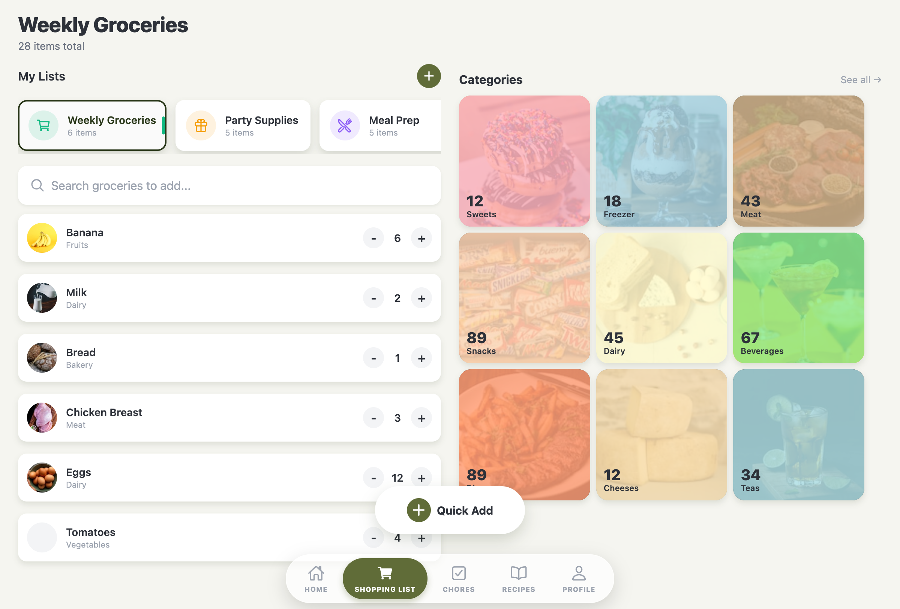
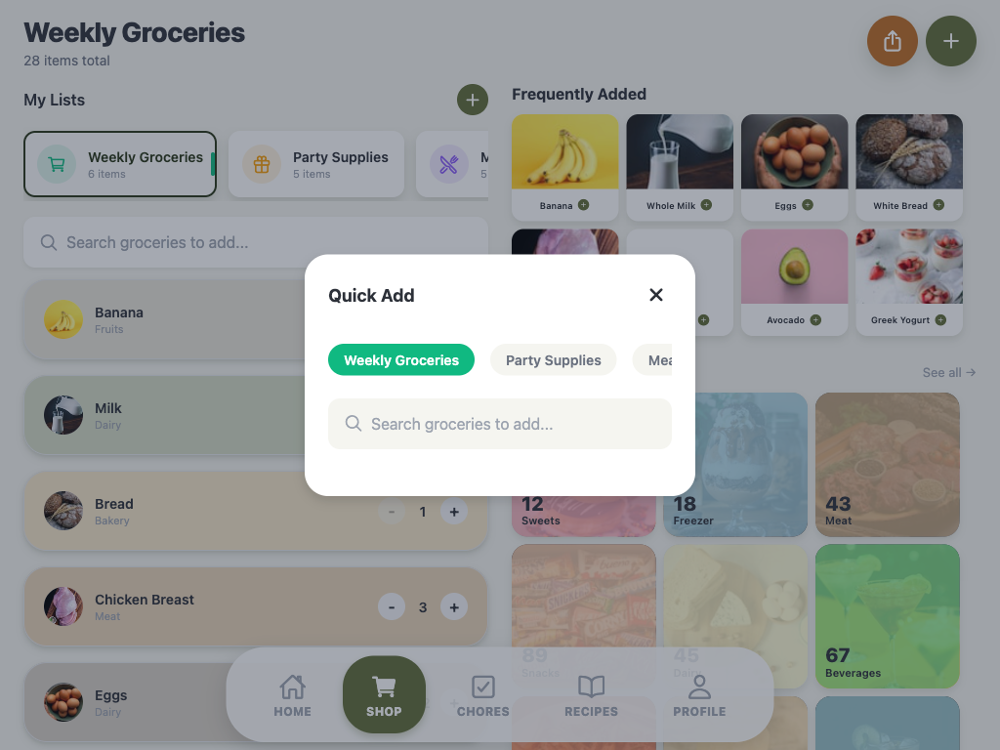
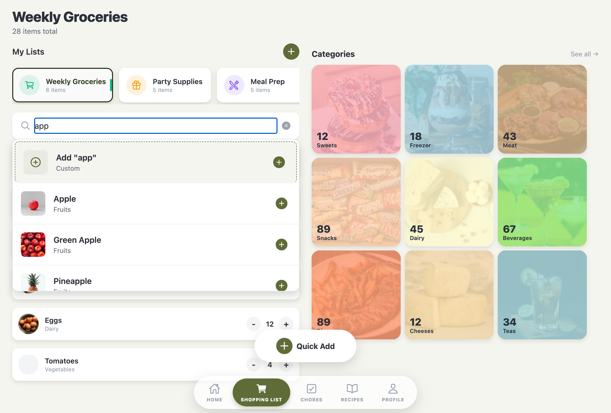
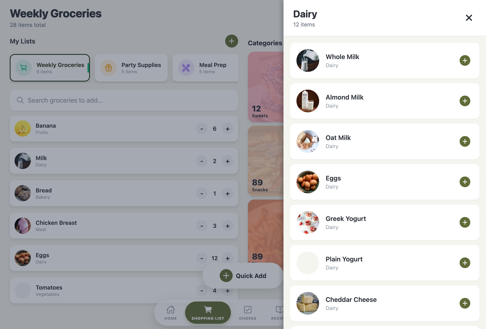

# Shopping Feature

## Overview

The Shopping feature provides comprehensive shopping list management with the ability to create multiple lists, browse groceries by category, search and add items, and track quantities. It's the most complex feature in the app with multiple components and modals.

## Screenshots

### Main Shopping View


### Quick Add Modal


### Search Dropdown


### Category Modal


### All Items Modal


### New List Modal


## Screens

### ShoppingListsScreen

- **File**: `mobile/src/features/shopping/screens/ShoppingListsScreen.tsx`
- **Purpose**: Complex shopping list management with two-column layout
- **Key functionality**:
  - Header showing selected list name and total item count
  - Two-column layout: shopping lists & items (left), categories discovery (right)
  - Multiple modal interactions (quantity, create list, category, all items, quick add)
  - Floating action button for quick add
  - **Guest Support**: Loads private list data from local storage (AsyncStorage) for guest users while signed-in users use the API
  - **Cache-Aware Repository** (signed-in users): Uses `CacheAwareShoppingRepository` wrapper with `useCachedEntities` hooks for reactive cache updates
    - Cache updates automatically trigger UI re-renders via React hooks
    - No manual state management needed for signed-in users
    - Realtime updates handled through cache events
  - **Service Integration**: All CRUD operations (toggle, delete, update, create) always call repository/service methods - no userMode branching in handlers
  - **Optimistic UI Updates**: Guest mode operations use optimistic updates with automatic revert on error via `executeWithOptimisticUpdate` helper
    - Signed-in mode relies on cache events for UI updates (no optimistic updates needed)

#### Code Snippet - Service and Repository Initialization

```typescript
// Determine data mode based on user authentication state
const userMode = useMemo(() => {
  if (config.mockData.enabled) {
    return 'guest' as const;
  }
  return determineUserDataMode(user);
}, [user]);

const isSignedIn = userMode === 'signed-in';

// Create service and repository
const shoppingService = useMemo(
  () => createShoppingService(userMode),
  [userMode]
);

const repository = useMemo(() => {
  return isSignedIn ? new CacheAwareShoppingRepository(shoppingService) : null;
}, [shoppingService, isSignedIn]);

// Use cache hooks for signed-in users
const { data: cachedLists, isLoading: isListsLoading } = useCachedEntities<ShoppingList>('shoppingLists');
const { data: cachedItems, isLoading: isItemsLoading } = useCachedEntities<ShoppingItem>('shoppingItems');

// For guest mode, use service directly
const [guestLists, setGuestLists] = useState<ShoppingList[]>([]);
const [guestItems, setGuestItems] = useState<ShoppingItem[]>([]);

const shoppingLists = isSignedIn ? cachedLists : guestLists;
const allItems = isSignedIn ? cachedItems : guestItems;
```

## Components

### ShoppingListPanel

- **File**: `mobile/src/features/shopping/components/ShoppingListPanel/`
- **Purpose**: Left column containing list selector and shopping items
- **Features**:
  - Horizontal drawer showing all shopping lists
  - Search bar for finding groceries
  - Swipeable shopping item rows with quantity controls
  - "New List" button
  - **Sync Status Indicators** (signed-in users only):
    - Each shopping item displays a sync status indicator next to quantity controls
    - Shows pending state (clock icon) when item is queued for sync
    - Shows failed state (warning icon) when sync has permanently failed
    - Hidden when item is confirmed (synced successfully)
    - Uses `useEntitySyncStatusWithEntity` hook per item to determine status
    - Integrates with sync queue system for real-time status updates
    - Implemented via `ShoppingItemCard` component to properly use React hooks

### GrocerySearchBar

- **File**: `mobile/src/features/shopping/components/GrocerySearchBar/`
- **Purpose**: Smart search component with dropdown results
- **Props**:

```typescript
interface GrocerySearchBarProps {
  items: GroceryItem[];
  onSelectItem: (item: GroceryItem) => void;
  onQuickAddItem: (item: GroceryItem) => void;

  placeholder?: string;
  variant?: 'surface' | 'background';
  showShadow?: boolean;
  maxResults?: number;  // default: 8
  allowCustomItems?: boolean;  // allow adding items not in database

  // Controlled state
  value?: string;
  onChangeText?: (text: string) => void;

  containerStyle?: ViewStyle;
  dropdownStyle?: ViewStyle;
}
```

- **Features**:
  - Filter by name or category
  - Support for custom item creation
  - Quick-add buttons for rapid multi-item addition
  - Dropdown showing up to 8 results

### CategoriesGrid

- **File**: `mobile/src/features/shopping/components/CategoriesGrid/`
- **Purpose**: Visual category tiles for browsing groceries
- **Props**:

```typescript
interface CategoriesGridProps {
  categories: Category[];
  onCategoryPress: (categoryName: string) => void;
  onSeeAllPress: () => void;
}
```

- **Features**:
  - Grid of category cards with images and item counts
  - "See all" button for full item view
  - Category background overlays
  - **Image Validation**: Uses `isValidImageUrl()` utility to validate category images before rendering
  - **Conditional Rendering**: Renders `ImageBackground` when category has valid image URL, falls back to plain `View` with background color when image is invalid or missing
  - **Test IDs**: Includes `testID` attributes for testing (`category-image-background-{id}` and `category-no-image-{id}`)

### FrequentlyAddedGrid

- **File**: `mobile/src/features/shopping/components/FrequentlyAddedGrid/`
- **Purpose**: Quick access grid showing frequently added items
- **Props**:

```typescript
interface FrequentlyAddedGridProps {
  items: GroceryItem[];
  onItemPress: (item: GroceryItem) => void;
}
```

- **Features**:
  - Displays up to 8 frequently added items
  - Grid layout with item images and names
  - Quick add functionality with tap
  - Auto-hides when no items available

### CategoryModal

- **File**: `mobile/src/features/shopping/components/CategoryModal/`
- **Purpose**: Modal showing all items within a selected category
- **Features**:
  - Scrollable list of items
  - Item selection and quick-add options

### AllItemsModal

- **File**: `mobile/src/features/shopping/components/AllItemsModal/`
- **Purpose**: Complete grocery database browser
- **Features**:
  - View all available groceries (111 items in database)
  - Search/filter functionality
  - Expandable category accordions
  - Select or quick-add items

### ShoppingQuickActionModal

- **File**: `mobile/src/features/shopping/components/ShoppingQuickActionModal/`
- **Purpose**: Quick add modal accessible from floating button
- **Features**:
  - List switcher (bubble buttons to select list)
  - Integrated grocery search bar
  - Rapid item additions

## Entity Creation (New)

The feature implementation now uses a Factory Pattern to separate business logic from UI components and ensure TDD compliance.

- **Factory**: `mobile/src/features/shopping/utils/shoppingFactory.ts`
- **Tests**: `mobile/src/features/shopping/utils/__tests__/shoppingFactory.test.ts`
- **Logic**: Generates `localId` using `expo-crypto` UUIDs.

```typescript
// Example usage
import { createShoppingItem } from '../utils/shoppingFactory';
const newItem = createShoppingItem(groceryItem, listId, quantity);
```

## Key Types

```typescript
// Entity interfaces now extend BaseEntity with shared metadata
import type { BaseEntity } from '../../../common/types/entityMetadata';

interface ShoppingItem extends BaseEntity {
  // BaseEntity provides: id, localId, createdAt?, updatedAt?, deletedAt?
  name: string;
  image: string;
  quantity: number;
  unit?: string;
  category: string;
  listId: string;
  isChecked: boolean;
}

interface ShoppingList extends BaseEntity {
  // BaseEntity provides: id, localId, createdAt?, updatedAt?, deletedAt?
  name: string;
  itemCount: number;
  icon: IoniconsName;
  color: string;
}

interface Category extends BaseEntity {
  // BaseEntity provides: id, localId, createdAt?, updatedAt?, deletedAt?
  name: string;
  itemCount: number;
  image: string;
  backgroundColor: string;
}

interface GroceryItem {
  id: string;
  name: string;
  image: string;
  category: string;
  defaultQuantity: number;
}
```

**Entity Metadata (from `BaseEntity`):**
- `id: string` - Legacy/Display ID for UI
- `localId: string` - Stable UUID for sync/merge operations
- `createdAt?: Date | string` - Creation timestamp
- `updatedAt?: Date | string` - Last modification timestamp
- `deletedAt?: Date | string` - Soft-delete timestamp (tombstone pattern)

See [`mobile/src/common/types/entityMetadata.ts`](../../mobile/src/common/types/entityMetadata.ts) for shared entity metadata interfaces and helpers.

## State Management

- **Cache-Aware State** (signed-in users):
  - Uses `useCachedEntities` hooks for reactive cache updates
    - `useCachedEntities<ShoppingList>('shoppingLists')` - Provides cached lists with loading states
    - `useCachedEntities<ShoppingItem>('shoppingItems')` - Provides cached items with loading states
  - Cache updates automatically trigger UI re-renders via React hooks
  - Realtime updates handled through cache events (no manual state updates needed)
  - Repository pattern: `CacheAwareShoppingRepository` wraps `RemoteShoppingService` with cache-first reads and write-through caching
- **Local state** (guest users):
  - All state managed within ShoppingListsScreen via `useState`
    - `guestLists` - All shopping lists (active only - deleted items filtered by service)
    - `guestItems` - All shopping items across lists (active only - deleted items filtered by service)
    - `selectedList` - Currently active list
    - `groceryItems` - Grocery database items
    - `categories` - Category definitions
    - `frequentlyAddedItems` - Frequently added grocery items
    - Various modal visibility states
- **Service**: `createShoppingService(mode)` factory creates service instance based on data mode
  - Loads all data via `shoppingService.getShoppingData()` on mount (guest mode)
  - Mode determined by `determineUserDataMode()`: 'guest' for guest users or when `config.mockData.enabled` is true, 'signed-in' for authenticated users
  - **Service handles mode internally**: Screen handlers always call repository/service methods; service implementation (LocalShoppingService vs RemoteShoppingService) handles guest vs signed-in logic
- **Repository Pattern** (signed-in users):
  - `CacheAwareShoppingRepository` wraps `RemoteShoppingService` with cache-first reads and write-through caching
  - Used by `ShoppingListsScreen` for signed-in users to provide reactive cache updates
  - **Catalog Data**: Uses `catalogService.getGroceryItems()` with API → Cache → Mock fallback strategy
    - Delegates to centralized `CatalogService` for consistent catalog fetching
    - No duplicate type definitions or mapping functions (uses shared types from `common/types/catalog.ts`)
- **Computed values**: `activeList` memoized from selectedList or first list, `filteredItems` filtered by selected list
- **Optimistic Updates**: Guest mode CRUD operations use `executeWithOptimisticUpdate()` helper for responsive UX with automatic error revert
  - Signed-in mode relies on cache events for UI updates (no optimistic updates needed)

## Service Layer

The feature uses a **Strategy Pattern** with a **Factory Pattern** to handle data fetching, switching transparently between local guest storage and backend API based on user authentication state.

- **Factory**: `createShoppingService(mode: 'guest' | 'signed-in')` (`mobile/src/features/shopping/services/shoppingService.ts`)
  - Returns `LocalShoppingService` when mode is 'guest'
  - Returns `RemoteShoppingService` when mode is 'signed-in'
  - Validates service compatibility with data mode
- **Interface**: `IShoppingService`
  - `getShoppingData(): Promise<ShoppingData>` - Returns all shopping-related data
  - **CRUD Methods**:
    - `createList(list: Partial<ShoppingList>): Promise<ShoppingList>` - Create new shopping list
    - `updateList(listId: string, updates: Partial<ShoppingList>): Promise<ShoppingList>` - Update existing list
    - `deleteList(listId: string): Promise<void>` - Soft-delete shopping list
    - `createItem(item: Partial<ShoppingItem>): Promise<ShoppingItem>` - Create new shopping item
    - `updateItem(itemId: string, updates: Partial<ShoppingItem>): Promise<ShoppingItem>` - Update existing item
    - `deleteItem(itemId: string): Promise<void>` - Soft-delete shopping item
    - `toggleItem(itemId: string): Promise<ShoppingItem>` - Toggle item checked status
- **ShoppingData**: Includes `shoppingLists`, `shoppingItems`, `categories`, `groceryItems`, `frequentlyAddedItems`
- **Service Classes** (extracted into separate files):
  - `LocalShoppingService` (`mobile/src/features/shopping/services/LocalShoppingService.ts`): 
    - Reads lists and items from `guestStorage` (AsyncStorage) instead of mocks
    - **Filters deleted items**: `getShoppingData()` uses `isEntityActive()` to filter out soft-deleted items (tombstone pattern)
    - Returns empty arrays when no guest data exists (not mock data)
    - **Mock Data Seeding**: Automatically seeds mock shopping lists and items when storage is empty (dev mode or when `config.mockData.enabled` is true)
      - Only seeds when storage is truly empty (no records at all, including soft-deleted)
      - Uses `seedShoppingDataIfEmpty()` private method to handle seeding logic
      - Seeds mock data with proper `createdAt` timestamps via `withCreatedAt()` helper
      - **Graceful Error Handling**: If seeding fails, logs error in dev mode but continues with empty arrays (seeding is a convenience feature, not critical)
      - Idempotent: won't re-seed after user deletes all lists/items (tombstones remain)
    - **Catalog Data**: Uses `catalogService.getCatalogData()` to fetch reference data (categories, groceryItems, frequentlyAddedItems) with API → Cache → Mock fallback strategy
    - Uses `entityOperations` utility (`findEntityIndex`, `updateEntityInStorage`) to reduce code duplication
    - **Timestamp Management**:
      - `createList()` and `createItem()`: Set both `createdAt` and `updatedAt` (via factory functions using `withCreatedAtAndUpdatedAt()`)
      - `updateList()` and `updateItem()`: Update `updatedAt` using `withUpdatedAt()` helper
      - `deleteList()` and `deleteItem()`: Set `deletedAt` and `updatedAt` using `markDeleted()` and `withUpdatedAt()` helpers
      - `toggleItem()`: Updates `updatedAt` using `withUpdatedAt()` helper
    - **ID Matching**: Service methods accept both `id` and `localId` via `findEntityIndex()` which checks both identifiers
  - `RemoteShoppingService` (`mobile/src/features/shopping/services/RemoteShoppingService.ts`): 
    - Calls backend via `api.ts` (`/shopping-lists`, `/shopping-lists/{id}` endpoints)
    - **Catalog Data**: Uses `catalogService.getGroceryItems()` with API → Cache → Mock fallback strategy
      - Delegates to centralized `CatalogService` for consistent catalog fetching
      - Uses shared `catalogUtils` functions (`buildCategoriesFromGroceries`, `buildFrequentlyAddedItems`) for consistency
      - No duplicate type definitions or mapping functions (uses shared types from `common/types/catalog.ts`)
    - Uses `toSupabaseTimestamps()` for API payloads (converts camelCase to snake_case)
    - Uses `normalizeTimestampsFromApi()` to normalize API responses (handles both camelCase and snake_case)
    - All CRUD operations fetch existing entities before updating to prevent data loss
    - Server timestamps are authoritative and overwrite client timestamps on response
    - **Timestamp Management**:
      - `createList()` and `createItem()`: Set both `createdAt` and `updatedAt` using `withCreatedAtAndUpdatedAt()` helper
      - `updateList()`, `updateItem()`, `toggleItem()`: Update `updatedAt` using `withUpdatedAt()` helper
      - `deleteList()` and `deleteItem()`: Set `deletedAt` and `updatedAt` using `markDeleted()` and `withUpdatedAt()` helpers
      - Handles missing server timestamps gracefully (falls back to optimistic timestamps if API doesn't return them)
    - **Cache Updates**: All CRUD operations update local cache after successful API calls
      - Uses `addEntityToCache()` for create operations
      - Uses `updateEntityInCache()` for update/delete/toggle operations
      - Cache updates are best-effort (failures are logged but don't throw)
    - **Guest Mode Protection**: Service factory prevents guest mode from creating this service. All methods require authentication (JWT tokens), providing defense-in-depth against guest data syncing.
- **Guest Storage**: `mobile/src/common/utils/guestStorage.ts`
  - Storage keys are centrally managed via `getGuestStorageKey(ENTITY_TYPES.*)` from `dataModeStorage.ts`
  - Uses envelope format internally: `{ version: 1, updatedAt: string, data: T[] }` for versioning support
  - `getShoppingLists()`: Retrieves lists from AsyncStorage (key: `@kitchen_hub_guest_shopping_lists`)
    - Normalizes timestamps from ISO strings to Date objects (shallow normalization)
    - Automatically upgrades legacy array format to envelope format on read
  - `getShoppingItems()`: Retrieves items from AsyncStorage (key: `@kitchen_hub_guest_shopping_items`)
    - Normalizes timestamps from ISO strings to Date objects (shallow normalization)
    - Automatically upgrades legacy array format to envelope format on read
  - `saveShoppingLists(lists)`: Persists lists to AsyncStorage as envelope format
    - Serializes timestamps from Date objects to ISO strings (shallow serialization)
    - Creates envelope with version 1 and current timestamp
  - `saveShoppingItems(items)`: Persists items to AsyncStorage as envelope format
    - Serializes timestamps from Date objects to ISO strings (shallow serialization)
    - Creates envelope with version 1 and current timestamp
  - Returns empty arrays when no data exists or on parse errors (graceful degradation)
  - Validates data format and filters invalid entities
  - **Internal Helpers**: Uses `readEntityEnvelope()` and `writeEntityEnvelope()` from `guestStorageHelpers.ts` for type-safe operations
- **Entity Factories**: `mobile/src/features/shopping/utils/shoppingFactory.ts`
  - `createShoppingList()`: Creates new shopping list objects
    - **Automatically populates `createdAt` and `updatedAt`** using `withCreatedAtAndUpdatedAt()` helper
  - `createShoppingItem()`: Creates new shopping item objects
    - **Automatically populates `createdAt` and `updatedAt`** using `withCreatedAtAndUpdatedAt()` helper
- **Timestamp Utilities**: `mobile/src/common/utils/timestamps.ts`
  - `withCreatedAtAndUpdatedAt()`: Auto-populates `createdAt` (if missing) and always sets `updatedAt` on entity creation
    - Recommended helper for all create operations
    - Preserves existing `createdAt` if provided, always sets `updatedAt` to current time
  - `withCreatedAt()`: Auto-populates `createdAt` on entity creation (legacy, use `withCreatedAtAndUpdatedAt()` for new code)
  - `withUpdatedAt()`: Auto-updates `updatedAt` on entity modification
  - `markDeleted()`: Sets `deletedAt` for soft-delete operations
  - `normalizeTimestampsFromApi()`: Centralized utility for normalizing API response timestamps (handles camelCase and snake_case formats)
  - `toSupabaseTimestamps()`: Converts camelCase timestamps to snake_case for API payloads
  - See [`mobile/src/common/types/entityMetadata.ts`](../../mobile/src/common/types/entityMetadata.ts) for serialization helpers
- **Entity Operations Utility**: `mobile/src/common/utils/entityOperations.ts`
  - `findEntityIndex()`: Finds entity by ID or localId with error handling
  - `updateEntityInStorage()`: Centralized helper for updating entities in storage arrays
  - Reduces code duplication across local services by ~60 lines
- **Configuration**: `config.mockData.enabled` (`mobile/src/config/index.ts`)
  - Controlled by `EXPO_PUBLIC_USE_MOCK_DATA` environment variable
  - When enabled, forces 'guest' mode regardless of user authentication state
  - Guest users always use 'guest' mode (local service)
- **API Client**: `mobile/src/services/api.ts` - Generic HTTP client wrapper

## Guest User Data Separation

The shopping feature implements guest user data separation to ensure guest users use local storage while signed-in users use cloud sync, preventing API call failures in production.

### Service Selection Pattern

Service selection is determined by data mode based on user authentication state:

```typescript
const { user } = useAuth();
const userMode = useMemo(() => {
  if (config.mockData.enabled) {
    return 'guest' as const;
  }
  return determineUserDataMode(user);
}, [user]);

const shoppingService = useMemo(
  () => createShoppingService(userMode),
  [userMode]
);
```

**Behavior**:
- **Development** (`config.mockData.enabled = true`): Always uses `LocalShoppingService` (guest mode) regardless of auth state
- **Production + Guest User** (`config.mockData.enabled = false` + `user.isGuest = true`): Uses `LocalShoppingService` which reads from AsyncStorage (no API calls)
- **Production + Signed-in User** (`config.mockData.enabled = false` + authenticated): Uses `RemoteShoppingService` (cloud sync)

### Handler Implementation Pattern

All screen handlers follow a consistent pattern that eliminates userMode branching:

- **Always call service methods**: Handlers never branch on `userMode` - they always call `shoppingService` methods
- **Service handles mode internally**: `LocalShoppingService` writes to AsyncStorage, `RemoteShoppingService` calls API
- **Optimistic UI updates**: All operations use `executeWithOptimisticUpdate()` helper for responsive UX
- **Automatic error revert**: Failed operations automatically revert optimistic state changes
- **ID matching**: Handlers support both `id` and `localId` for consistent entity identification

**Helper Function**: `executeWithOptimisticUpdate<T>()`
- Eliminates code duplication across handlers (~90 lines reduced)
- Provides consistent error handling and revert logic
- Maintains responsive UX with optimistic updates

**Example Handler Pattern**:
```typescript
const handleToggleItemChecked = async (itemId: string) => {
  const targetItem = allItems.find((item) => item.id === itemId || item.localId === itemId);
  if (!targetItem) return;

  const previousChecked = targetItem.isChecked;
  const nextChecked = !previousChecked;

  await executeWithOptimisticUpdate(
    () => shoppingService.toggleItem(itemId),  // Always call service
    () => { /* optimistic update */ },
    () => { /* revert on error */ },
    'Failed to toggle shopping item:'
  );
};
```

**Create Operations**: Use temporary items for instant UI feedback:
- Create temp item with `createShoppingItem()` for immediate display
- Call `shoppingService.createItem()` to persist
- Replace temp item with real item from service on success
- Remove temp item on error

### List Selection Utilities

To prevent stale list state when switching between mock and remote data sources, the feature uses selection utilities:

- **File**: `mobile/src/features/shopping/utils/selectionUtils.ts`
- **Functions**:
  - `getSelectedList()`: Selects the best matching list, preserving the current selection when valid, falling back to first list
  - `getActiveListId()`: Validates and preserves active list ID when switching data sources
- **Tests**: `mobile/src/features/shopping/utils/__tests__/selectionUtils.test.ts` - Parameterized tests covering all scenarios

This ensures that when a user switches from guest (local) to signed-in (remote), the selected list remains valid or gracefully falls back to the first available list.

## Conflict Resolution & Realtime Sync

The shopping feature implements timestamp-based conflict resolution for offline-first sync scenarios using Last-Write-Wins (LWW) and tombstone handling.

### Realtime Sync Enhancement

**File**: `mobile/src/features/shopping/utils/shoppingRealtime.ts`

The realtime sync handlers now use conflict resolution utilities to handle concurrent modifications:

- **`applyShoppingListChange()`**: Merges realtime list updates using `mergeEntitiesWithTombstones()`
  - Compares timestamps before applying changes
  - Respects `deletedAt` tombstones (delete always wins unless recreate)
  - Filters out deleted entities from results
- **`applyShoppingItemChange()`**: Merges realtime item updates using `mergeEntitiesWithTombstones()`
  - Same conflict resolution logic as lists
  - Handles new items, updates, and deletions deterministically

**Timestamp Normalization**:
- Realtime payloads are normalized from snake_case (database) to camelCase Date objects
- Uses `fromSupabaseTimestamps()` helper for consistent conversion
- Handles both snake_case and camelCase formats for backward compatibility

### Conflict Resolution Utilities

**File**: `mobile/src/common/utils/conflictResolution.ts`

Shared utilities for resolving conflicts between local and remote state:

- **`compareTimestamps()`**: Compares two timestamps (Date or ISO string), normalizes to Date objects
- **`determineConflictWinner()`**: Determines winner based on `updatedAt` (LWW strategy)
  - Returns `'local'` if local is newer, `'remote'` if remote is newer or equal (tie-breaker)
- **`mergeEntitiesLWW()`**: Merges two entities using Last-Write-Wins
  - Winner record wins wholesale (entire entity, not partial field mixing)
  - Preserves local-only fields (e.g., `localId`) from local side
- **`mergeEntitiesWithTombstones()`**: Merges entities with tombstone awareness
  - **Resurrection Policy**: Delete always wins unless recreate (new entity with new ID)
  - Once deleted, always deleted (regardless of timestamp ordering)
  - Returns `null` if both sides agree on deletion
- **`mergeEntityArrays()`**: Merges arrays of entities using LWW + tombstone rules
  - Handles additions (new entities are always added)
  - Handles updates (merged using LWW)
  - Handles deletions (filtered out from result)
  - Time complexity: O(n + m)

### Sync Application

**File**: `mobile/src/common/utils/syncApplication.ts`

Utility for applying remote updates to local cached state:

- **`applyRemoteUpdatesToLocal()`**: Merges remote entities with local cache
  - Reads from signed-in cache (AsyncStorage)
  - Merges using `mergeEntityArrays()` with conflict resolution
  - Persists merged result back to cache
  - Should be called in sync pipeline/repository layer, NOT inside Remote*Service methods
  - **Defense-in-Depth Guardrail**: Validates storage key mode to ensure only signed-in cache keys are used. Throws error if called with guest or unknown storage keys, preventing programming errors.

**Note**: Conflict resolution is client-side. The backend sync endpoint (`POST /auth/sync`) performs simple upsert operations and returns conflicts. Client-side utilities handle timestamp-based merging.

### Conflict Resolution Validation & Test Coverage

**Comprehensive Test Coverage**:

1. **Unit Tests** (`mobile/src/common/utils/__tests__/conflictResolution.test.ts`):
   - LWW scalar conflicts (local newer, remote newer, equal timestamps)
   - Tombstone handling (delete always wins policy)
   - Recreate after delete scenarios (tombstone resistance)
   - Deterministic outcome validation
   - Timestamp edge cases (millisecond precision, timezone normalization)

2. **Integration Tests** (`mobile/src/common/utils/__tests__/syncApplication.test.ts`):
   - Offline rename vs online rename scenarios
   - Additions never removed during merge
   - Concurrent modification scenarios
   - Offline toggle vs online delete
   - Delete vs update ordering

3. **Full Sync Flow Tests** (`mobile/src/common/utils/__tests__/syncApplication.integration.test.ts`):
   - Complete sync flow with multiple conflict types
   - Multiple entity types sync (recipes, shopping lists, chores)
   - Cache state validation after complex merges

**Deterministic Outcome Guarantees**:
- All conflict scenarios resolve deterministically
- Same inputs always produce same outputs
- Order-independent merge results
- UTC timezone normalization ensures consistent comparison

**Timezone Normalization Policy**:
- All timestamps stored and compared in UTC
- ISO strings are parsed as UTC (no timezone conversion)
- `compareTimestamps()` normalizes to UTC internally
- Server timestamps are always UTC
- Client timestamps generated in UTC
- `normalizeToUtc()` helper ensures consistent UTC representation

## Key Dependencies

- `react-native-gesture-handler` - GestureDetector for swipe interactions
- `react-native-reanimated` - Smooth swipe animations
- `config` - Application configuration (`mobile/src/config/index.ts`) for mock data toggle
- `createShoppingService` - Service factory for selecting guest/signed-in data source based on mode
- `guestStorage` - Guest data persistence utilities (`mobile/src/common/utils/guestStorage.ts`)
- `isEntityActive` - Utility to filter active entities (`mobile/src/common/types/entityMetadata.ts`) - used by `LocalShoppingService.getShoppingData()` to filter deleted items
- `determineUserDataMode` - Utility to determine data mode from user state (`mobile/src/common/types/dataModes.ts`)
- `getSelectedList`, `getActiveListId` - Selection utilities from `utils/selectionUtils.ts` for preventing stale list state
- `catalogService` - Catalog service (`mobile/src/common/services/catalogService.ts`) - Provides catalog data with API → Cache → Mock fallback strategy. Used by all shopping services (LocalShoppingService, RemoteShoppingService, CacheAwareShoppingRepository) for consistent catalog fetching
- `catalogUtils` - Catalog utilities (`mobile/src/common/utils/catalogUtils.ts`) - Shared functions for building categories and frequently added items. Used by all services for consistent data transformation
- `GrocerySearchItemDto` - Shared type (`mobile/src/common/types/catalog.ts`) - Centralized DTO type for catalog API responses, preventing code duplication
- `isValidImageUrl` - Image validation utility (`mobile/src/common/utils/imageUtils.ts`) - Validates image URL strings (handles empty strings, whitespace-only strings, null/undefined). Used by `CategoriesGrid` to determine if category images should be rendered
- `mockGroceriesDB` - Grocery database with images and categories (fallback data for catalog service)
- `mockShoppingLists`, `mockItems`, `mockCategories` - Mock data (used by LocalShoppingService for seeding)
- `isDevMode` - Development mode detection utility (`mobile/src/common/utils/devMode.ts`) - Wrapper around React Native `__DEV__` constant for testability. Used by `LocalShoppingService` to determine if dev-only seeding should occur
- `api` - HTTP client (`mobile/src/services/api.ts`) for remote service calls
- `useAuth` - Auth context hook for determining user state
- `CenteredModal` - Shared modal component
- `ScreenHeader` - Shared header component
- `useResponsive` - Responsive layout hook
- `conflictResolution` - Conflict resolution utilities (`mobile/src/common/utils/conflictResolution.ts`)
- `syncApplication` - Sync application utilities (`mobile/src/common/utils/syncApplication.ts`)
- `guestNoSyncGuardrails` - Guest mode sync guardrails (`mobile/src/common/guards/guestNoSyncGuardrails.ts`) - Runtime assertions preventing guest data from syncing remotely
- `syncQueueStorage` - Offline write queue storage (`mobile/src/common/utils/syncQueueStorage.ts`) - Manages queued write operations for offline sync with status tracking (`PENDING`, `RETRYING`, `FAILED_PERMANENT`)
- `syncQueueProcessor` - Queue processor (`mobile/src/common/utils/syncQueueProcessor.ts`) - Background worker loop that continuously drains the sync queue with exponential backoff retry logic. Processes ready items only, respects backoff delays, and handles error classification (network/auth/validation/server errors)
- `useSyncQueue` - Sync queue hook (`mobile/src/common/hooks/useSyncQueue.ts`) - React hook that manages worker loop lifecycle, starting/stopping based on network status and app foreground/background state
- `useEntitySyncStatusWithEntity` - Entity sync status hook (`mobile/src/common/hooks/useSyncStatus.ts`) - React hook that provides sync status (pending/confirmed/failed) for individual entities. Used by ShoppingItemCard to display sync status indicators
- `useCachedEntities` - Cache entities hook (`mobile/src/common/hooks/useCachedEntities.ts`) - React hook that provides reactive cache updates for signed-in users. Automatically triggers UI re-renders when cache changes. Used by ShoppingListsScreen for lists and items
- `CacheAwareShoppingRepository` - Cache-aware repository (`mobile/src/common/repositories/cacheAwareShoppingRepository.ts`) - Wraps RemoteShoppingService with cache-first reads and write-through caching. Provides reactive cache updates via useCachedEntities hooks
- `SyncStatusIndicator` - Sync status indicator component (`mobile/src/common/components/SyncStatusIndicator/`) - Visual indicator component showing pending, confirmed, or failed sync status. Displays clock icon for pending, warning icon for failed, checkmark for confirmed
- `determineIndicatorStatus` - Status determination utility (`mobile/src/common/utils/syncStatusUtils.ts`) - Utility function that determines indicator status from sync status flags (failed > pending > confirmed priority)

## UI Flow

1. User selects a shopping list from horizontal drawer
2. Items in that list appear below with quantity controls
3. User can search for groceries or browse categories
4. Clicking an item opens quantity modal to confirm addition
5. Quick-add button adds items with default quantity instantly
6. Swipe items to delete them from the list
